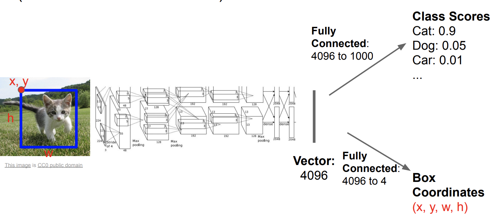
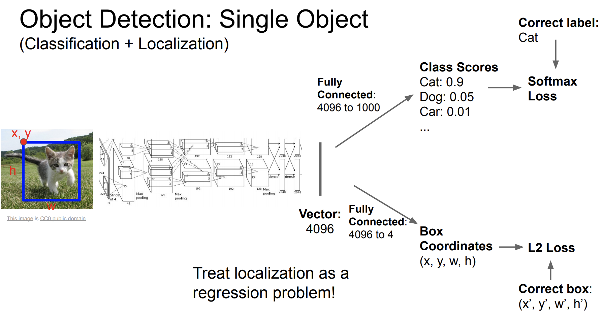
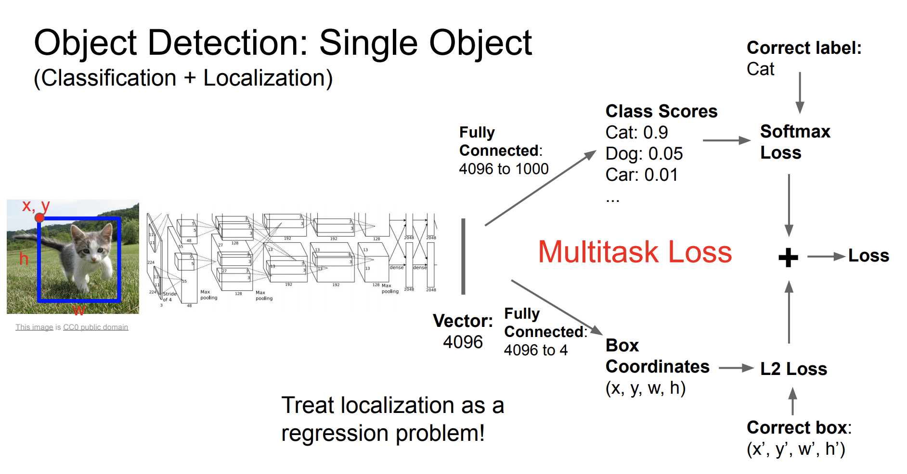
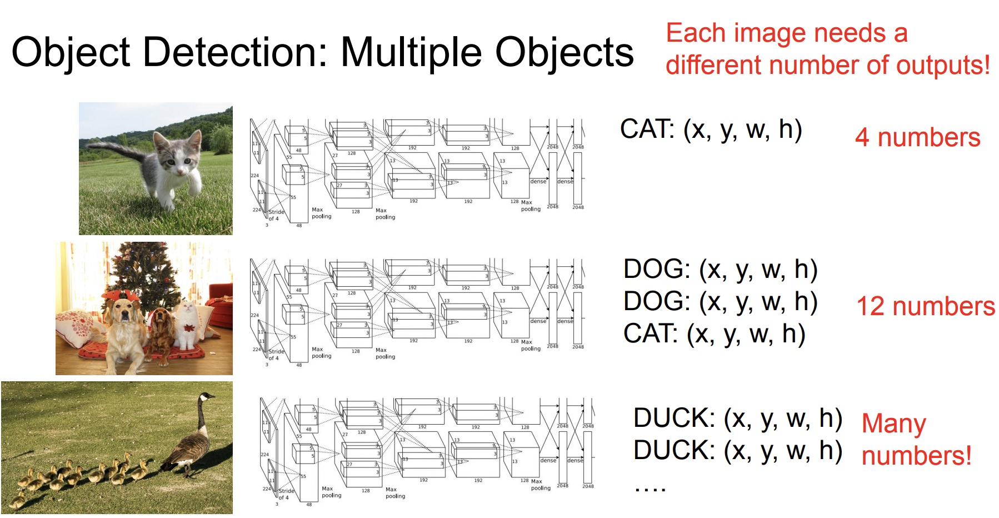

# Single Object

(Classification + Localization)

Update:

Final:

#  Multiple Objects

**Region Proposals:** Selective Search

 ● Find “blobby” image regions that are likely to contain objects 

● Relatively fast to run; e.g. Selective Search gives 2000 region proposals in a few seconds on CPU

# Reference 

[cs231 **Detection and Segmentation** Semantic segmentation Object detection Instance segmentation](http://cs231n.stanford.edu/slides/2020/lecture_12.pdf)

