# 卷积神经网络基础

## 计算机视觉介绍

计算机视觉是一个飞速发展的一个领域，这多亏了深度学习。深度学习与计算机视觉可以帮助汽车，查明周围的行人和汽车，并帮助汽车避开它们。还使得人脸识别技术变得更加效率和精准，你们即将能够体验到或早已体验过仅仅通过刷脸就能解锁手机或者门锁。当你解锁了手机，我猜手机上一定有很多分享图片的应用。在上面，你能看到美食，酒店或美丽风景的图片。有些公司在这些应用上使用了深度学习技术来向你展示最为生动美丽以及与你最为相关的图片。机器学习甚至还催生了新的艺术类型。

第一，计算机视觉的高速发展标志着新型应用产生的可能，这是几年前，人们所不敢想象的。通过学习使用这些工具，你也许能够创造出新的产品和应用。

其次，即使到头来你未能在计算机视觉上有所建树，但我发现，人们对于计算机视觉的研究是如此富有想象力和创造力，由此衍生出新的神经网络结构与算法，这实际上启发人们去创造出计算机视觉与其他领域的交叉成果。

## 边缘检测

卷积运算是卷积神经网络最基本的组成部分，使用边缘检测作为入门样例。

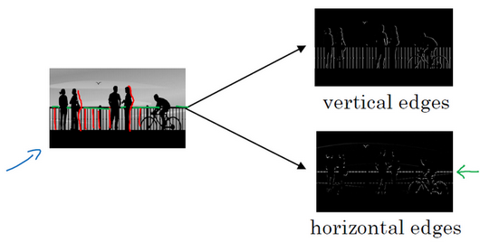

在这张图片中的栏杆就对应垂直线，与此同时，这些行人的轮廓线某种程度上也是垂线，这些线是垂直边缘检测器的输出。同样，你可能也想检测水平边缘，比如说这些栏杆就是很明显的水平线，它们也能被检测到。

## Padding

为了构建深度神经网络，你需要学会使用的一个基本的卷积操作就是**padding**，让我们来看看它是如何工作的。

如果你用一个3×3的过滤器卷积一个6×6的图像，你最后会得到一个4×4的输出，也就是一个4×4矩阵。那是因为你的3×3过滤器在6×6矩阵中，只可能有4×4种可能的位置。这背后的数学解释是，如果我们有一个$ n \times n$的图像，用$f \times f$的过滤器做卷积，那么输出的维度就是$(n-f+1)\times (n-f+1)$。在这个例子里是4，因此得到了一个4×4的输出。

这样的话会有两个缺点，**第一个缺点是每次做卷积操作，你的图像就会缩小**，从6×6缩小到4×4，你可能做了几次之后，你的图像就会变得很小了，可能会缩小到只有1×1的大小。你可不想让你的图像在每次识别边缘或其他特征时都缩小，这就是第一个缺点。

第二个缺点时，如果你注意角落边缘的像素，这个像素点（绿色阴影标记）只被一个输出所触碰或者使用，因为它位于这个3×3的区域的一角。但如果是在中间的像素点，比如这个（红色方框标记），就会有许多3×3的区域与之重叠。**所以那些在角落或者边缘区域的像素点在输出中采用较少，意味着你丢掉了图像边缘位置的许多信息。**

为了解决这些问题，你可以在卷积操作之前填充这幅图像。在这个案例中，你可以沿着图像边缘再填充一层像素。如果你这样操作了，那么6×6的图像就被你填充成了一个8×8的图像。如果你用3×3的图像对这个8×8的图像卷积，你得到的输出就不是4×4的，而是6×6的图像，你就得到了一个尺寸和原始图像6×6的图像。

习惯上，你可以用0去填充，如果$p$是填充的数量，在这个案例中，$p=1$，因为我们在周围都填充了一个像素点，输出也就变成了$(n+2p-f+1)\times (n+2p-f+1)$，所以就变成了$6 \times 6$，和输入的图像一样大。这样一来，丢失信息或者更准确来说角落或图像边缘的信息发挥的作用较小的这一缺点就被削弱了。如果你想的话，也可以填充两个像素点，也就是说在这里填充一层。实际上你还可以填充更多像素。

至于选择填充多少像素，通常有两个选择，分别叫做**Valid**卷积和**Same**卷积。

**Valid**卷积意味着不填充，这样的话，如果你有一个$n \times n$的图像，用一个$f \times f$的过滤器卷积，它将会给你一个$(n-f+1)\times (n-f+1)$维的输出。这类似于我们在前面的视频中展示的例子，有一个6×6的图像，通过一个3×3的过滤器，得到一个4×4的输出。

另一个经常被用到的填充方法叫做**Same**卷积，那意味你填充后，你的输出大小和输入大小是一样的。根据这个公式$n-f+1$，当你填充$p$个像素点，$n$就变成了$n+2p$，最后公式变为$n+2p-f+1$。因此如果你有一个$n \times n$的图像，用个像素填充边缘，输出的大小就是这样的$(n+2p-f+1)\times (n+2p-f+1)$。

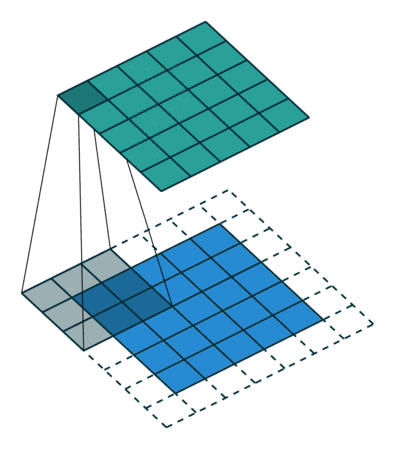

## 卷积步长（Strided convolutions）

卷积中的步幅是另一个构建卷积神经网络的基本操作。

滑动卷积核时，我们会先从输入的左上角开始，每次往左滑动一列或者往下滑动一行逐一计算输出，我们将每次滑动的行数和列数称为Stride，在之前的图片中，Stride=1；在下图中，Stride=2。

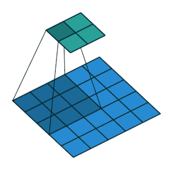

卷积过程中，有时需要通过padding来避免信息损失，有时也要在卷积时通过设置的**步长（Stride）**来压缩一部分信息，或者使输出的尺寸小于输入的尺寸。

**Stride的作用：**是成倍缩小尺寸，而这个参数的值就是缩小的具体倍数，比如步幅为2，输出就是输入的1/2；步幅为3，输出就是输入的1/3。以此类推。

**【卷积核的大小一般为奇数\*奇数】** 1*1，3*3，5*5，7*7都是最常见的。**这是为什么呢？**为什么没有偶数*偶数？

**（1）更容易padding**

在卷积时，我们有时候需要卷积前后的尺寸不变。这时候我们就需要用到padding。假设图像的大小，也就是被卷积对象的大小为n*n，卷积核大小为k*k，padding的幅度设为(k-1)/2时，卷积后的输出就为(n-k+2*((k-1)/2))/1+1=n，即卷积输出为n*n，保证了卷积前后尺寸不变。但是如果k是偶数的话，(k-1)/2就不是整数了。

**（2）更容易找到卷积锚点**

在CNN中，进行卷积操作时一般会以卷积核模块的一个位置为基准进行滑动，这个基准通常就是卷积核模块的中心。若卷积核为奇数，卷积锚点很好找，自然就是卷积模块中心，但如果卷积核是偶数，这时候就没有办法确定了，让谁是锚点似乎都不怎么好。

**【卷积的计算公式】**

**输入图片的尺寸：**一般用 ![[公式]](https://www.zhihu.com/equation?tex=n%5Ctimes+n) 表示输入的image大小。

**卷积核的大小：**一般用 ![[公式]](https://www.zhihu.com/equation?tex=f%5Ctimes+f) 表示卷积核的大小。

**填充（Padding）：**一般用 ![[公式]](https://www.zhihu.com/equation?tex=p) 来表示填充大小。

**步长(Stride)：**一般用 ![[公式]](https://www.zhihu.com/equation?tex=s) 来表示步长大小。

**输出图片的尺寸：**一般用 ![[公式]](https://www.zhihu.com/equation?tex=o) 来表示。

如果已知 ![[公式]](https://www.zhihu.com/equation?tex=n) 、 ![[公式]](https://www.zhihu.com/equation?tex=f) 、 ![[公式]](https://www.zhihu.com/equation?tex=p) 、 ![[公式]](https://www.zhihu.com/equation?tex=s) 可以求得 ![[公式]](https://www.zhihu.com/equation?tex=o) ，**计算公式如下：**![[公式]](https://www.zhihu.com/equation?tex=o%3D%5Clfloor+%5Cfrac%7Bn+%2B+2p+-+f%7D%7Bs%7D++%5Crfloor+%2B+1)

其中"![[公式]](https://www.zhihu.com/equation?tex=%5Clfloor+%5C+%5Crfloor)"是向下取整符号，用于结果不是整数时进行向下取整。

## 三维卷积

上述例子都只包含一个输入通道。实际上，大多数输入图像都有 RGB 3个通道。

这里就要涉及到“卷积核”和“filter”这两个术语的区别。在只有一个通道的情况下，“卷积核”就相当于“filter”，这两个概念是可以互换的。但在一般情况下，它们是两个完全不同的概念。**每个“filter”实际上恰好是“卷积核”的一个集合**，在当前层，每个通道都对应一个卷积核，且这个卷积核是独一无二的。

**多通道卷积的计算过程：**将矩阵与滤波器对应的每一个通道进行卷积运算，最后相加，形成一个单通道输出，加上偏置项后，我们得到了一个最终的单通道输出。如果存在多个filter，这时我们可以把这些最终的单通道输出组合成一个总输出。

这里我们还需要**注意**一些问题——滤波器的通道数、输出特征图的通道数。

**某一层滤波器的通道数 = 上一层特征图的通道数。**如上图所示，我们输入一张 ![[公式]](https://www.zhihu.com/equation?tex=6%5Ctimes6%5Ctimes3) 的RGB图片，那么滤波器（ ![[公式]](https://www.zhihu.com/equation?tex=3%5Ctimes3%5Ctimes3) ）也要有三个通道。

**某一层输出特征图的通道数 = 当前层滤波器的个数。**如上图所示，当只有一个filter时，输出特征图（ ![[公式]](https://www.zhihu.com/equation?tex=4%5Ctimes4) ）的通道数为1；当有2个filter时，输出特征图（![[公式]](https://www.zhihu.com/equation?tex=4%5Ctimes4%5Ctimes2) ）的通道数为2。

如果要计算下一个输出，你把这个立方体滑动一个单位，再与这27个数相乘，把它们都加起来，就得到了下一个输出，以此类推。

那么，这个能干什么呢？举个例子，这个过滤器是3×3×3的，如果你想检测图像红色通道的边缘，那么你可以将第一个过滤器设为$ \left[
 \begin{matrix}
   1 & 0 & -1 \\
   1 & 0 & -1 \\
   1 & 0 & -1
  \end{matrix}
  \right] $，和之前一样，而绿色通道全为0， \left[
 \begin{matrix}
   0 & 0 & 0 \\
   0 & 0 & 0 \\
   0 & 0 & 0
  \end{matrix}
  \right] ，蓝色也全为0。如果你把这三个堆叠在一起形成一个3×3×3的过滤器，那么这就是一个检测垂直边界的过滤器，但只对红色通道有用。

标准的卷积网络：

Convolution、Pooling、Fully connected

## 池化层

除了卷积层，卷积网络也经常使用池化层来缩减模型的大小，提高计算速度，同时提高所提取特征的鲁棒性，我们来看一下。

先举一个池化层的例子，然后我们再讨论池化层的必要性。假如输入是一个4×4矩阵，用到的池化类型是最大池化（**max pooling**）。执行最大池化的树池是一个2×2矩阵。执行过程非常简单，把4×4的输入拆分成不同的区域，我把这个区域用不同颜色来标记。对于2×2的输出，输出的每个元素都是其对应颜色区域中的最大元素值。

你可以把这个4×4输入看作是某些特征的集合，也许不是。你可以把这个4×4区域看作是某些特征的集合，也就是神经网络中某一层的非激活值集合。数字大意味着可能探测到了某些特定的特征，左上象限具有的特征可能是一个垂直边缘，一只眼睛，或是大家害怕遇到的**CAP**特征。显然左上象限中存在这个特征，这个特征可能是一只猫眼探测器。然而，右上象限并不存在这个特征。最大化操作的功能就是只要在任何一个象限内提取到某个特征，它都会保留在最大化的池化输出里。所以最大化运算的实际作用就是，如果在过滤器中提取到某个特征，那么保留其最大值。如果没有提取到这个特征，可能在右上象限中不存在这个特征，那么其中的最大值也还是很小，这就是最大池化的直观理解。

另外还有一种类型的池化，平均池化，它不太常用。目前来说，最大池化比平均池化更常用。但也有例外，就是深度很深的神经网络，你可以用平均池化来分解规模为7×7×1000的网络的表示层，在整个空间内求平均值，得到1×1×1000。

有几点要注意，第一，池化层和最大池化层没有参数；第二卷积层的参数相对较少其实许多参数都存在于神经网络的全连接层。观察可发现，随着神经网络的加深，激活值尺寸会逐渐变小，如果激活值尺寸下降太快，也会影响神经网络性能。示例中，激活值尺寸在第一层为6000，然后减少到1600，慢慢减少到84，最后输出**softmax**结果。我们发现，许多卷积网络都具有这些属性，模式上也相似。

卷积网络映射这么少参数有两个原因：

**一是参数共享。**观察发现，特征检测如垂直边缘检测如果适用于图片的某个区域，那么它也可能适用于图片的其他区域。也就是说，如果你用一个3×3的过滤器检测垂直边缘，那么图片的左上角区域，以及旁边的各个区域（左边矩阵中蓝色方框标记的部分）都可以使用这个3×3的过滤器。每个特征检测器以及输出都可以在输入图片的不同区域中使用同样的参数，以便提取垂直边缘或其它特征。它不仅适用于边缘特征这样的低阶特征，同样适用于高阶特征，例如提取脸上的眼睛，猫或者其他特征对象。即使减少参数个数，这9个参数同样能计算出16个输出。直观感觉是，一个特征检测器，如垂直边缘检测器用于检测图片左上角区域的特征，这个特征很可能也适用于图片的右下角区域。因此在计算图片左上角和右下角区域时，你不需要添加其它特征检测器。假如有一个这样的数据集，其左上角和右下角可能有不同分布，也有可能稍有不同，但很相似，整张图片共享特征检测器，提取效果也很好。

第二个方法是使用稀疏连接，我来解释下。这个0是通过3×3的卷积计算得到的，它只依赖于这个3×3的输入的单元格，右边这个输出单元（元素0）仅与36个输入特征中9个相连接。而且其它像素值都不会对输出产生任影响，这就是稀疏连接的概念。

再举一个例子，这个输出（右边矩阵中红色标记的元素 30）仅仅依赖于这9个特征（左边矩阵红色方框标记的区域），看上去只有这9个输入特征与输出相连接，其它像素对输出没有任何影响。

神经网络可以通过这两种机制减少参数，以便我们用更小的训练集来训练它，从而预防过度拟合。你们也可能听过，卷积神经网络善于捕捉平移不变。通过观察可以发现，向右移动两个像素，图片中的猫依然清晰可见，因为神经网络的卷积结构使得即使移动几个像素，这张图片依然具有非常相似的特征，应该属于同样的输出标记。实际上，我们用同一个过滤器生成各层中，图片的所有像素值，希望网络通过自动学习变得更加健壮，以便更好地取得所期望的平移不变属性。

# 深度卷积网络

## 经典网络

**LeNet-5**、**AlexNet**和**VGGNet**罗列

**LeNet-5**

首先看看**LeNet-5**的网络结构，假设你有一张32×32×1的图片，**LeNet-5**可以识别图中的手写数字，比如像这样手写数字7。**LeNet-5**是针对灰度图片训练的，所以图片的大小只有32×32×1。实际上**LeNet-5**的结构和我们上周讲的最后一个范例非常相似，使用6个5×5的过滤器，步幅为1。由于使用了6个过滤器，步幅为1，**padding**为0，输出结果为28×28×6，图像尺寸从32×32缩小到28×28。然后进行池化操作，在这篇论文写成的那个年代，人们更喜欢使用平均池化，而现在我们可能用最大池化更多一些。在这个例子中，我们进行平均池化，过滤器的宽度为2，步幅为2，图像的尺寸，高度和宽度都缩小了2倍，输出结果是一个14×14×6的图像。我觉得这张图片应该不是完全按照比例绘制的，如果严格按照比例绘制，新图像的尺寸应该刚好是原图像的一半。

接下来是卷积层，我们用一组16个5×5的过滤器，新的输出结果有16个通道。**LeNet-5**的论文是在1998年撰写的，当时人们并不使用**padding**，或者总是使用**valid**卷积，这就是为什么每进行一次卷积，图像的高度和宽度都会缩小，所以这个图像从14到14缩小到了10×10。然后又是池化层，高度和宽度再缩小一半，输出一个5×5×16的图像。将所有数字相乘，乘积是400。

下一层是全连接层，在全连接层中，有400个节点，每个节点有120个神经元，这里已经有了一个全连接层。但有时还会从这400个节点中抽取一部分节点构建另一个全连接层，就像这样，有2个全连接层。

最后一步就是利用这84个特征得到最后的输出，我们还可以在这里再加一个节点用来预测结果，有10个可能的值，对应识别0-9这10个数字。在现在的版本中则使用**softmax**函数输出十种分类结果，而在当时，**LeNet-5**网络在输出层使用了另外一种，现在已经很少用到的分类器。

**AlexNet**

**AlexNet**首先用一张227×227×3的图片作为输入，实际上原文中使用的图像是224×224×3，但是如果你尝试去推导一下，你会发现227×227这个尺寸更好一些。第一层我们使用96个11×11的过滤器，步幅为4，由于步幅是4，因此尺寸缩小到55×55，缩小了4倍左右。然后用一个3×3的过滤器构建最大池化层，f=3，步幅s为2，卷积层尺寸缩小为27×27×96。接着再执行一个5×5的卷积，**padding**之后，输出是27×27×276。然后再次进行最大池化，尺寸缩小到13×13。再执行一次**same**卷积，相同的**padding**，得到的结果是13×13×384，384个过滤器。再做一次**same**卷积，就像这样。再做一次同样的操作，最后再进行一次最大池化，尺寸缩小到6×6×256。6×6×256等于9216，将其展开为9216个单元，然后是一些全连接层。最后使用**softmax**函数输出识别的结果，看它究竟是1000个可能的对象中的哪一个。

实际上，这种神经网络与**LeNet**有很多相似之处，不过**AlexNet**要大得多。正如前面讲到的**LeNet**或**LeNet-5**大约有6万个参数，而**AlexNet**包含约6000万个参数。当用于训练图像和数据集时，**AlexNet**能够处理非常相似的基本构造模块，这些模块往往包含着大量的隐藏单元或数据，这一点**AlexNet**表现出色。**AlexNet**比**LeNet**表现更为出色的另一个原因是它使用了**ReLu**激活函数。

**VGG-16**

这节课要讲的第三个，也是最后一个范例是**VGG**，也叫作**VGG-16**网络。值得注意的一点是，**VGG-16**网络没有那么多超参数，这是一种只需要专注于构建卷积层的简单网络。首先用3×3，步幅为1的过滤器构建卷积层，**padding**参数为**same**卷积中的参数。然后用一个2×2，步幅为2的过滤器构建最大池化层。因此**VGG**网络的一大优点是它确实简化了神经网络结构，下面我们具体讲讲这种网络结构。

**VGG-16**的这个数字16，就是指在这个网络中包含16个卷积层和全连接层。确实是个很大的网络，总共包含约1.38亿个参数，即便以现在的标准来看都算是非常大的网络。但**VGG-16**的结构并不复杂，这点非常吸引人，而且这种网络结构很规整，都是几个卷积层后面跟着可以压缩图像大小的池化层，池化层缩小图像的高度和宽度。同时，卷积层的过滤器数量变化存在一定的规律，由64翻倍变成128，再到256和512。作者可能认为512已经足够大了，所以后面的层就不再翻倍了。无论如何，每一步都进行翻倍，或者说在每一组卷积层进行过滤器翻倍操作，正是设计此种网络结构的另一个简单原则。这种相对一致的网络结构对研究者很有吸引力，而它的主要缺点是需要训练的特征数量非常巨大。

文中揭示了，随着网络的加深，图像的高度和宽度都在以一定的规律不断缩小，每次池化后刚好缩小一半，而通道数量在不断增加，而且刚好也是在每组卷积操作后增加一倍。也就是说，图像缩小的比例和通道数增加的比例是有规律的。从这个角度来看，这篇论文很吸引人。

**NiN**

前几节介绍的LeNet、AlexNet和VGG在设计上的共同之处是：先以由卷积层构成的模块充分抽取空间特征，再以由全连接层构成的模块来输出分类结果。其中，AlexNet和VGG对LeNet的改进主要在于如何对这两个模块加宽（增加通道数）和加深。本节我们介绍网络中的网络（NiN）。它提出了另外一个思路，**即串联多个由卷积层和“全连接”层构成的小网络来构建一个深层网络**。

我们知道，卷积层的输入和输出通常是四维数组（样本，通道，高，宽），而全连接层的输入和输出则通常是二维数组（样本，特征）。如果想在全连接层后再接上卷积层，则需要将全连接层的输出变换为四维。而$1\times 1$卷积层。它可以看成全连接层，其中空间维度（高和宽）上的每个元素相当于样本，通道相当于特征。因此，NiN使用$1\times 1$卷积层来替代全连接层，从而使空间信息能够自然传递到后面的层中去。图对比了NiN同AlexNet和VGG等网络在结构上的主要区别。

传统卷积结构：

使用relu的一个非线性变换操作为：
$$
f_{i,j,k}=max(w_k^Tx_{i,j},0)
$$
i,j表示像素下标，xi,j表示像素值，wk表示卷积参数，k就是下标的索引。

MLP卷积层结构如下图：

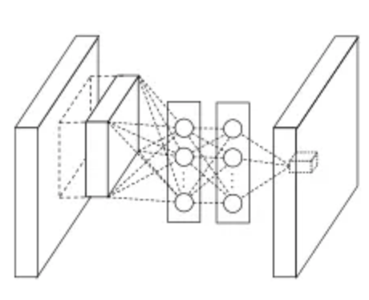

mlpconv层的计算公式为：
$$
f_{i,j,k_1}^1 = max({w^1_{k_1}}^Tx_{i,j}+b_{k_1},0)\\
.\\
.\\
.\\
f_{i,j,k_n}^n = max({w^1_{k_n}}^Tx_{i,j}+b_{k_n},0)\\
$$
i,j表示像素下标，xi,j表示像素值，wk,n表示第n层卷积卷积参数。

从以上可以看出，MLP卷积层通过叠加"micro network"网络，提高非线性表达，而其中的"micro network"基本组成单元是1*1卷积网路，说到这，就要解释一下1*1卷积了，该篇论文是首次提出1*1卷积，具有划时代的意义，之后的Googlenet借鉴了1*1卷积，还专门致谢过这篇论文。

**1*1卷积的意义：**

实现了不同通道同一位置的信息融合。

同时还提出了用全局均值池化代替全连接层。

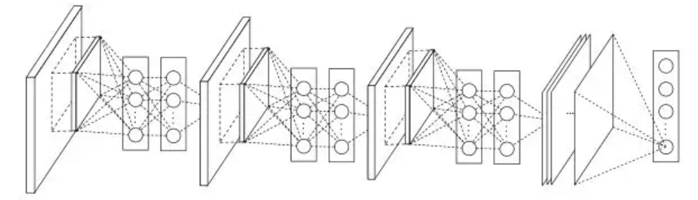

上图看出，该网络结构有三个MLP卷积层组成，每个MLP卷积层分别是一个普通卷积，加两个1*1卷积。以1000分类为例，最后一个1*1卷积输出的featuremap大小为6*6*1000。之后每个featuremap采用全局均值池化，输出1000个分类。由于没有全连接的大量参数，使用全局均值池化不需要参数，极大的降低了参数量。

- 全局平均池化没有参数，可以避免过拟合产生。
- 全局平均池可以对空间信息进行汇总，因此对输入的空间转换具有更强的鲁棒性

**Network In Network通过创新的创建MLP卷积层，提高了网络的非线性表达同时降低了参数量，用全局均值池化代替全连接层，极大的降低了参数量。**

## 残差网络(ResNets)

非常非常深的神经网络是很难训练的，因为存在梯度消失和梯度爆炸问题。这节课我们学习跳跃连接（**Skip connection**），它可以从某一层网络层获取激活，然后迅速反馈给另外一层，甚至是神经网络的更深层。我们可以利用跳跃连接构建能够训练深度网络的**ResNets**，有时深度能够超过100层。

在深度学习中，网络层数增多一般会伴着下面几个问题

1. 计算资源的消耗
2. 模型容易过拟合
3. 梯度消失/梯度爆炸问题的产生

问题1可以通过GPU集群来解决，对于一个企业资源并不是很大的问题；问题2的过拟合通过采集海量数据，并配合Dropout正则化等方法也可以有效避免；问题3通过Batch Normalization也可以避免。貌似我们只要无脑的增加网络的层数，我们就能从此获益，但实验数据给了我们当头一棒。

作者发现，随着网络层数的增加，网络发生了退化（degradation）的现象：随着网络层数的增多，训练集loss逐渐下降，然后趋于饱和，当你再增加网络深度的话，训练集loss反而会增大。注意这并不是过拟合，因为在过拟合中训练loss是一直减小的。

当网络退化时，浅层网络能够达到比深层网络更好的训练效果，这时如果我们把低层的特征传到高层，那么效果应该至少不比浅层的网络效果差，或者说如果一个VGG-100网络在第98层使用的是和VGG-16第14层一模一样的特征，那么VGG-100的效果应该会和VGG-16的效果相同。所以，我们可以在VGG-100的98层和14层之间添加一条直接映射（Identity Mapping）来达到此效果。

从信息论的角度讲，由于DPI（数据处理不等式）的存在，在前向传输的过程中，随着层数的加深，Feature Map包含的图像信息会逐层减少，而ResNet的直接映射的加入，保证了 ![[公式]](https://www.zhihu.com/equation?tex=l%2B1) 层的网络一定比 ![[公式]](https://www.zhihu.com/equation?tex=l) 层包含更多的图像信息。

基于这种使用直接映射来连接网络不同层直接的思想，残差网络应运而生。

**残差块**

残差网络是由一系列残差块组成的。一个残差块可以用表示为：
$$
x_{l+1} = x_l + \mathcal{F}(x_l,w_l)
$$
残差块分成两部分直接映射部分和残差部分。 ![[公式]](https://www.zhihu.com/equation?tex=h%28x_l%29) 是直接映射，反应在图中是左边的曲线； ![[公式]](https://www.zhihu.com/equation?tex=%5Cmathcal%7BF%7D%28x_l%2C+%7BW_l%7D%29) 是残差部分，一般由两个或者三个卷积操作构成，即图中右侧包含卷积的部分。

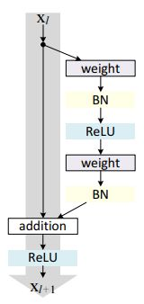

图中的Weight在卷积网络中是指卷积操作，addition是指单位加操作。

在卷积网络中， ![[公式]](https://www.zhihu.com/equation?tex=x_l) 可能和 ![[公式]](https://www.zhihu.com/equation?tex=x_%7Bl%2B1%7D) 的Feature Map的数量不一样，这时候就需要使用 ![[公式]](https://www.zhihu.com/equation?tex=1%5Ctimes1) 卷积进行升维或者降维。这时，残差块表示为：
$$
x_{l+1} =h(x_l) + \mathcal{F}(x_l,w_l)
$$
其中 ![[公式]](https://www.zhihu.com/equation?tex=h%28x_l%29+%3D+W%27_lx) 。其中 ![[公式]](https://www.zhihu.com/equation?tex=W%27_l) 是 ![[公式]](https://www.zhihu.com/equation?tex=1%5Ctimes1) 卷积操作，但是实验结果 ![[公式]](https://www.zhihu.com/equation?tex=1%5Ctimes1) 卷积对模型性能提升有限，所以一般是在升维或者降维时才会使用。

## 1 x 1 卷积

如果是一张6×6×32的图片，那么使用1×1过滤器进行卷积效果更好。具体来说，1×1卷积所实现的功能是遍历这36个单元格，计算左图中32个数字和过滤器中32个数字的元素积之和，然后应用**ReLU**非线性函数。

我们以其中一个单元为例，它是这个输入层上的某个切片，用这36个数字乘以这个输入层上1×1切片，得到一个实数，像这样把它画在输出中。

这个1×1×32过滤器中的32个数字可以这样理解，一个神经元的输入是32个数字（输入图片中左下角位置32个通道中的数字），即相同高度和宽度上某一切片上的32个数字，这32个数字具有不同通道，乘以32个权重（将过滤器中的32个数理解为权重），然后应用**ReLU**非线性函数，在这里输出相应的结果。

一般来说，如果过滤器不止一个，而是多个，就好像有多个输入单元，其输入内容为一个切片上所有数字，输出结果是6×6过滤器数量。

所以1×1卷积可以从根本上理解为对这32个不同的位置都应用一个全连接层，全连接层的作用是输入32个数字（过滤器数量标记为，在这36个单元上重复此过程）,输出结果是6×6×#filters（过滤器数量），以便在输入层上实施一个非平凡（**non-trivial**）计算。

这种方法通常称为1×1卷积，有时也被称为**Network in Network**，在林敏、陈强和杨学成的论文中有详细描述。虽然论文中关于架构的详细内容并没有得到广泛应用，但是1×1卷积或**Network in Network**这种理念却很有影响力，很多神经网络架构都受到它的影响。

假设这是一个28×28×192的输入层，你可以使用池化层压缩它的高度和宽度，这个过程我们很清楚。但如果通道数量很大，该如何把它压缩为28×28×32维度的层呢？你可以用32个大小为1×1的过滤器，严格来讲每个过滤器大小都是1×1×192维，因为过滤器中通道数量必须与输入层中通道的数量保持一致。但是你使用了32个过滤器，输出层为28×28×32。

## Inception网络

一般来说，提升网络性能最保险的方法就是增加网络的宽度和深度，这样做同时也会伴随着副作用。首先越深越宽的网络往往会意味着有巨大的参数量，当数据量很少的时候，训练出来的网络很容易过拟合，并且当网络有很深的深度的时候，很容易造成梯度消失现象这两个副作用制约着又深又宽的卷积神经网络的发展，Inception网络很好的解决了这两个问题。

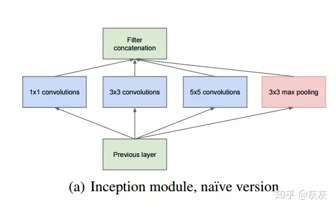

Inception网络结构中其中一个模块是这样的：在同一层中，分别含有1*1、3*3、5*5卷积和池化层，在使用滤波器进行卷积操作与池化层进行池化操作时都会使用padding以保证输出都是同尺寸大小，经过这些操作后输出的结果也就是特征图Featuremap再全部整合在一起。该模块的特性就是在同一层中，分别通过使用上述不同尺寸的滤波器与进行池化操作收集到了上一层输入的不同特征。这样就增加了网络的宽度，用这些不同尺寸的滤波器和池化操作去提取上一层的不同特征。

但是这样存在一个问题，经过这样一个模块后，输出的特征图往往很大，滤波器参数的默认计算是滤波器的尺寸n*n*深度的，深度等于上一层的特征图的个数，这样用不了几层就会造成参数过多并且计算量过大的问题，为了解决这个问题，使用了如下的构造：

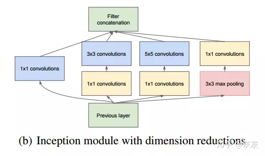

相比于上一个原始的Inception模块，维度减少模型中在3*3卷积层和5*5卷积层前增加了1*1的卷积层，并在池化层后增加了1*1的卷积层。这样做的意义是减少了参数量，避免了每层的计算量过大。

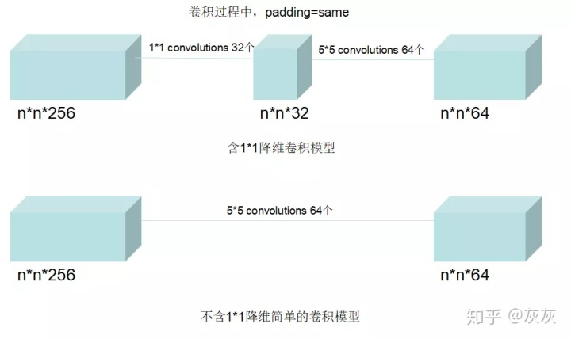

如上图所示，针对5*5卷积的这一层，不包含1*1的卷积模块时，参数量为5 * 5 * 256 * 64=409600个参数，连接数为(5 * 5 * 256+1) * 64 * n * n=409664 * n * n个。而包含1 *  1的卷积模块时，参数量为1 * 1 * 256 * 32+5 * 5 * 32 * 64=59392个参数，连接数为((1 * 1 * 256+1) * 32 * n * n+(5 * 5 * 32+1) * 64 * n * n）=59488 * n * n个。由此可见，包含1*1的卷积模块比不包含的参数数量和计算量要少很多。

Inception网络在增加了网络宽度，每一层都用不同的卷积池化去提取上一层特征图的特征，并且采用了在3 * 3和5 * 5卷积前，池化层后添加1 * 1卷积，可以有效避免了复杂的参数和计算量。这样Inception很好的缓和了因扩大网络宽度而造成的计算量过大和过拟合问题。

**Inception网络减缓梯度消失现象**

Inception网络框架中会有额外的两个softmadx预测层，这两个预测层分别是从网络框架中间部分引出的分支，用于反向传播更新梯度，这样就避免了因梯度消失导致浅层的网络参数无法更新。注意这两个分支只在训练的时候防止梯度消失会用到，真正做预测的时候需要删除。

## 数据增强

大部分的计算机视觉任务使用很多的数据，所以数据扩充是经常使用的一种技巧来提高计算机视觉系统的表现。我认为计算机视觉是一个相当复杂的工作，你需要输入图像的像素值，然后弄清楚图片中有什么，似乎你需要学习一个复杂方程来做这件事。在实践中，更多的数据对大多数计算机视觉任务都有所帮助，不像其他领域，有时候得到充足的数据，但是效果并不怎么样。但是，当下在计算机视觉方面，计算机视觉的主要问题是没有办法得到充足的数据。对大多数机器学习应用，这不是问题，但是对计算机视觉，数据就远远不够。所以这就意味着当你训练计算机视觉模型的时候，数据扩充会有所帮助，这是可行的，无论你是使用迁移学习，使用别人的预训练模型开始，或者从源代码开始训练模型。让我们来看一下计算机视觉中常见的数据扩充的方法。

**垂直镜像对称**

或许最简单的数据扩充方法就是垂直镜像对称，假如，训练集中有这张图片，然后将其翻转得到右边的图像。对大多数计算机视觉任务，左边的图片是猫，然后镜像对称仍然是猫，如果镜像操作保留了图像中想识别的物体的前提下，这是个很实用的数据扩充技巧。

另一个经常使用的技巧是随机裁剪，给定一个数据集，然后开始随机裁剪，可能修剪这个（编号1），选择裁剪这个（编号2），这个（编号3），可以得到不同的图片放在数据集中，你的训练集中有不同的裁剪。随机裁剪并不是一个完美的数据扩充的方法，如果你随机裁剪的那一部分（红色方框标记部分，编号4），这部分看起来不像猫。但在实践中，这个方法还是很实用的，随机裁剪构成了很大一部分的真实图片。

镜像对称和随机裁剪是经常被使用的。当然，理论上，你也可以使用旋转，剪切（**shearing**：此处并非裁剪的含义，图像仅水平或垂直坐标发生变化）图像，可以对图像进行这样的扭曲变形，引入很多形式的局部弯曲等等。当然使用这些方法并没有坏处，尽管在实践中，因为太复杂了所以使用的很少。

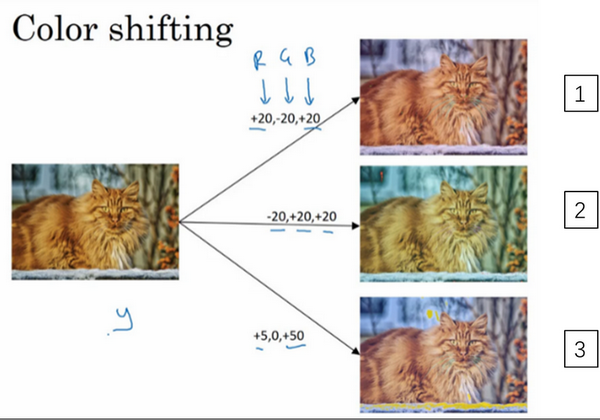

在这个例子中（编号1），要给红色、蓝色通道加值，给绿色通道减值。红色和蓝色会产生紫色，使整张图片看起来偏紫，这样训练集中就有失真的图片。为了演示效果，我对图片的颜色进行改变比较夸张。在实践中，对**R**、**G**和**B**的变化是基于某些分布的，这样的改变也可能很小。

这么做的目的就是使用不同的**R**、**G**和**B**的值，使用这些值来改变颜色。在第二个例子中（编号2），我们少用了一点红色，更多的绿色和蓝色色调，这就使得图片偏黄一点。

在这（编号3）使用了更多的蓝色，仅仅多了点红色。在实践中，**R**、**G**和**B**的值是根据某种概率分布来决定的。这么做的理由是，可能阳光会有一点偏黄，或者是灯光照明有一点偏黄，这些可以轻易的改变图像的颜色，但是对猫的识别，或者是内容的识别，以及标签，还是保持不变的。所以介绍这些，颜色失真或者是颜色变换方法，这样会使得你的学习算法对照片的颜色更改更具鲁棒性。

# 目标检测

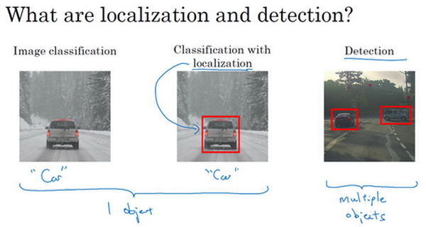

图片分类任务我们已经熟悉了，就是算法遍历图片，判断其中的对象是不是汽车，这就是图片分类。这节课我们要学习构建神经网络的另一个问题，即定位分类问题。这意味着，我们不仅要用算法判断图片中是不是一辆汽车，还要在图片中标记出它的位置，用边框或红色方框把汽车圈起来，这就是定位分类问题。其中“定位”的意思是判断汽车在图片中的具体位置。

## 基于滑动窗口的目标检测算法

**汽车检测例子**

假如你想构建一个汽车检测算法，步骤是，首先创建一个标签训练集，也就是$x$和$y$表示适当剪切的汽车图片样本，这张图片（编号1）$x$是一个正样本，因为它是一辆汽车图片，这几张图片（编号2、3）也有汽车，但这两张（编号4、5）没有汽车。出于我们对这个训练集的期望，你一开始可以使用适当剪切的图片，就是整张图片几乎都被汽车占据，你可以照张照片，然后剪切，剪掉汽车以外的部分，使汽车居于中间位置，并基本占据整张图片。有了这个标签训练集，你就可以开始训练卷积网络了，输入这些适当剪切过的图片（编号6），卷积网络输出y，0或1表示图片中有汽车或没有汽车。训练完这个卷积网络，就可以用它来实现滑动窗口目标检测，具体步骤如下。

假设这是一张测试图片，首先选定一个特定大小的窗口，比如图片下方这个窗口，将这个红色小方块输入卷积神经网络，卷积网络开始进行预测，即判断红色方框内有没有汽车。

滑动窗口目标检测算法接下来会继续处理第二个图像，即红色方框稍向右滑动之后的区域，并输入给卷积网络，因此输入给卷积网络的只有红色方框内的区域，再次运行卷积网络，然后处理第三个图像，依次重复操作，直到这个窗口滑过图像的每一个角落。

为了滑动得更快，我这里选用的步幅比较大，思路是以固定步幅移动窗口，遍历图像的每个区域，把这些剪切后的小图像输入卷积网络，对每个位置按0或1进行分类，这就是所谓的图像滑动窗口操作。

重复上述操作，不过这次我们选择一个更大的窗口，截取更大的区域，并输入给卷积神经网络处理，你可以根据卷积网络对输入大小调整这个区域，然后输入给卷积网络，输出0或1。

这种算法叫作滑动窗口目标检测，因为我们以某个步幅滑动这些方框窗口遍历整张图片，对这些方形区域进行分类，判断里面有没有汽车。

滑动窗口目标检测算法也有很明显的缺点，就是计算成本，因为你在图片中剪切出太多小方块，卷积网络要一个个地处理。如果你选用的步幅很大，显然会减少输入卷积网络的窗口个数，但是粗糙间隔尺寸可能会影响性能。反之，如果采用小粒度或小步幅，传递给卷积网络的小窗口会特别多，这意味着超高的计算成本。

## 滑动窗口的卷积实现

假设对象检测算法输入一个14×14×3的图像，图像很小，不过演示起来方便。在这里过滤器大小为5×5，数量是16，14×14×3的图像在过滤器处理之后映射为10×10×16。然后通过参数为2×2的最大池化操作，图像减小到5×5×16。然后添加一个连接400个单元的全连接层，接着再添加一个全连接层，最后通过**softmax**单元输出$y$。为了跟下图区分开，我先做一点改动，用4个数字来表示$y$，它们分别对应**softmax**单元所输出的4个分类出现的概率。这4个分类可以是行人、汽车、摩托车和背景或其它对象。

现在我要演示的就是如何把这些全连接层转化为卷积层，画一个这样的卷积网络，它的前几层和之前的一样，而对于下一层，也就是这个全连接层，我们可以用5×5的过滤器来实现，数量是400个（编号1所示），输入图像大小为5×5×16，用5×5的过滤器对它进行卷积操作，过滤器实际上是5×5×16，因为在卷积过程中，过滤器会遍历这16个通道，所以这两处的通道数量必须保持一致，输出结果为1×1。假设应用400个这样的5×5×16过滤器，输出维度就是1×1×400，我们不再把它看作一个含有400个节点的集合，而是一个1×1×400的输出层。从数学角度看，它和全连接层是一样的，因为这400个节点中每个节点都有一个5×5×16维度的过滤器，所以每个值都是上一层这些5×5×16激活值经过某个任意线性函数的输出结果。

我们再添加另外一个卷积层（编号2所示），这里用的是1×1卷积，假设有400个1×1的过滤器，在这400个过滤器的作用下，下一层的维度是1×1×400，它其实就是上个网络中的这一全连接层。最后经由1×1过滤器的处理，得到一个**softmax**激活值，通过卷积网络，我们最终得到这个1×1×4的输出层，而不是这4个数字（编号3所示）。

## Bounding Box预测

在滑动窗口法中，你取这些离散的位置集合，然后在它们上运行分类器，在这种情况下，这些边界框没有一个能完美匹配汽车位置，也许这个框（编号1）是最匹配的了。还有看起来这个真实值，最完美的边界框甚至不是方形，稍微有点长方形（红色方框所示），长宽比有点向水平方向延伸，有没有办法让这个算法输出更精准的边界框呢？

其中一个能得到更精准边界框的算法是**YOLO**算法，**YOLO**(**You only look once**)意思是你只看一次，这是由**Joseph Redmon**，**Santosh Divvala**，**Ross Girshick**和**Ali Farhadi**提出的算法。

## 交并比

如何判断对象检测算法运作良好呢？并交比函数，可以用来评价对象检测算法。

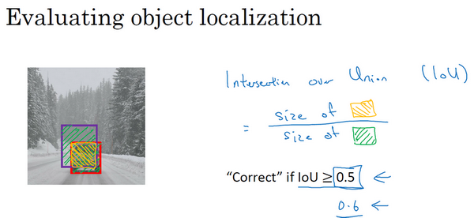

在对象检测任务中，你希望能够同时定位对象，所以如果实际边界框是这样的，你的算法给出这个紫色的边界框，那么这个结果是好还是坏？所以交并比（**loU**）函数做的是计算两个边界框交集和并集之比。两个边界框的并集是这个区域，就是属于包含两个边界框区域（绿色阴影表示区域），而交集就是这个比较小的区域（橙色阴影表示区域），那么交并比就是交集的大小，这个橙色阴影面积，然后除以绿色阴影的并集面积。

一般约定，在计算机检测任务中，如果$IoU\geq 0.5$，就说检测正确，如果预测器和实际边界框完美重叠，**loU**就是1，因为交集就等于并集。但一般来说只要IoU\geq 0.5，那么结果是可以接受的，看起来还可以。一般约定，0.5是阈值，用来判断预测的边界框是否正确。一般是这么约定，但如果你希望更严格一点，你可以将**loU**定得更高，比如说大于0.6或者更大的数字，但**loU**越高，边界框越精确。

所以这是衡量定位精确度的一种方式，你只需要统计算法正确检测和定位对象的次数，你就可以用这样的定义判断对象定位是否准确。再次，0.5是人为约定，没有特别深的理论依据，如果你想更严格一点，可以把阈值定为0.6。有时我看到更严格的标准，比如0.6甚至0.7，但很少见到有人将阈值降到0.5以下。

人们定义**loU**这个概念是为了评价你的对象定位算法是否精准，但更一般地说，**loU**衡量了两个边界框重叠地相对大小。如果你有两个边界框，你可以计算交集，计算并集，然后求两个数值的比值，所以这也可以判断两个边界框是否相似。

## 非极大值抑制（Non-max suppression）

实践中当你运行对象分类和定位算法时，对于每个格子都运行一次，所以这个格子（编号1）可能会认为这辆车中点应该在格子内部，这几个格子（编号2、3）也会这么认为。对于左边的车子也一样，所以不仅仅是这个格子，如果这是你们以前见过的图像，不仅这个格（编号4）子会认为它里面有车，也许这个格子（编号5）和这个格子（编号6）也会，也许其他格子也会这么认为，觉得它们格子内有车。

我们分步介绍一下非极大抑制是怎么起效的，因为你要在361个格子上都运行一次图像检测和定位算法，那么可能很多格子都会举手说我的$p_c$，我这个格子里有车的概率很高，而不是361个格子中仅有两个格子会报告它们检测出一个对象。所以当你运行算法的时候，最后可能会对同一个对象做出多次检测，所以非极大值抑制做的就是清理这些检测结果。这样一辆车只检测一次，而不是每辆车都触发多次检测。

