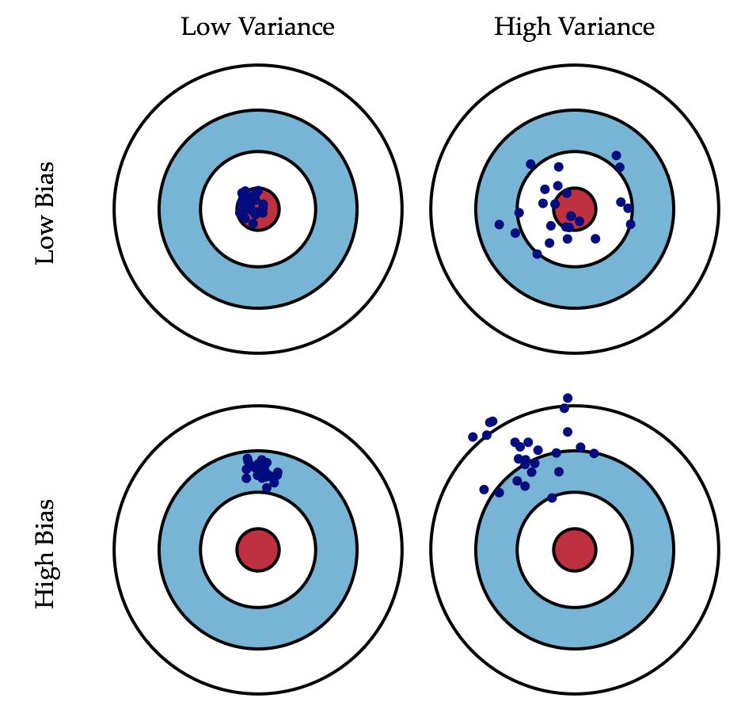
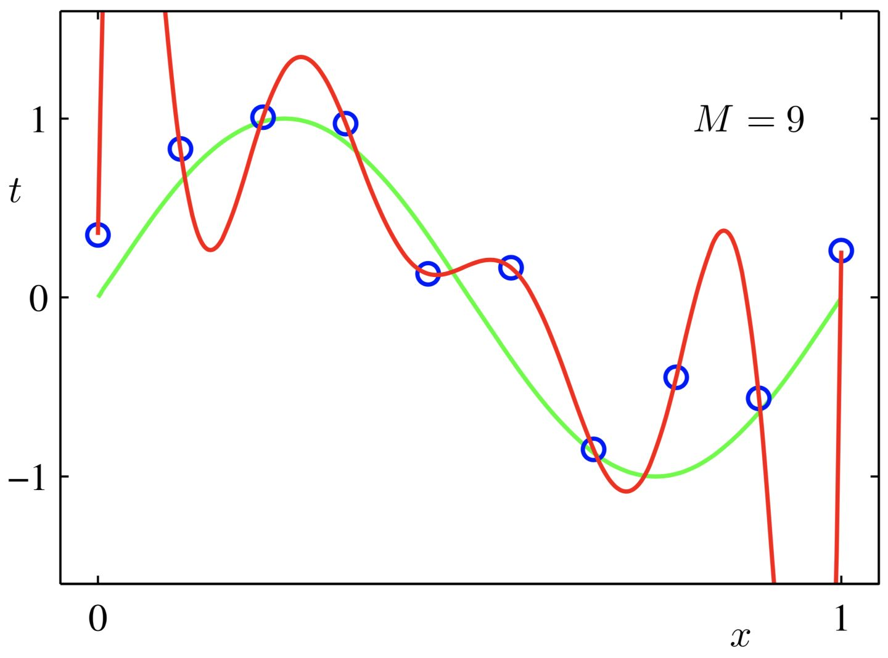
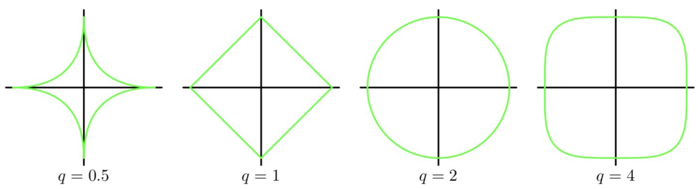
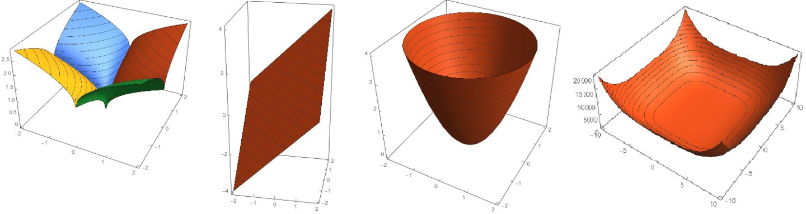
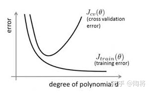
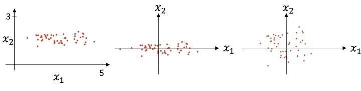
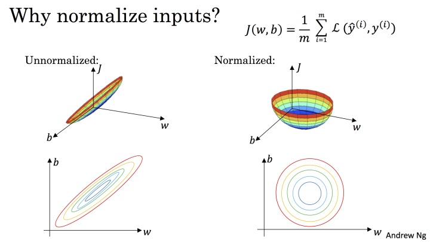
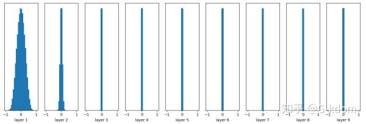
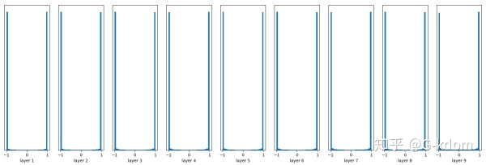
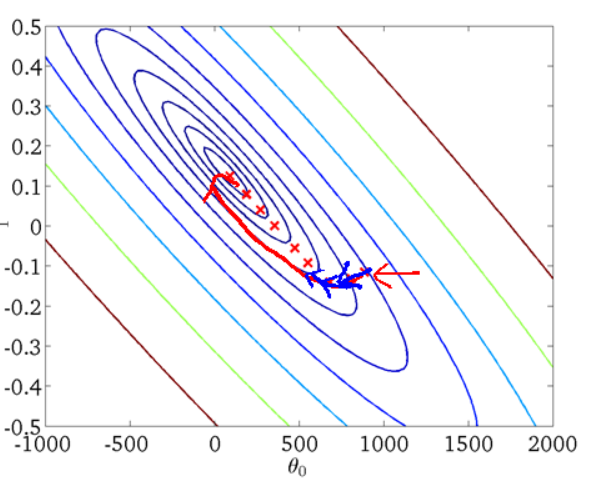

# 训练，验证，测试集

## 概括

- 训练集相当于上课学知识
- 验证集相当于课后的的练习题，用来纠正和强化学到的知识
- 测试集相当于期末考试，用来最终评估学习效果

## 细谈

**训练集**

训练集（Training Dataset）是用来训练模型使用的

**验证集**

当我们的模型训练好之后，我们并不知道他的表现如何。这个时候就可以使用验证集（Validation Dataset）来看看模型在新数据（验证集和测试集是不同的数据）上的表现如何。**同时通过调整超参数，让模型处于最好的状态**

验证集有2个主要的作用：

1. 评估模型效果，为了调整超参数而服务
2. 调整超参数，使得模型在验证集上的效果最好

说明：

1. 验证集不像训练集和测试集，它是非必需的。如果不需要调整超参数，就可以不使用验证集，直接用测试集来评估效果。
2. 验证集评估出来的效果并非模型的最终效果，主要是用来调整超参数的，模型最终效果以测试集的评估结果为准。

**测试集**

通过测试集的评估，我们会得到一些最终的评估指标，例如：准确率、精确率、召回率、F1等。

## 划分数据集

**交叉验证法**

3种主流的交叉验证法：

留出法，留一法，k折交叉验证

**留出法**

按照固定比例将数据集**静态的**划分为训练集、验证集、测试集。的方式就是留出法

1. 对于小规模样本集（几万量级），常用的分配比例是 60% 训练集、20% 验证集、20% 测试集。
2. 对于大规模样本集（百万级以上），只要验证集和测试集的数量足够即可，例如有 100w 条数据，那么留 1w 验证集，1w 测试集即可。1000w 的数据，同样留 1w 验证集和 1w 测试集。
3. 超参数越少，或者超参数很容易调整，那么可以减少验证集的比例，更多的分配给训练集。

**留一法**

每次的测试集都只有一个样本，要进行 m 次训练和预测。 这个方法用于训练的数据只比整体数据集少了一个样本，因此最接近原始样本的分布。但是训练复杂度增加了，因为模型的数量与原始数据样本数量相同。 一般在数据缺乏时使用。

**k折交叉验证**

静态的「留出法」对数据的划分方式比较敏感，有可能不同的划分方式得到了不同的模型。「k 折交叉验证」是一种动态验证的方式，这种方式可以降低数据划分带来的影响。具体步骤如下：

1. 将数据集分为训练集和测试集，将测试集放在一边
2. 将训练集分为 k 份
3. 每次使用 k 份中的 1 份作为验证集，其他全部作为训练集。
4. 通过 k 次训练后，我们得到了 k 个不同的模型。
5. 评估 k 个模型的效果，从中挑选效果最好的超参数
6. 使用最优的超参数，然后将 k 份数据全部作为训练集重新训练模型，得到最终模型。

**k 一般取 10** 数据量小的时候，k 可以设大一点，这样训练集占整体比例就比较大，不过同时训练的模型个数也增多。 数据量大的时候，k 可以设小一点。

# 偏差、方差、噪声

在机器学习中，我们用训练数据集去训练一个模型，通常的做法是定义一个误差函数，通过将这个误差的最小化过程，来提高模型的性能。然而我们学习一个模型的目的是为了解决训练数据集这个领域中的一般化问题，单纯地将训练数据集的损失最小化，并不能保证在解决更一般的问题时模型仍然是最优，甚至不能保证模型是可用的。这个训练数据集的损失与一般化的数据集的损失之间的差异就叫做**泛化误差（generalization error）**。

而泛化误差可以分解为**偏差（Biase）**、**方差（Variance）**和**噪声（Noise）**。

Bias和Variance分别从两个方面来描述我们学习到的模型与真实模型之间的差距。

**Bias**是用**所有可能的训练数据集**训练出的**所有模型**的输出的**平均值**与**真实模型**的输出值之间的差异。

**Variance**是**不同的训练数据集训练出的模型**输出值之间的差异。

**噪声**的存在是学习算法所无法解决的问题，数据的质量决定了学习的上限。假设在数据已经给定的情况下，此时上限已定，我们要做的就是尽可能的接近这个上限。

| 符号            | 含义                              |
| --------------- | --------------------------------- |
| $x$             | 测试样本                          |
| $D$             | 数据集                            |
| $y_D$           | x在数据集中的标记                 |
| $y$             | x的真实标记                       |
| $f$             | 训练集D学得的模型                 |
| $f(x;D)$        | 由训练集D学得的模型f对x的预测输出 |
| \overline{f}(x) | 模型f对x的期望预测输出            |

以回归任务为例，学习算法的期望预测为：
$$
\overline{f}(x)=E_D[f(x;D)]
$$
这里的期望预测也就是针对不同数据集D，模型f对样本x的预测值取其期望，也叫做**平均预测（average predicted）。**

**（1）方差定义：**

使用样本数相同的不同训练集产生的**方差**为：
$$
var(x)=E_D[(f(x;D)-\overline{f}(x))^2]
$$
**方差的含义：方差度量了同样大小的训练集的变动所导致的学习性能的变化，即刻画了数据扰动所造成的影响。**

**（2）偏差定义：**

期望输出与真实标记的差别称为**偏差（bias）**，即：
$$
bias^2(x)=(\overline{f}(x)-y)^2
$$
**偏差的含义：偏差度量了学习算法的期望预测与真实结果的偏离程度，即刻画了学习算法本身的拟合能力。**

**（3）噪声：**

噪声为：
$$
\xi ^2 = E_D [(y_D-y)^2]
$$
**噪声的含义：噪声则表达了在当前任务上任何学习算法所能达到的期望泛化误差的下界，即刻画了学习问题本身的难度。**




初始模型训练完成后，我首先要知道算法的偏差高不高，如果偏差较高，试着评估训练集或训练数据的性能。如果偏差的确很高，甚至无法拟合训练集，那么你要做的就是选择一个新的网络，比如含有更多隐藏层或者隐藏单元的网络，或者花费更多时间来训练网络，或者尝试更先进的优化算法，但是可能有用，也可能没用。

训练学习算法时，会不断尝试这些方法，直到解决掉偏差问题，这是最低标准，反复尝试，直到可以拟合数据为止，至少能够拟合训练集。

如果网络足够大，通常可以很好的拟合训练集，**只要你能扩大网络规模**，如果图片很模糊，算法可能无法拟合该图片，但如果有人可以分辨出图片，如果你觉得基本误差不是很高，那么训练一个更大的网络，你就应该可以……至少可以很好地拟合训练集，至少可以拟合或者过拟合训练集。一旦偏差降低到可以接受的数值，检查一下方差有没有问题，为了评估方差，我们要**查看验证集性能**，我们能从一个性能理想的训练集推断出验证集的性能是否也理想，如果方差高，最好的解决办法就是采用更多数据，如果你能做到，会有一定的帮助，但有时候，我们无法获得更多数据，我们也可以尝试通过正则化来减少过拟合。

**两个关键点**

第一点，高偏差和高方差是两种不同的情况，我们后续要尝试的方法也可能完全不同，通常会用训练验证集来诊断算法是否存在偏差或方差问题，然后根据结果选择尝试部分方法。举个例子，**如果算法存在高偏差问题，准备更多训练数据其实也没什么用处，至少这不是更有效的方法**，所以大家要清楚存在的问题是偏差还是方差，还是两者都有问题，明确这一点有助于我们选择出最有效的方法。

第二点，在机器学习的初期阶段，关于所谓的偏差方差权衡的讨论屡见不鲜，原因是我们能尝试的方法有很多。可以增加偏差，减少方差，也可以减少偏差，增加方差，但是在深度学习的早期阶段，我们没有太多工具可以做到只减少偏差或方差却不影响到另一方。但在当前的深度学习和大数据时代，只要持续训练一个更大的网络，只要准备了更多数据，那么也并非只有这两种情况，我们假定是这样，那么，只要正则适度，通常构建一个更大的网络便可以，在不影响方差的同时减少偏差，而采用更多数据通常可以在不过多影响偏差的同时减少方差。这两步实际要做的工作是：训练网络，选择网络或者准备更多数据，现在我们有工具可以做到在减少偏差或方差的同时，不对另一方产生过多不良影响。我觉得这就是深度学习对监督式学习大有裨益的一个重要原因，也是我们不用太过关注如何平衡偏差和方差的一个重要原因，但有时我们有很多选择，减少偏差或方差而不增加另一方。最终，我们会得到一个非常规范化的网络。

# 正则化

## 出现原因

深度学习可能存在过拟合问题——高方差，有两个解决方法，一个是正则化，另一个是准备更多的数据，这是非常可靠的方法，但你可能无法时时刻刻准备足够多的训练数据或者获取更多数据的成本很高，但正则化通常有助于避免过拟合或减少你的网络误差。

首先，从使用正则化的目的角度：**正则化是为了防止过拟合**



## 二次正则项

线性的损失函数
$$
E(w)=\frac{1}{2}\sum_{n=1}^N\{t_n-w^T\phi(X_n)\}^2
$$


$E(w)$是**损失函数（又称误差函数 or 评价函数）**，E即Evaluate，有时候写成L即Loss
$t_n$是测试集的真实输出，又称目标变量【对应第一幅图中的蓝色点】
$w$ 是权重（需要训练的部分，未知数）

$\phi()$是**基函数**，例如多项式函数，核函数
测试样本有n个数据
整个函数直观解释就是**误差平方和**，$\frac{1}{2}$只是为了**求导后消去方便计算**

加**正则化项**，得到最终的**误差函数（Error function）**
$$
\frac{1}{2}\sum_{n=1}^N\{t_n-w^T\phi(X_n)\}^2+\frac{\lambda}{2}w^Tw
$$
目标函数 = 误差函数（损失函数 or 评价函数） + 正则化项
$\lambda$被称为正则化系数，**越大，这个限制越强**

对$w$求导，并令为0，可以解得：
$$
w=(\lambda I+\phi	^T\phi)^{-1}\phi	^Tt
$$

## 一般正则项

$$
\frac{1}{2}\sum_{n=1}^N\{t_n-w^T\phi(X_n)\}^2+\frac{\lambda}{2}\sum_{j=1}^M|w_j|^q
$$

> M是模型的阶次（表现形式是数据的维度），比如M=2，就是一个平面（二维）内的点



直观理解：




$L2$正则化是常见的正则化类型，而$L1$：$\sum_{j=1}^{n_x}|w|$，如果用的是$L1$正则化，最终会是稀疏的，也就是说向量中有很多0，有人说这样有利于压缩模型，因为集合中参数均为0，存储模型所占用的内存更少。实际上，虽然正则化使模型变得稀疏，却没有降低太多存储内存，所以我认为这并不是$L1$正则化的目的，至少不是为了压缩模型，人们在训练网络时，越来越倾向于使用$L2$正则化。

**范数合集：**


![[公式]](https://www.zhihu.com/equation?tex=L_%7B0%7D) 范数： ![[公式]](https://www.zhihu.com/equation?tex=%5Cleft+%5C%7C+w+%5Cright+%5C%7C_%7B0%7D+%3D+%5C%23%28i%29%5C+with+%5C+x_%7Bi%7D+%5Cneq+0) *（非零元素的个数）*

![[公式]](https://www.zhihu.com/equation?tex=L_%7B1%7D) 范数： ![[公式]](https://www.zhihu.com/equation?tex=%5Cleft+%5C%7C+w+%5Cright+%5C%7C_%7B1%7D+%3D+%5Csum_%7Bi+%3D+1%7D%5E%7Bd%7D%5Clvert+x_i%5Crvert) *（每个元素绝对值之和）*

![[公式]](https://www.zhihu.com/equation?tex=L_%7B2%7D) 范数： ![[公式]](https://www.zhihu.com/equation?tex=%5Cleft+%5C%7C+w+%5Cright+%5C%7C_%7B2%7D+%3D+%5CBigl%28%5Csum_%7Bi+%3D+1%7D%5E%7Bd%7D+x_i%5E2%5CBigr%29%5E%7B1%2F2%7D) *（欧氏距离）*

![[公式]](https://www.zhihu.com/equation?tex=L_%7Bp%7D) 范数： ![[公式]](https://www.zhihu.com/equation?tex=%5Cleft+%5C%7C+w+%5Cright+%5C%7C_%7Bp%7D+%3D+%5CBigl%28%5Csum_%7Bi+%3D+1%7D%5E%7Bd%7D+x_i%5Ep%5CBigr%29%5E%7B1%2Fp%7D)

## dropout 正则化

Dropout可以比较有效的缓解过拟合的发生，在一定程度上达到正则化的效果。


**（1）取平均的作用：** 

先回到标准的模型即没有dropout，我们用相同的训练数据去训练5个不同的神经网络，一般会得到5个不同的结果，此时我们可以采用 “5个结果取均值”或者“多数取胜的投票策略”去决定最终结果。例如3个网络判断结果为数字9,那么很有可能真正的结果就是数字9，其它两个网络给出了错误结果。这种“综合起来取平均”的策略通常可以有效防止过拟合问题。因为不同的网络可能产生不同的过拟合，取平均则有可能让一些“相反的”拟合互相抵消。dropout掉不同的隐藏神经元就类似在训练不同的网络，随机删掉一半隐藏神经元导致网络结构已经不同，整个dropout过程就相当于对很多个不同的神经网络取平均。而不同的网络产生不同的过拟合，一些互为“反向”的拟合相互抵消就可以达到整体上减少过拟合。

**（2）减少神经元之间复杂的共适应关系：** 

因为dropout程序导致两个神经元不一定每次都在一个dropout网络中出现。这样权值的更新不再依赖于有固定关系的隐含节点的共同作用，阻止了某些特征仅仅在其它特定特征下才有效果的情况 。迫使网络去学习更加鲁棒的特征 ，这些特征在其它的神经元的随机子集中也存在。换句话说假如我们的神经网络是在做出某种预测，它不应该对一些特定的线索片段太过敏感，即使丢失特定的线索，它也应该可以从众多其它线索中学习一些共同的特征。从这个角度看dropout就有点像L1，L2正则，减少权重使得网络对丢失特定神经元连接的鲁棒性提高。

（3）**Dropout类似于性别在生物进化中的角色：**

物种为了生存往往会倾向于适应这种环境，环境突变则会导致物种难以做出及时反应，性别的出现可以繁衍出适应新环境的变种，有效的阻止过拟合，即避免环境改变时物种可能面临的灭绝。

## 其他正则化方法

除了$L1,L2$正则化和随机失活（**dropout**）正则化，还有几种方法可以减少神经网络中的过拟合:

**数据扩增**

假设你正在拟合猫咪图片分类器，如果你想通过扩增训练数据来解决过拟合，但扩增数据代价高，而且有时候我们无法扩增数据，但我们可以通过添加这类图片来增加训练集。例如，水平翻转图片，并把它添加到训练集。所以现在训练集中有原图，还有翻转后的这张图片，所以通过水平翻转图片，训练集则可以增大一倍，因为训练集有冗余，这虽然不如我们额外收集一组新图片那么好，但这样做节省了获取更多猫咪图片的花费。

除了水平翻转图片，你也可以随意裁剪图片。我们可以增大数据集，额外生成假训练数据。和全新的，独立的猫咪图片数据相比，这些额外的假的数据无法包含像全新数据那么多的信息，但我们这么做基本没有花费，代价几乎为零，除了一些对抗性代价。以这种方式扩增算法数据，进而正则化数据集，减少过拟合比较廉价。

对于光学字符识别，我们还可以通过添加数字，随意旋转或扭曲数字来扩增数据，把这些数字添加到训练集，它们仍然是数字。

**early stopping**

还有另外一种常用的方法叫作**early stopping**，运行梯度下降时，我们可以绘制训练误差，或只绘制代价函数的优化过程，在训练集上用0-1记录分类误差次数。呈单调下降趋势，

在对模型训练的时候，模型在训练集上的训练误差(training error)随着时间会一直减少，然而模型在验证集上的验证误差会减少到一定程度后逐步上升，形成一个非对称的U型曲线。对模型进行训练的过程即是对模型的参数进行更新的过程，参数更新会用到一些优化算法，为了能够得到最低测试误差时的参数，Early Stopping的做法就是运行优化方法直到若干次在验证集上的验证误差没有提升时候停止。

一般做法是，在训练的过程中，记录到目前为止最好的验证正确率(validation accuracy)，当连续10次Epoch，validation accuracy没有达到最佳Accuracy，则认为accuracy不再有所提升，此时就可以停止迭代了。



# 归一化、标准化

## 归一化 Normalization

归一化一般是将数据映射到指定的范围，用于去除不同维度数据的量纲以及量纲单位。

常见的映射范围有 [0, 1] 和 [-1, 1] ，最常见的归一化方法就是 **Min-Max 归一化**：

**Min-Max 归一化**
$$
x_{new}=\frac{x-x_{min}}{x_{max}-x_{min}}
$$
我们判断一个人的身体状况是否健康，那么我们会采集人体的很多指标，比如说：身高、体重、红细胞数量、白细胞数量等。

一个人身高 180cm，体重 70kg，白细胞计数 ![[公式]](https://www.zhihu.com/equation?tex=7.50%C3%9710%5E%7B9%7D%2FL) ，etc.

衡量两个人的状况时，白细胞计数就会起到主导作用从而**遮盖住其他的特征**，归一化后就不会有这样的问题。

## 标准化 Normalization

> 归一化和标准化的英文翻译是一致的，但是根据其用途（或公式）的不同去理解（或翻译）

下面我们将探讨最常见的标准化方法： **Z-Score 标准化**。
$$
x_{new}=\frac{x-\mu}{\sigma}
$$
其中 ![[公式]](https://www.zhihu.com/equation?tex=%5Cmu) 是样本数据的**均值（mean）**， ![[公式]](https://www.zhihu.com/equation?tex=%5Csigma) 是样本数据的**标准差（std）**。



上图则是一个散点序列的标准化过程：原图->减去均值->除以标准差。




器学习的目标无非就是不断优化损失函数，使其值最小。在上图中， ![[公式]](https://www.zhihu.com/equation?tex=J%28w%2Cb%29) 就是我们要优化的目标函数

我们不难看出，**标准化后可以更加容易地得出最优参数** ![[公式]](https://www.zhihu.com/equation?tex=w) **和** ![[公式]](https://www.zhihu.com/equation?tex=b) **以及计算出** ![[公式]](https://www.zhihu.com/equation?tex=J%28w%2Cb%29) **的最小值，从而达到加速收敛的效果**。 

## Batch Normalization

在机器学习中，**最常用标准化的地方**莫过于神经网络的 **BN 层（Batch Normalization）**

我们知道数据预处理做标准化可以加速收敛，同理，在神经网络使用标准化也可以**加速收敛**，而且还有如下好处：

- 具有正则化的效果（Batch Normalization reglarizes the model）
- 提高模型的泛化能力（Be advantageous to the generalization of network）
- 允许更高的学习速率从而加速收敛（Batch Normalization enables higher learning rates）

其原理是**利用正则化减少内部相关变量分布的偏移（Reducing Internal Covariate Shift）**，从而**提高了算法的鲁棒性**。

Batch Normalization 由两部分组成，第一部分是**缩放与平移（scale and shift）**，第二部分是**训练缩放尺度和平移的参数（train a BN Network）**

# 梯度消失/梯度爆炸

## 定义

在反向传播过程中需要对激活函数进行求导：

如果导数大于1，那么随着网络层数的增加梯度更新将会朝着指数爆炸的方式增加这就是梯度爆炸。

同样如果导数小于1，那么随着网络层数的增加梯度更新信息会朝着指数衰减的方式减少这就是梯度消失。

因此，梯度消失、爆炸，其根本原因在于反向传播训练法则，属于先天不足。

## 解决方案

**预训练加微调**

此方法来自Hinton在2006年发表的一篇论文，Hinton为了解决梯度的问题，提出采取无监督逐层训练方法，其基本思想是每次训练一层隐节点，训练时将上一层隐节点的输出作为输入，而本层隐节点的输出作为下一层隐节点的输入，此过程就是逐层“预训练”（pre-training）；在预训练完成后，再对整个网络进行“微调”（fine-tunning）。

Hinton在训练深度信念网络（Deep Belief Networks）中，使用了这个方法，在各层预训练完成后，再利用BP算法对整个网络进行训练。此思想相当于是先寻找局部最优，然后整合起来寻找全局最优，此方法有一定的好处，但是目前应用的不是很多了。

**梯度剪切、正则**

梯度剪切这个方案主要是针对梯度爆炸提出的，其思想是设置一个**梯度剪切阈值**，然后更新梯度的时候，如果梯度超过这个阈值，那么就将其强制限制在这个范围之内，通过这种直接的方法就可以防止梯度爆炸。

**权重正则化**

正则化是通过对网络权重做正则限制过拟合，仔细看正则项在损失函数的形式：
$$
Loss = (y-W^Tx)^2+\alpha||w||^2
$$
其中，$\alpha$是指正则项系数，因此，如果发生梯度爆炸，权值的范数就会变的非常大，通过正则化项，可以部分限制梯度爆炸的发生。

注：事实上，在深度神经网络中，往往是梯度消失出现的更多一些。

**激活函数**

选择好的激活函数譬如：Relu、LeakyRelu 等等

**批正则化**

Batchnorm本质上是解决反向传播过程中的梯度问题。Batchnorm全名是batch normalization，简称BN，通过规范化操作将输出x规范化以此来保证网络的稳定性。

Batchnorm就是通过对每一层的输出规范为均值和方差一致的方法，消除了w带来的放大缩小的影响，进而解决梯度消失和爆炸的问题。

**残差网络**

残差网络的出现导致了image net比赛的终结，自从残差提出后，几乎所有的深度网络都离不开残差的身影，相比较之前的几层，几十层的深度网络，在残差网络面前都不值一提，残差可以很轻松的构建几百层，一千多层的网络而不用担心梯度消失过快的问题，原因就在于残差的捷径（shortcut）部分。

**LSTM**

LSTM全称是长短期记忆网络（long-short term memory networks），是不那么容易发生梯度消失的，主要原因在于LSTM内部复杂的“门”(gates)，LSTM通过它内部的“门”可以接下来更新的时候“记住”前几次训练的”残留记忆“，因此，经常用于生成文本中。

# 权重初始化

模型权重的初始化对于网络的训练很重要，不好的初始化参数会导致梯度传播问题，降低训练速度；而好的初始化参数能够加速收敛，并且更可能找到较优解。如果权重一开始很小，信号到达最后也会很小；如果权重一开始很大，信号到达最后也会很大。

不合适的权重初始化会使得隐藏层数据的方差过大（例如，随着输入数据量的增长，随机初始化的神经元的输出数据的分布中的方差也增大），从而在经过sigmoid这种非线性层时离中心较远(导数接近0)，因此过早地出现梯度消失。

梯度消失和梯度爆炸的解决办法之一就是更谨慎的选择随机初始化参数。

## 权重初始化方法

**全零初始化**

我们在线性回归，logistics回归的时候，基本上都是把参数初始化为0，我们的模型也能够很好的工作。然后**在神经网络中，把** ![[公式]](https://www.zhihu.com/equation?tex=w) **初始化为0是不可以的**。这是因为如果把 ![[公式]](https://www.zhihu.com/equation?tex=w) 初始化0，那么每一层的神经元学到的东西都是一样的（输出是一样的），而且在BP的时候，每一层内的神经元也是相同的，因为他们的gradient相同，weight update也相同。这显然是一个不可接受的结果。

**随机初始化**

随机初始化是很多人经常使用的方法，一般初始化的权重为高斯或均匀分布中随机抽取的值。然而这是有弊端的，一旦随机分布选择不当，就会导致网络优化陷入困境。

**把权重初始化为较小的值**，如均值为0，方差为0.01的高斯分布：

```python
w = np.random.randn( node_in, node_out) * 0.01
```



随着层数的增加，我们看到输出值迅速向0靠拢，在后几层中，几乎所有的输出值 x 都很接近0。高斯初始化，给权重较小的值，这种更新方式在小型网络中很常见，然而当网络deep的时候，会出现**梯度消失**的情况。

但是如果把**权重初始成一个比较大的值**，如均值为0，方差为1的高斯分布：

```text
w = np.random.randn(node_in, node_out) * 1.0
```



**Xavier初始化**

Xavier初始化可以帮助减少梯度消失的问题，使得信号在神经网络中可以传递得更深，在经过多层神经元后保持在合理的范围（不至于太小或太大）。

**Xavier初始化的基本思想：**保持输入和输出的方差一致（服从相同的分布），这样就避免了所有输出值都趋向于0。

根据输入和输出神经元的数量自动决定初始化的范围：定义参数所在的层的输入维度为 ![[公式]](https://www.zhihu.com/equation?tex=m) ，输出维度为 ![[公式]](https://www.zhihu.com/equation?tex=n) ，那么参数将从 ![[公式]](https://www.zhihu.com/equation?tex=%5Cleft%28+-%5Csqrt%7B%5Cfrac%7B6%7D%7Bm%2Bn%7D%7D%2C%5Csqrt%7B%5Cfrac%7B6%7D%7Bm%2Bn%7D%7D+%5Cright%29) 均匀分布中采样

当激活函数为ReLU函数时，可随机初始化参数（$n^{[l]}$表示第l层的神经元数）：
$$
w^{[l]}=np.random.randn(n^{[l]},n^{[l-1]}) * np.sqrt(\frac{2}{n^{[l-1]}})
$$
当激活函数为tanh函数时，可随机初始化参数：
$$
w^{[l]}=np.random.randn(n^{[l]},n^{[l-1]}) * np.sqrt(\frac{1}{n^{[l-1]}})
$$
这种方式称为**Xavier初始化**。或者也可以：
$$
w^{[l]}=np.random.randn(n^{[l]},n^{[l-1]}) * np.sqrt(\frac{2}{n^{[l-1]}+n^{[l]}})
$$
**Xavier初始化主要用于tanh，不适用于ReLU。**

**He initialization**

为了解决上面的问题，何恺明大神提出了一种针对ReLU的初始化方法，一般称作 He initialization 或 MSRA。

主要想要解决的问题是由于经过relu后，方差会发生变化，因此我们初始化权值的方法也应该变化。只考虑输入个数时，MSRA初始化是一个均值为0，方差为2/n的高斯分布：
$$
w \sim [0,\sqrt\frac{2}{n}]
$$
**He initialization的思想是：**在ReLU网络中，假定每一层有一半的神经元被激活，另一半为0（x负半轴中是不激活的），所以要保持variance不变，只需要在Xavier的基础上再除以2：

```text
w = np.random.randn(node_in, node_out) / np.sqrt(node_in/2)
```

效果是比Xavier initialization好很多。现在神经网络中，隐藏层常使用ReLU，权重初始化常用He initialization这种方法。

**Batch Normalization Layer**

在网络中间层中使用 Batch Normalization 层一定程度上能够减缓对较好的网络参数初始化的依赖，使用方差较小的参数分布即可。

**pre-training**

如果不想从零开始训练神经网络时，我们往往选择一个已经在任务A上训练好的模型（称为pre-trained model），将其放在任务B上做模型调整（称为fine-tuning）

**梯度检验**

神经网络算法使用反向传播计算目标函数关于每个参数的梯度，可以看做解析梯度。由于计算过程中涉及到的参数很多，反向传播计算的梯度很容易出现误差，导致最后迭代得到效果很差的参数值。

为了确认代码中反向传播计算的梯度是否正确，可以采用梯度检验（gradient check）的方法。通过计算数值梯度，得到梯度的近似值，然后和反向传播得到的梯度进行比较，若两者相差很小的话则证明反向传播的代码是正确无误的。


# 优化函数

## 梯度下降法

梯度下降法有很多优点，其中，在梯度下降法的求解过程中，只需求解损失函数的一阶导数，计算的代价比较小，这使得梯度下降法能在很多大规模数据集上得到应用。梯度下降法的含义是通过当前点的梯度方向寻找到新的迭代点。

**批量梯度下降法BGD**

批梯度下降法(Batch Gradient Descent)针对的是整个数据集，通过对所有的样本的计算来求解梯度的方向。
$$
\frac{\delta J(\theta)}{\delta \theta j } =\sum_{i=1}^m(h_{\theta}(x^{(i)}-y^{(i)})x_j^{(i)}
$$
进一步得到了迭代式：
$$
\theta^{'}_j = \theta_j - \alpha \frac{\delta J(\theta)}{\delta \theta _j}
$$
每迭代一步，都要用到训练集所有的数据，如果样本数目很大，那么可想而知这种方法的迭代速度

优点：全局最优解；易于并行实现；
缺点：当样本数目很多时，训练过程会很慢。
从迭代的次数上来看，BGD迭代的次数相对较少。其迭代的收敛曲线示意图可以表示如下：



**小批量梯度下降法MBGD**

假设训练集中的样本的个数为1000，则每个mini-batch只是其一个子集，假设，每个mini-batch中含有10个样本，这样，整个训练数据集可以分为100个mini-batch。

**随机梯度下降法SGD**


