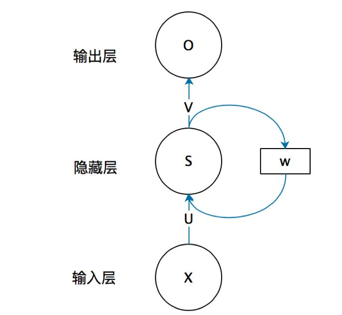
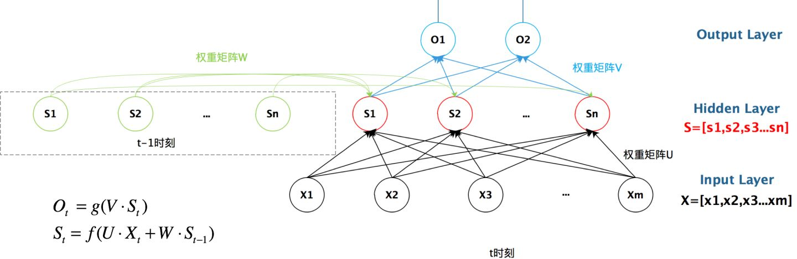
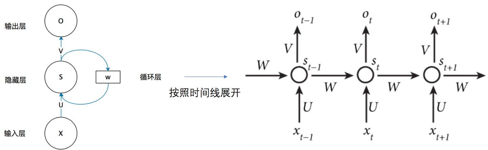
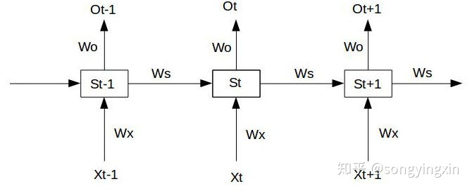
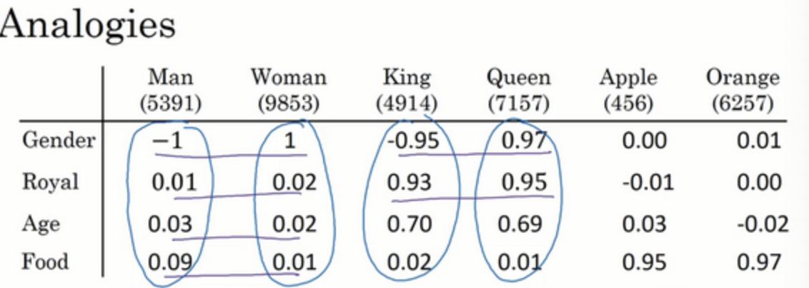
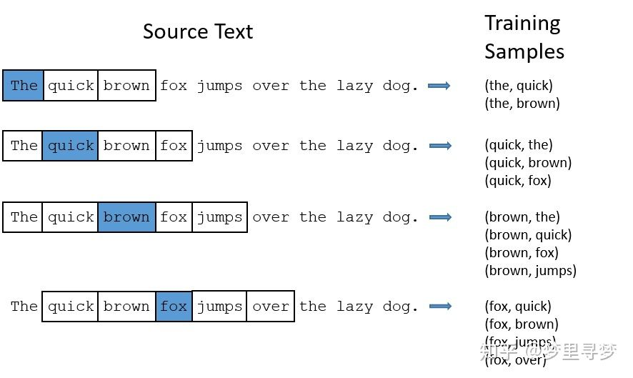

# 循环序列模型（Recurrent Neural Networks）

## 为什么选择序列模型

他们都只能单独的取处理一个个的输入，前一个输入和后一个输入是完全没有关系的。但是，某些任务需要能够更好的处理**序列**的信息，即前面的输入和后面的输入是有关系的。

> 比如，当我们在理解一句话意思时，孤立的理解这句话的每个词是不够的，我们需要处理这些词连接起来的整个序列；当我们处理视频的时候，我们也不能只单独的去分析每一帧，而要分析这些帧连接起来的整个序列。

## RNN结构

首先看一个简单的循环神经网络如，它由输入层、一个隐藏层和一个输出层组成：

我们现在这样来理解，如果把上面有W的那个带箭头的圈去掉，它就变成了最普通的**全连接神经网络**。x是一个向量，它表示**输入层**的值（这里面没有画出来表示神经元节点的圆圈）；s是一个向量，它表示**隐藏层**的值（这里隐藏层面画了一个节点，你也可以想象这一层其实是多个节点，节点数与向量s的维度相同）；

U是输入层到隐藏层的**权重矩阵**，o也是一个向量，它表示**输出层**的值；V是隐藏层到输出层的**权重矩阵**。

**循环神经网络**的**隐藏层**的值s不仅仅取决于当前这次的输入x，还取决于上一次**隐藏层**的值s。**权重矩阵** W就是**隐藏层**上一次的值作为这一次的输入的权重。

如果我们把上面的图展开，**循环神经网络**也可以画成下面这个样子：

现在看上去就比较清楚了，这个网络在t时刻接收到输入 ![[公式]](https://www.zhihu.com/equation?tex=x_%7Bt%7D) 之后，隐藏层的值是 ![[公式]](https://www.zhihu.com/equation?tex=s_%7Bt%7D) ，输出值是 ![[公式]](https://www.zhihu.com/equation?tex=o_%7Bt%7D) 。关键一点是， ![[公式]](https://www.zhihu.com/equation?tex=s_%7Bt%7D) 的值不仅仅取决于 ![[公式]](https://www.zhihu.com/equation?tex=x_%7Bt%7D) ，还取决于 ![[公式]](https://www.zhihu.com/equation?tex=s_%7Bt-1%7D) 。我们可以用下面的公式来表示**循环神经网络**的计算方法：

用公式表示如下
$$
O_t = g(V\cdot S_t)\\
S_t = f(U \cdot X_t + W \cdot S_{t-1})
$$

## RNN 梯度消失

无论是梯度消失还是梯度爆炸，都是**源于网络结构太深**，造成网络权重不稳定，从本质上来讲是**因为梯度反向传播中的连乘效应。**

我们给定一个三个时间的RNN单元，如下：

我们假设最左端的输入 ![[公式]](https://www.zhihu.com/equation?tex=S_0) 为给定值， 且神经元中没有激活函数（便于分析）， 则前向过程如下：

![[公式]](https://www.zhihu.com/equation?tex=S_1+%3D+W_xX_1+%2B+W_sS_0+%2B+b_1+%5Cqquad+%5Cqquad+%5Cqquad+O_1+%3D+W_oS_1+%2B+b_2+%5C%5C+S_2+%3D+W_xX_2+%2B+W_sS_1+%2B+b_1+%5Cqquad+%5Cqquad+%5Cqquad+O_2+%3D+W_oS_2+%2B+b_2+%5C%5C+S_3+%3D+W_xX_3+%2B+W_sS_2+%2B+b_1+%5Cqquad+%5Cqquad+%5Cqquad+O_3+%3D+W_oS_3+%2B+b_2+%5C%5C)

在 ![[公式]](https://www.zhihu.com/equation?tex=t%3D3) 时刻， 损失函数为 ![[公式]](https://www.zhihu.com/equation?tex=L_3+%3D+%5Cfrac%7B1%7D%7B2%7D%28Y_3+-+O_3%29%5E2) ，那么如果我们要训练RNN时， 实际上就是是对 ![[公式]](https://www.zhihu.com/equation?tex=W_x%2C+W_s%2C+W_o%2Cb_1%2Cb_2) 求偏导， 并不断调整它们以使得 ![[公式]](https://www.zhihu.com/equation?tex=L_3) 尽可能达到最小（参见反向传播算法与梯度下降算法)。

那么我们得到以下公式：

![[公式]](https://www.zhihu.com/equation?tex=%5Cfrac%7B%5Cdelta+L_3%7D%7B%5Cdelta+W_0%7D+%3D+%5Cfrac%7B%5Cdelta+L_3%7D%7B%5Cdelta+O_3%7D+%5Cfrac%7B%5Cdelta+O_3%7D%7B%5Cdelta+W_0%7D+%5C%5C+%5Cfrac%7B%5Cdelta+L_3%7D%7B%5Cdelta+W_x%7D+%3D+%5Cfrac%7B%5Cdelta+L_3%7D%7B%5Cdelta+O_3%7D+%5Cfrac%7B%5Cdelta+O_3%7D%7B%5Cdelta+S_3%7D+%5Cfrac%7B%5Cdelta+S_3%7D%7B%5Cdelta+W_x%7D+%2B+%5Cfrac%7B%5Cdelta+L_3%7D%7B%5Cdelta+O_3%7D+%5Cfrac%7B%5Cdelta+O_3%7D%7B%5Cdelta+S_3%7D+%5Cfrac%7B%5Cdelta+S_3%7D%7B%5Cdelta+S_2%7D+%5Cfrac%7B%5Cdelta+S_2%7D%7B%5Cdelta+W_x%7D+%2B+%5Cfrac%7B%5Cdelta+L_3%7D%7B%5Cdelta+O_3%7D+%5Cfrac%7B%5Cdelta+O_3%7D%7B%5Cdelta+S_3%7D+%5Cfrac%7B%5Cdelta+S_3%7D%7B%5Cdelta+S_2%7D+%5Cfrac%7B%5Cdelta+S_2%7D%7B%5Cdelta+S_1%7D%5Cfrac%7B%5Cdelta+S_1%7D%7B%5Cdelta+W_x%7D+%5C%5C+%5Cfrac%7B%5Cdelta+L_3%7D%7B%5Cdelta+W_s%7D+%3D+%5Cfrac%7B%5Cdelta+L_3%7D%7B%5Cdelta+O_3%7D+%5Cfrac%7B%5Cdelta+O_3%7D%7B%5Cdelta+S_3%7D+%5Cfrac%7B%5Cdelta+S_3%7D%7B%5Cdelta+W_s%7D+%2B+%5Cfrac%7B%5Cdelta+L_3%7D%7B%5Cdelta+O_3%7D+%5Cfrac%7B%5Cdelta+O_3%7D%7B%5Cdelta+S_3%7D+%5Cfrac%7B%5Cdelta+S_3%7D%7B%5Cdelta+S_2%7D+%5Cfrac%7B%5Cdelta+S_2%7D%7B%5Cdelta+W_s%7D+%2B+%5Cfrac%7B%5Cdelta+L_3%7D%7B%5Cdelta+O_3%7D+%5Cfrac%7B%5Cdelta+O_3%7D%7B%5Cdelta+S_3%7D+%5Cfrac%7B%5Cdelta+S_3%7D%7B%5Cdelta+S_2%7D+%5Cfrac%7B%5Cdelta+S_2%7D%7B%5Cdelta+S_1%7D%5Cfrac%7B%5Cdelta+S_1%7D%7B%5Cdelta+W_s%7D+%5C%5C)

将上述偏导公式与第三节中的公式比较，我们发现， 随着神经网络层数的加深对 ![[公式]](https://www.zhihu.com/equation?tex=W_0) 而言并没有什么影响， 而对 ![[公式]](https://www.zhihu.com/equation?tex=W_x%2C+W_s) 会随着时间序列的拉长而产生梯度消失和梯度爆炸问题。

根据上述分析整理一下公式可得， 对于任意时刻t对 ![[公式]](https://www.zhihu.com/equation?tex=W_x%2C+W_s) 求偏导的公式为：

![[公式]](https://www.zhihu.com/equation?tex=%5Cfrac%7B%5Cdelta+L_t%7D%7B%5Cdelta+W_x+%7D+%3D+%5Csum_%7Bk%3D0%7D%5Et+%5Cfrac%7B%5Cdelta+L_t%7D%7B%5Cdelta+O_t%7D+%5Cfrac%7B%5Cdelta+O_t%7D%7B%5Cdelta+S_t%7D%28+%5Cprod_%7Bj%3Dk%2B1%7D%5Et+%5Cfrac%7B%5Cdelta+S_j%7D%7B%5Cdelta+S_%7Bj-1%7D%7D+%29+%5Cfrac%7B+%5Cdelta+S_k+%7D%7B%5Cdelta+W_x%7D+%5C%5C+%5Cfrac%7B%5Cdelta+L_t%7D%7B%5Cdelta+W_s+%7D+%3D+%5Csum_%7Bk%3D0%7D%5Et+%5Cfrac%7B%5Cdelta+L_t%7D%7B%5Cdelta+O_t%7D+%5Cfrac%7B%5Cdelta+O_t%7D%7B%5Cdelta+S_t%7D%28+%5Cprod_%7Bj%3Dk%2B1%7D%5Et+%5Cfrac%7B%5Cdelta+S_j%7D%7B%5Cdelta+S_%7Bj-1%7D%7D+%29+%5Cfrac%7B+%5Cdelta+S_k+%7D%7B%5Cdelta+W_s%7D)

我们发现， 导致梯度消失和爆炸的就在于 ![[公式]](https://www.zhihu.com/equation?tex=%5Cprod_%7Bj%3Dk%2B1%7D%5Et+%5Cfrac%7B%5Cdelta+S_j%7D%7B%5Cdelta+S_%7Bj-1%7D%7D) ， 而加上激活函数后的S的表达式为：

![[公式]](https://www.zhihu.com/equation?tex=S_j+%3D+tanh%28W_xX_j+%2B+W_sS_%7Bj-1%7D+%2B+b_1%29+)

那么则有：

![[公式]](https://www.zhihu.com/equation?tex=%5Cprod_%7Bj%3Dk%2B1%7D%5Et+%5Cfrac%7B%5Cdelta+S_j%7D%7B%5Cdelta+S_%7Bj-1%7D%7D+%3D+%5Cprod_%7Bj%3Dk%2B1%7D%5Et+tanh%27+W_s)

而在这个公式中， tanh的导数总是小于1 的， 如果 ![[公式]](https://www.zhihu.com/equation?tex=W_s) 也是一个大于0小于1的值， 那么随着t的增大， 上述公式的值越来越趋近于0， 这就导致了梯度消失问题。 那么如果 ![[公式]](https://www.zhihu.com/equation?tex=W_s) 很大， 上述公式会越来越趋向于无穷， 这就产生了梯度爆炸。

## LSTM

RNN产生梯度消失与梯度爆炸的原因就在于 ![[公式]](https://www.zhihu.com/equation?tex=%5Cprod_%7Bj%3Dk%2B1%7D%5Et+%5Cfrac%7B%5Cdelta+S_j%7D%7B%5Cdelta+S_%7Bj-1%7D%7D+) ， 如果我们能够将这一坨东西去掉， 我们的不就解决掉梯度问题了吗。 LSTM通过门机制来解决了这个问题。

我们先从LSTM的三个门公式出发：

- 遗忘门： ![[公式]](https://www.zhihu.com/equation?tex=f_t+%3D+%5Csigma%28+W_f+%5Ccdot+%5Bh_%7Bt-1%7D%2C+x_t%5D+%2B+b_f%29)
- 输入门： ![[公式]](https://www.zhihu.com/equation?tex=i_t+%3D+%5Csigma%28W_i+%5Ccdot+%5Bh_%7Bt-1%7D%2C+x_t%5D+%2B+b_i%29)
- 输出门： ![[公式]](https://www.zhihu.com/equation?tex=o_t+%3D+%5Csigma%28W_o+%5Ccdot+%5Bh_%7Bt-1%7D%2C+x_t+%5D+%2B+b_0+%29)
- 当前单元状态 ![[公式]](https://www.zhihu.com/equation?tex=c_t) : ![[公式]](https://www.zhihu.com/equation?tex=c_t+%3D+f_t+%5Ccirc+c_%7Bt-1%7D+%2B+i_t+%5Ccirc+tanh%28W_c+%5Ccdot+%5Bh_%7Bt-1%7D%2C+x_t%5D+%2B+b_c+%29)
- 当前时刻的隐层输出： ![[公式]](https://www.zhihu.com/equation?tex=h_t+%3D+o_t+%5Ccirc+tanh%28c_t%29)

我们注意到， 首先三个门的激活函数是sigmoid， 这也就意味着这三个门的输出要么接近于0 ， 要么接近于1。这就使得 ![[公式]](https://www.zhihu.com/equation?tex=%5Cfrac%7B%5Cdelta+c_t%7D%7B%5Cdelta+c_%7Bt-1%7D%7D+%3D+f_t%EF%BC%8C+%5Cfrac%7B%5Cdelta+h_t%7D%7B%5Cdelta+h_%7Bt-1%7D%7D+%3D+o_t) 是非0即1的，当门为1时， 梯度能够很好的在LSTM中传递，很大程度上减轻了梯度消失发生的概率， 当门为0时，说明上一时刻的信息对当前时刻没有影响， 我们也就没有必要传递梯度回去来更新参数了。所以， 这就是为什么通过门机制就能够解决梯度的原因： 使得单元间的传递 ![[公式]](https://www.zhihu.com/equation?tex=%5Cfrac%7B%5Cdelta+S_j%7D%7B%5Cdelta+S_%7Bj-1%7D%7D) 为0 或 1。

## GRU

GRU是另一种十分主流的RNN衍生物。 RNN和LSTM都是在设计网络结构用于缓解梯度消失问题，只不过是网络结构有所不同。GRU在数学上的形式化表示如下：
$$
z_t :=sigm(W_{xz}x_t+W_{hz}h_{t-1}),\\
r_t: =sigm(W_{xr}x_t+W_{hr}h_{t-1}),\\
\overline{h}_t :=tanh(W_{xh}x_t+r_t\odot(W_{hh}h_{t-1})),\\
h_t:=(1-z_t)\odot \overline{h}_t+z_t\odot h_{t-1}
$$

- **重置门** ![[公式]](https://www.zhihu.com/equation?tex=r_t) ： ![[公式]](https://www.zhihu.com/equation?tex=r_t) 用于控制前一时刻隐层单元 ![[公式]](https://www.zhihu.com/equation?tex=%5Cboldsymbol+h_%7Bt-1%7D) 对当前词 ![[公式]](https://www.zhihu.com/equation?tex=%5Cboldsymbol+x_t) 的影响。如果 ![[公式]](https://www.zhihu.com/equation?tex=%5Cboldsymbol+h_%7Bt-1%7D) 对 ![[公式]](https://www.zhihu.com/equation?tex=%5Cboldsymbol+x_t) 不重要， 即从当前词 ![[公式]](https://www.zhihu.com/equation?tex=%5Cboldsymbol+x_t) 开始表述了新的意思，与上文无关。那么开关 ![[公式]](https://www.zhihu.com/equation?tex=r_t) 可以打开，使得 ![[公式]](https://www.zhihu.com/equation?tex=%5Cboldsymbol+h_%7Bt-1%7D) 对 ![[公式]](https://www.zhihu.com/equation?tex=%5Cboldsymbol+x_t) 不产生影响。
- **更新门** ![[公式]](https://www.zhihu.com/equation?tex=z_t) ： ![[公式]](https://www.zhihu.com/equation?tex=z_t) 用于决定是否忽略当前词 ![[公式]](https://www.zhihu.com/equation?tex=%5Cboldsymbol+x_t) 。类似于LSTM中的输入门 ![[公式]](https://www.zhihu.com/equation?tex=i_t) ， ![[公式]](https://www.zhihu.com/equation?tex=z_t) 可以判断当前词 ![[公式]](https://www.zhihu.com/equation?tex=%5Cboldsymbol+x_t) 对整体意思的表达是否重要。当 ![[公式]](https://www.zhihu.com/equation?tex=z_t) 开关接通下面的支路时，我们将忽略当前词 ![[公式]](https://www.zhihu.com/equation?tex=%5Cboldsymbol+x_t) ，同时构成了从 ![[公式]](https://www.zhihu.com/equation?tex=%5Cboldsymbol+h_%7Bt-1%7D) 到 ![[公式]](https://www.zhihu.com/equation?tex=%5Cboldsymbol+h_t) 的短路连接，这使得梯度得已有效地反向传播。和LSTM相同，这种短路机制有效地缓解了梯度消失现象，这个机制于highway networks十分相似。

# 自然语言处理与词嵌入（Natural Language Processing and Word Embeddings） 

## 词汇表征 Word Representation

一般地，第一步我们会将每一个单词转换为一个onehot向量，假如我们使用的词典有10000个单词，那么每个单词转换为onehot向量后都是一个10000*1的向量，这个向量中只有单词所在的位置为1其余位置都为0；第二步便可以将这三个单词进行比较相似度了（采用余弦相似度或者欧式距离等）。如不出意外，我们发现这三个单词两两的相似度是相同的，那这是否意味着这3个句子都是不相关或者相关度是一样的呢？显然不是的。

在将这三个句子进行聚类时，我们首先将这个句子中的每个单词进行了onehot向量化，但是这个onehot向量把每个词都孤立起来，这样使得算法对相关词的泛化能力不强。例如apple和orange都属于水果，他们的形状都是圆的，都是可以可吃的等等具有多个相似性的特征，而iPhone属于手机，形状一般是方形，但是向量化onehot后并不能将这些特征表示出来，它只是显示出他们在词典中的位置。显然，如果我们能换一种表示，将这些单词的特征都表示出来，对我们的聚类无疑是非常有帮助的。

词嵌入（word embedding）便是这样将一个单词的表示特征化的技术。词嵌入相当于将一个单词嵌入到一个多维的特征矩阵中，在每个维度的的值代表着这个单词在这个维度的特征。

对于这些词，比如我们想知道这些词与 Gender（ 性别）的关系。假定男性的性别为-1，女性的性别为+1，那么 man 的性别值可能就是-1，而 woman 就是-1。最终根据经验 king 就是-0.95， queen 是+0.97， apple 和 orange 没有性别可言。

另一个特征可以是这些词有多 Royal（ 高贵），所以这些词， man， woman 和高贵没太关系，所以它们的特征值接近 0。而 king 和 queen 很高贵， apple 和 orange 跟高贵也没太大关系。

那么 Age（ 年龄）呢？ man 和 woman 一般没有年龄的意思，也许 man 和 woman 隐含着成年人的意思，但也可能是介于 young 和 old 之间，所以它们（ man 和 woman）的值也接近 0。而通常 king 和 queen 都是成年人， apple 和 orange 跟年龄更没什么关系了。

所以你可以想很多的特征，为了说明，我们假设有 300 个不同的特征，这样的话你就有了这一列数字（上图编号 1 所示），这里只写了几个，实际上是 300 个数字，这样就组成了一个 300 维的向量来表示 man 这个词。

假设词典的单词量为10000，所以，我们的词表征矩阵（或称为特征矩阵）就是这么一个300*10000的矩阵，而词嵌入（word embedding）的过程其实也就是将这个词特征矩阵与onehot后的词向量相乘，这样就得到了某个单词的特征向量。你可以将某个词的词嵌入过程视为将某个单词嵌入到一个300维的特征空间中的一个点，这也是术语嵌入的来源。那么词表征矩阵是怎么得来的呢，实际上他也是通过神经网络学习得到的。

## 使用词嵌入

词嵌入还有一个迷人的特性就是它还能帮助实现类比推理，尽管类比推理可能不是自然语言处理应用中最重要的，不过它能帮助人们理解词嵌入做了什么，以及词嵌入能够做什么。

这是一系列你希望词嵌入可以捕捉的单词的特征表示，假如我提出一个问题，**man**如果对应**woman**，那么**king**应该对应什么？你们应该都能猜到**king**应该对应**queen**。能否有一种算法来自动推导出这种关系，下面就是实现的方法。

我们用一个四维向量来表示**man**，我们用$e_{5391}$来表示，不过在这节视频中我们先把它（上图编号1所示）称为$e_{man}$，而旁边这个（上图编号2所示）表示**woman**的嵌入向量，称它为$e_{woman}$，对**king**和**queen**也是用一样的表示方法。在该例中，假设你用的是四维的嵌入向量，而不是比较典型的50到1000维的向量。这些向量有一个有趣的特性，就是假如你有向量$e_{man}$和$e_{woman}$，将它们进行减法运算。

可以发现，**man**和**woman**主要的差异是**gender**（**性别**）上的差异，而**king**和**queen**之间的主要差异，根据向量的表示，也是**gender**（**性别**）上的差异，这就是为什么他们差值结果是相同的。

这种思想首先是被**Tomas Mikolov** 和 **Wen-tau Yih**还有**Geoffrey Zweig**提出的，这是词嵌入领域影响力最为惊人和显著的成果之一，这种思想帮助了研究者们对词嵌入领域建立了更深刻的理解。

## Word2vec

**Word2vec 是 Word Embedding 的方法之一**。他是 2013 年由谷歌的 Mikolov 提出了一套新的词嵌入方法。

在 Word2vec 出现之前，已经有一些 Word Embedding 的方法，但是之前的方法并不成熟，也没有大规模的得到应用。

CBOW(Continuous Bag-of-Words Model)和Skip-gram (Continuous Skip-gram Model)，是Word2vec 的两种训练模式。下面简单做一下解释：

**CBOW**

通过上下文来预测当前值。相当于一句话中扣掉一个词，让你猜这个词是什么

**Skip-gram**

用当前词来预测上下文。相当于给你一个词，让你猜前面和后面可能出现什么词。

为了提高速度，Word2vec 经常采用 2 种加速方式：

1. Negative Sample（负采样）
2. Hierarchical Softmax

优点：

1. 由于 Word2vec 会考虑上下文，跟之前的 Embedding 方法相比，效果要更好（但不如 18 年之后的方法）
2. 比之前的 Embedding方 法维度更少，所以速度更快
3. 通用性很强，可以用在各种 NLP 任务中

缺点：

1. 由于词和向量是一对一的关系，所以多义词的问题无法解决。
2. Word2vec 是一种静态的方式，虽然通用性强，但是无法针对特定任务做动态优化

## 负采样

针对skip-gram以及CBOW的算法训练，当面对百万级的文本，就算是隐藏层是检索功能，其计算量也是相当大，而且还会造成冗余计算，这时候**对高频词抽样以及负采样**就应运而生了。

举例，原始文本为“The quick brown fox jumps over the laze dog”，如果我使用大小为2的窗口，那么我们可以得到图中展示的那些训练样本。

但是对于“the”这种常用高频单词，这样的处理方式会存在下面两个问题：

1. 当我们得到成对的单词训练样本时，("fox", "the") 这样的训练样本并不会给我们提供关于“fox”更多的语义信息，因为“the”在每个单词的上下文中几乎都会出现。
2. 由于在文本中“the”这样的常用词出现概率很大，因此我们将会有大量的（”the“，...）这样的训练样本，而这些样本数量远远超过了我们学习“the”这个词向量所需的训练样本数。

Word2Vec通过“抽样”模式来解决这种高频词问题。它的基本思想如下：**对于我们在训练原始文本中遇到的每一个单词，它们都有一定概率被我们从文本中删掉，而这个被删除的概率与单词的频率有关。**

## 情感分类

