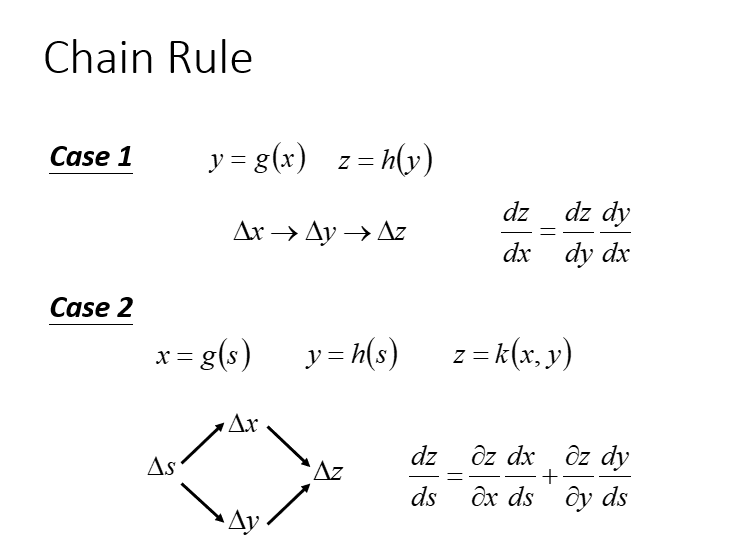

# Introduction to deep learning 

深度学习的三步走：

- Step1：神经网络（Neural network）
- Step2：模型评估（Goodness of function）
- Step3：选择最优函数（Pick best function）

## Step1 神经网络

神经网络也可以有很多不同的连接方式，这样就会产生不同的结构（structure）在这个神经网络里面，我们有很多逻辑回归函数，其中每个逻辑回归都有自己的权重和自己的偏差，这些权重和偏差就是参数。 那这些神经元都是通过什么方式连接的呢？其实连接方式都是你手动去设计的。

## Step2 模型评估

对于模型的评估，我们一般采用损失函数来反应模型的好差，所以对于神经网络来说，我们采用交叉熵（cross entropy）函数来对$y$和$\hat{y}$的损失进行计算，接下来我们就是调整参数，让交叉熵越小越好。

## Step3 选择最优函数

如何找到最优的函数和最好的一组参数呢，我们用的就是梯度下降，

# Basics of Neural Network programming

在神经网络的计算中，通常先有一个叫做前向暂停(**forward pause**)或叫做前向传播(**foward propagation**)的步骤，接着有一个叫做反向暂停(**backward pause**) 或叫做反向传播**(backward propagation**)的步骤。

## 梯度下降

- 给到 $\theta$(weight and bias)
- 先选择一个初始的 $\theta^0$，计算 $\theta^0$ 的损失函数（Loss Function）设一个参数的偏微分
- 计算完这个向量（vector）偏微分，然后就可以去更新的你$\theta$
- 百万级别的参数（millions of parameters）
- 反向传播（Backpropagation）是一个比较有效率的算法，让你计算梯度（Gradient） 的向量（Vector）时，可以有效率的计算出来

## 链式法则

- 连锁影响(可以看出x会影响y，y会影响z)
- BP主要用到了chain rule

## 前向反向传播

前向传播算法就是：**将上一层的输出作为下一层的输入，并计算下一层的输出，一直到运算到输出层为止。**

**反向传播**（back propagation, **BP**）算法是 "误差反向传播" 的简称，也称为**backprop**，允许来自代价函数的信息通过网络向后流动，以便计算梯度。

我们的目标是要求计算$\frac{\partial z}{\partial w}$（Forward pass的部分）和计算$\frac{\partial l}{\partial z}$( Backward pass的部分 )，然后把$\frac{\partial z}{\partial w}$和$\frac{\partial l}{\partial z}$相乘，我们就可以得到$\frac{\partial l}{\partial w}$,所有我们就可以得到神经网络中所有的参数，然后用梯度下降就可以不断更新，得到损失最小的函数

