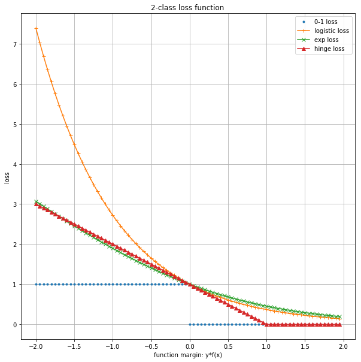

# 统计学习方法

方法=模型+策略+算法

监督学习, 非监督学习, 强化学习都有这样的三要素.

这里回顾一下第一章的统计学习三要素:

1. **模型**
   1. 监督学习中, 模型就是所要学习的条件概率分布或者决策函数.
2. **策略**
   1. 统计学习的目标在于从假设空间中选取最优模型.
   2. 损失函数度量一次预测的好坏; **风险函数**度量平均意义下模型预测的好坏.
   3. 经验风险最小化(ERM)与结构风险最小化(SRM)
   4. 经验风险或者结构风险是最优化的目标函数.
3. **算法**
   1. 统计学习基于训练数据集, 根据学习策略, 从假设空间中选择最优模型, 最后需要考虑用干什么样的计算方法求解**最优模型**.
   2. 统计学习问题转化为最优化问题.
      1. 有显式解析解, 对应的最优化问题比较简单
      2. 通常解析解不存在, 需要通过数值计算的方式求解.
   3. 算法需要解决的问题是如何找到**全局最优解**, 并且求解的过程非常高效

# 不同视角

这本书的内容可以从多个角度进行划分

1. 简单分类方法
   1. 感知机
   2. k近邻法
   3. 朴素贝叶斯法
   4. 决策树
2. 复杂分类方法
   1. 逻辑斯谛回归模型
   2. 最大熵
   3. 支持向量机
   4. 提升方法
3. 标注方法
   1. 隐马尔科夫模型
   2. 条件随机场

# 模型

分类问题与标注问题都可以认为是从输入空间到输出空间的映射。

**他们可以写成条件概率分布$P(Y|X)$或者决策函数$Y=f(x)$的形式。**

## 概率模型和非概率模型

对应**概率模型**和**非概率模型**.

1. 概率模型(由条件概率表示的模型)
   1. 朴素贝叶斯
   1. 隐马尔科夫模型
1. 非概率模型(由决策函数表示的模型)
   1. 感知机
   1. k近邻
   1. 支持向量机
   1. 提升方法
1. 概率模型和非概率模型
   1. 决策树
   1. 逻辑斯谛回归模型
   1. 最大熵模型
   1. 条件随机场

## 生成模型和判别模型

1. 判别模型
   1. 直接学习条件概率分布$P(Y|X)$或者决策函数$Y=f(X)$的方法为判别方法，对应的模型为判别模型。
   1. 感知机，k近邻，决策树，逻辑斯谛回归模型，最大熵模型，支持向量机，提升方法，条件随机场
1. 生成模型
   1. 先学习联合概率分布$P(X, Y)$，从而求得条件概率分布$P(Y|X)$的方法是生成方法，对应的模型是生成模型。
   1. 朴素贝叶斯，隐马尔科夫模型

## 线性模型和非线性模型

1. 线性模型
   1. 感知机
1. 对数线性模型
   1. 逻辑斯谛回归模型
   1. 最大熵模型
   1. 条件随机场
1. 非线性模型
   1. k近邻
   1. 决策树
   1. 支持向量机(核函数)
   1. 提升方法

## 生成与判别, 分类与标注

|      | 判别   | 生成 |
| ---- | ------ | ---- |
| 分类 | LR, ME | NB   |
| 标注 | CRF    | HMM  |

# 学习策略

## 损失函数

注意，书中这里描述的是，**在二分类的监督问题中**，后面会在这个基础上做推广。

1. 合页损失

   线性支持向量机

   $max(0, 1- yf(x)) $

1. 逻辑斯谛损失函数

   逻辑斯谛回归模型与最大熵模型

   $log(1+exp(-yf(x)))$

1. 指数损失函数

   提升方法

   $exp(- yf(x))$

三种损失函数都是0-1损失函数的上界. 

