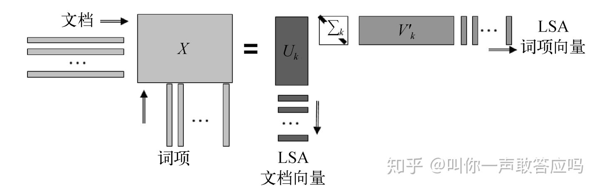

潜在语义分析(LSA)是一种用于知识获取和展示的计算理论和方法，出发点就是**文本中的词与词之间存在某种联系**，即存在某种潜在的语义结构。这种潜在的语义结构**隐含在文本中词语的上下文使用模式中**。因此采用统计计算的方法，对大量的文本中进行分析来寻找这种潜在的语义结构，它不需要确定的语义编码，仅依赖于上下文中事物的联系，并用语义结构来表示词和文本，达到消除词之间的相关性，简化文本向量的目的。

# 单词向量空间与话题向量空间

单词向量空间模型通过单词的向量表示·文本的寓意内容，以单词-文本矩阵X维输入，其中每一行对应一个单词，每一列对应一个文本，每一个元素表示单词在文本中的频数或权值。
$$
X=  \left[
 \begin{matrix}
   x_{11} & x_{12} & ... & x_{1n} \\
   x_{21} & x_{22} & ... & x_{2n} \\
   ... & ... & ... & ...\\
   x_{m1}& x_{m2}&...& x_{mn}
  \end{matrix}
  \right]
$$
**每一列向量就是单词向量**，表示一个文本，两个单词向量的内积或标准化内积表示文本之间的语义相似度。

话题向量空间模型通过话题的向量表示文本的语义内容。

假设有话题-文本矩阵：
$$
Y=  \left[
 \begin{matrix}
   y_{11} & y_{12} & ... & y_{1n} \\
   y_{21} & y_{22} & ... & y_{2n} \\
   ... & ... & ... & ...\\
   y_{k1}& y_{k2}&...& y_{kn}
  \end{matrix}
  \right]
$$
其中每一行对应一个话题，每一列对应一个文本，每一个元素表示话题在文本中的权值。这个剧真的每一列向量是话题向量，表示一个文本，两个话题向量的内积或标准化内积表示文本之间的语义相似度。

假设有单词-话题矩阵
$$
T=  \left[
 \begin{matrix}
   t_{11} & y_{12} & ... & y_{1k} \\
   t_{21} & y_{22} & ... & y_{2k} \\
   ... & ... & ... & ...\\
   t_{m1}& y_{m2}&...& y_{mk}
  \end{matrix}
  \right]
$$
其中每一行对应一个单词，每一列对应一个话题，每一个元素表示单词在话题中的权值。

**得到**
$$
X \approx TY
$$

