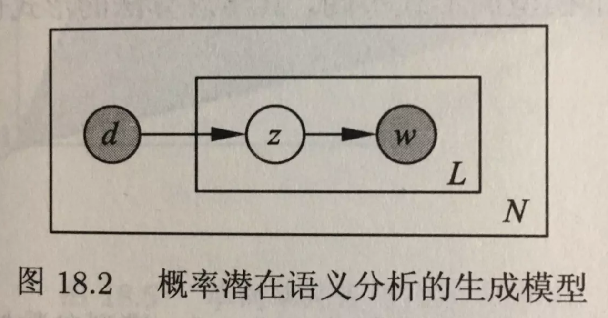

概率潜在语义分析（Probabilistic Latent Semantic Analysis，PLSA）是一种利用概率生成模型对文本集合进行话题分析的无监督学习方法。**模型最大特点是用隐变量表示话题。整个模型表示文本生成话题，话题生成单词。假设每个文本由一个话题分布决定，每个话题由一个单词分布决定。**

# 生成模型

生成模型中，单词变量与文本变量是观测变量，话题变量是隐变量。也就是说模型生成的是单词-话题-文本三元组)三元组的集合，但观测到的是单词-文本二元组)的集合。观测数据表示为单词-文本矩阵的形式，的行表示单词，列表示文本，元素表示单词-文本对)出现的次数。

从数据生成过程可以推出，文本-单词共现数据出现的概率为：

%3D%5Cprod_%7B(w%2Cd)%7DP(w%2Cd)%5E%7Bn(w%2Cd)%7D)

)表示)出现的次数，每个单词-文本对生成的概率如下：

%26%3DP(d)P(w%7Cd)%5C%5C%20%26%3DP(d)%5Csum_z%20P(w%2Cz%7Cd)%5C%5C%20%26%3DP(d)%5Csum_z%20P(z%7Cd)P(w%7Cz)%20%5Cend%7Baligned%7D)

最后一个等号基于在话题给定条件下单词与文本条件独立的假设：

%3DP(z%7Cd)P(w%7Cz))

# 共现模型

与生成模型一样，文本-单词共现数据出现的概率为：

%3D%5Cprod_%7B(w%2Cd)%7DP(w%2Cd)%5E%7Bn(w%2Cd)%7D)

每个单词-文本对生成的概率如下：

%3D%5Csum_%7Bz%5Cin%20Z%7DP(z)P(w%7Cz)P(d%7Cz))

共现模型同样假设在话题给定条件下单词与文本条件独立：

%3DP(w%7Cz)P(d%7Cz))

其直观图示如下：

容易验证**生成模型和共现模型是等价的。**但两者性质不同，生成模型中单词变量和文本变量是不对称的，而共现模型中单词变量和文本变量是对称的。因此两个模型的学习算法形式也有所不同。

