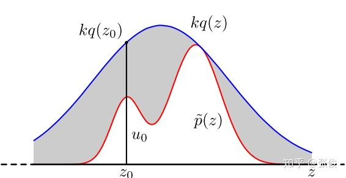

# 概览

马尔科夫蒙特卡洛法（Markov Chain Monte Carlo, MCMC）经常用在贝叶斯概率模型的推理和学习中，主要是为了解决计算困难的问题。

日常中我们会用采样的方法采集样本，进行近似的数值计算，比如计算样本均值，方差，期望。虽然许多常见的概率密度函数（t 分布，均匀分布，正态分布），我们都可以直接在 Numpy，Scikit-Learn 中找到，但很多时候，一些概率密度函数，特别是高维的概率密度函数，并不是常见的分布，这个时候我们就需要用到 MCMC。

# 蒙特卡洛法 Monte Carlo

蒙特卡洛法是比较宽泛的一系列算法的统称，它的特点是假设概率分布已知，通过重复的随机采样来获得数值结果。比如根据大数定理，我们可以用采样得到的样本计算得到的样本均值来估计总体期望。又比如，积分的运算往往可以表示为随机变量在一个概率密度函数分布上的期望。

# 接受-拒绝法

假设有一个非常复杂不常见的分布 p(x)，我们没有现成的工具包可以调用后进行采样，那么我们可以用我们已经有的采样分布比如高斯分布作为**建议分布(proposal distribution)**，用 **q(x)** 表示，来进行采样，再按照一定的方法来拒绝当前的样本，使得最后得到的样本尽可能的逼近于 **p(x)**。

首先我们需要**找到一个常数 k 使得 kq(x) 一定大于等于 p(x),** 也就是如图所示，p(x) 在 q(x) 下面。接着对 q(x) 进行采样，假设得到的样本为 ![[公式]](https://www.zhihu.com/equation?tex=z_0) 。然后我们按照均匀分布在 ![[公式]](https://www.zhihu.com/equation?tex=%280%2C+kq%28z_0%29%29) 中采样得到 u。如果 u 落到了图中的灰色区域，则拒绝这次采样，否则接受样本 ![[公式]](https://www.zhihu.com/equation?tex=z_0) 。重复这个过程得到一系列的样本 ![[公式]](https://www.zhihu.com/equation?tex=z_0%2Cz_1%2C%E2%80%A6z_n) 。

在这个过程中，我们可以发现只有当建议分布 q(x) 和复杂分布 p(x) 重合的尽可能多的地方的样本更有可能被接受。那么相反的，如果他们重合部分非常少，那么就会导致拒绝的比例很高，抽样的效率就降低了。很多时候我们时候在高维空间进行采样，所以即使 p(x) 和 q(x) 很接近，两者的差异也可能很大。

我们可以发现接受-拒绝法需要我们提出一个建议分布和常量，而且采样的效率也不高，那么我们就需要一个更一般的方法，就是我们的马尔科夫蒙特卡洛法。不过 MCMC 依旧有个问题, 它的抽样样本不是独立的。到了 Gibbs Sampling 的部分，我们可以看到它做了一些小 trick，来假装使得样本独立。

使用接受-拒绝采样，我们可以解决一些概率分布不是常见的分布的时候，得到其采样集并用蒙特卡罗方法求和得到。但是接受-拒绝采样也只能部分满足我们的需求，在很多时候我们还是很难得到我们的概率分布的样本集。比如之前的第一个问题有时可以解决，但又会产生另一个问题：

1. 对于一些二维分布 ![[公式]](https://www.zhihu.com/equation?tex=p%28x%2Cy%29) ，我们只能得到条件分布 ![[公式]](https://www.zhihu.com/equation?tex=p%28x%7Cy%29%2Cp%28y%7Cx%29) ，却不能得到二维分布的一般形式；
2. 对于复杂非常见分布 ![[公式]](https://www.zhihu.com/equation?tex=p%28x_%7B1%7D%2Cx_%7B2%7D%2C...%2Cx_%7Bn%7D%29) ，我们很难找到合适的 ![[公式]](https://www.zhihu.com/equation?tex=q%28x%29%2Cc) 。

要想将蒙特卡罗方法作为一个通用的采样模拟求和的方法，还的需马尔科夫链的帮忙。

# 马尔科夫链

## 平稳分布

设有马尔科夫链 ![[公式]](https://www.zhihu.com/equation?tex=+X%3D%7BX_0%2C+X_1%2C+%E2%80%A6%2C+X_t%2C+%E2%80%A6%7D) , 其状态空间为 S，转移概率矩阵为 ![[公式]](https://www.zhihu.com/equation?tex=P%3D%28p_%7Bij%7D%29) ，如果存在状态空间 S 上的一个分布：

使得 π=Pπ，则称 π 为马尔科夫链 ![[公式]](https://www.zhihu.com/equation?tex=+X%3D%7BX_0%2C+X_1%2C+%E2%80%A6%2C+X_t%2C+%E2%80%A6%7D) 的平稳分布。

我们可以理解为，当一个初始分布为该马尔科夫链的平稳分布的时候，接下来的任何转移操作之后的结果分布依然是这个平稳分布。注意，马尔科夫链可能存在唯一平稳分布，无穷多个平稳分布，或者不存在平稳分布。

其它定理：

\1. 不可约且非周期的有限状态马尔科夫链，有唯一平稳分布存在。

\2. 不可约、非周期且正常返的马尔科夫链，有唯一平稳分布存在。

其中，不可约和正常返大家请自行查阅相关定义。直观上可以理解为，任何两个状态都是连通的，即从任意一个状态跳转到其它任意状态的概率值大于零。

## 遍历定理

设有马尔科夫链 ![[公式]](https://www.zhihu.com/equation?tex=X%3D%7BX_0%2C+X_1%2C+%5Cdots%2C+X_t%2C+%5Cdots+%7D) ， 其状态空间为 S，若马尔科夫链 X 是不可约、非周期且正常返的，则该马尔科夫链有唯一平稳分布 ![[公式]](https://www.zhihu.com/equation?tex=%5Cpi%3D+%5Cbegin%7Bpmatrix%7D+%5Cpi_1%2C+%5Cpi_2%2C+%5Cdots+%5Cend%7Bpmatrix%7D%5ET) ，且转移概率的极限分布是马尔科夫链的平稳分布。

## 逆马尔科夫链

设有马尔科夫链 ![[公式]](https://www.zhihu.com/equation?tex=+X%3D%7BX_0%2C+X_1%2C+%5Cdots%2C+X_t%2C+%5Cdots+%7D) ，其状态空间为 S，转移概率矩阵为 P，如果有状态分布 ![[公式]](https://www.zhihu.com/equation?tex=%5Cpi%3D+%5Cbegin%7Bpmatrix%7D+%5Cpi_1%2C+%5Cpi_2%2C+%5Cdots+%5Cend%7Bpmatrix%7D%5ET) ，对于任意状态 i,j∈S，对于任意一个时刻 t 满足：

或简写为：

该式也被称之为细致平衡方程。 定理：满足细致平衡方程的状态分布 π 就是该马尔科夫链的平稳分布，即 Pπ=π。因此，可逆马尔科夫链一定有唯一平稳分布，所以可逆马尔科夫链满足遍历定理的条件

