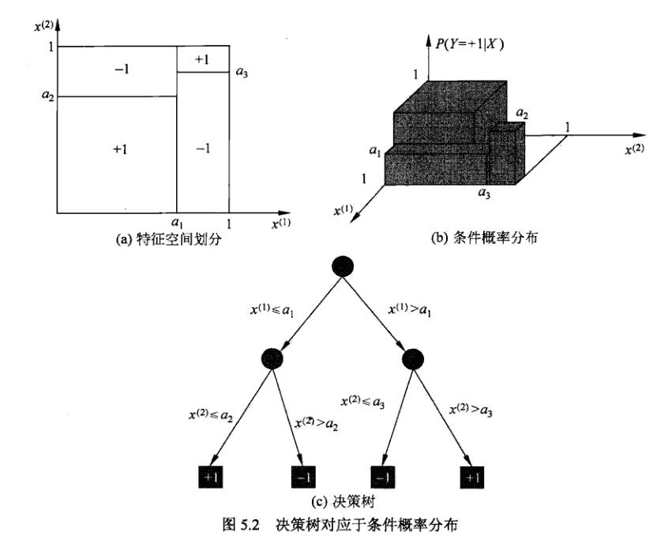
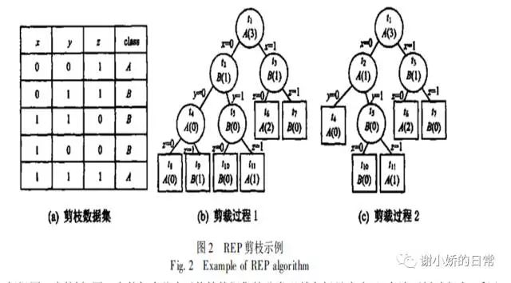
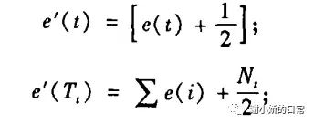

# 决策树模型与学习

决策树学习通常包括3个步骤：特征选择，决策树生成，剪枝。

决策树的内部结点表示一个特征或属性，叶结点表示一个类。

## 决策树模型

分类决策树模型是一种描述对实例进行分类的树形结构。决策树由结点和有向边组成。结点分为内部结点和叶结点。

## 决策树与if-then规则

**If-then**：决策树路径或其对应的if-then规则集合具有一个重要的性质，互斥并且完备，也就是说，每一个实例都被一条路径或一条规则所覆盖，而且只被一条路径或者一条规则覆盖。

## 决策树与条件概率分布

**概率分布**：决策树将特征空间划分为互不相交的单元，并在每个单元定义一个类的概率分布。决策树的一条路径对应于划分中的一个单元，决策树所表示的条件概率分布由各个单元给定条件下类的条件概率分布组成，即$𝑃(𝑌|𝑋)$，叶结点（单元）上的条件概率往往偏向某一类。

## 决策树学习

假设给定训练数据集：
$$
D = {(x_1,y_1),(x_2,y_2),...(x_N,y_N)}
$$
其中，$x_j=(x_j^{(1)},(x_j^{(2)},...,(x_j^{(n)})^T$为输入实例，$n$为特征个数，$y_i \in{1,2,...,K}$为类标记

# 特征选择

## 特征选择问题

## 特征选择问题

特征选择在于选取对训练数据具有分类能力的特征。

如果利用一个特征进行分类的结果与随机分类的结果没有很大区别，则称这个特征是没有分类能力的。经验上扔掉这样的特征对决策树学习的影响不大。

## 信息增益

设$X$是一个取有限个值的离散随机变量，其概率分布为：
$$
P(X=x_i)=p_i,i=1,2,...,n
$$
则随机变量$X$的熵定义为：
$$
H(X)=-\sum_{i=1}^np_ilogp_i
$$
**熵（entropy）**：熵度量的是随机变量的不确定性。熵越大，不确定性越大。

设有随机变量(X,Y)，其联合概率分布为：
$$
P(X=x_i,Y=y_j)=p_{ij},i=1,2,...,n;j=1,2,...,m
$$
条件熵$H(Y|X)$：
$$
H(Y|X)=\sum_{i=1}^np_iH(Y|X=x_i)
$$
同时有：
$$
p_i=P(X=x_i),i=1,2,...,n
$$
**信息增益**
$$
g(D,A)=H(D)-H(D|A)
$$

## 信息增益比

$$
g_R(D,A)=\frac{g(D,A)}{H(D)}
$$

# 决策树的生成

**预剪枝：**
预剪枝就是在树的构建过程（只用到训练集），设置一个阈值（样本个数小于预定阈值或GINI指数小于预定阈值），使得当在当前分裂节点中分裂前和分裂后的误差超过这个阈值则分列，否则不进行分裂操作。

## ID3算法

ID3的核心是在各个结点上应用“信息增益”准则选择特征。

从根结点出发，选择信息增益最大的特征作为结点特征，由该特征的不同取值建立子结点，对子结点递归调用以上方法。直到所有特征的信息增益均很小（设一个阈值$\epsilon$）或没有特征可选为止。

## C4.5的生成算法

对ID3算法进行了改进，生成过程中用信息增益比来选择特征。

## 预剪枝的优缺点

***优点&缺点***

由于预剪枝不必生成整棵决策树，且算法相对简单， 效率很高， 适合解决大规模问题。但是尽管这一方法看起来很直接， 但是 怎样精确地估计何时停止树的增长是相当困难的。

预剪枝有一个缺点， 即视野效果问题 。 也就是说在相同的标准下，也许当前的扩展会造成过度拟合训练数据，但是更进一步的扩展能够满足要求，也有可能准确地拟合训练数据。这将使得算法过早地停止决策树的构造。

# 决策树的剪枝

学习时过多地考虑如何提高对训练数据的正确分类，从而构建出过于复杂的决策树（过拟合）。解决办法是考虑决策树的复杂度，对已生成的树进行简化，这一过程称为剪枝（pruning）。

具体地，从树上裁掉一些子树或叶结点，并将其根结点或父结点作为新的叶结点，从而简化分类树模型。

决策树的剪枝往往通过极小化决策树整体的损失函数来实现。

- REP-错误率降低剪枝

  对于决策树T 的每棵非叶子树$S$ , 用叶子替代这棵子树. 如果$S$被叶子替代后形成的新树关于$D$ 的误差等于或小于$S$ 关于$D$所产生的误差, 则用叶子替代子树$S$

***优点：***

REP 是当前最简单的事后剪枝方法之一。

它的计算复杂性是线性的。

和原始决策树相比，修剪后的决策树对未来新事例的预测偏差较小。

***缺点：***

但在数据量较少的情况下很少应用. REP方法趋于过拟合( overfitting) , 这是因为训练数据集中存在的特性在剪枝过程中都被忽略了, 当剪枝数据集比训练数据集小得多时 , 这个问题特别值得注意

- PEP-悲观剪枝

  为了克服REP方法需要独立剪枝数据集的缺点而提出的, 它不需要分离的剪枝数据集，为了提高对未来事例的预测可靠性, PEP 方法对误差估计增加了连续性校正(continuity correction)。

  

- CCP-代价复杂度剪枝

  CCP 方法就是著名的CART(Classificationand Regression Trees)剪枝算法

- MEP-最小错误剪枝

  MEP 方法的基本思路是采用自底向上的方式, 对于树中每个非叶节点, 首先计算该节点的误差 $Er(t)$ . 然后, 计算该节点每个分枝的误差$Er(Tt)$ , 并且加权相加, 权为每个分枝拥有的训练样本比例. 如果 $Er(t)$ 大于 $Er(Tt)$ , 则保留该子树; 否则, 剪裁它.

# CART

## CART思想

CART算法采用的是一种二分递归分割的技术，将当前样本分成两个子样本集，使得生成的非叶子节点都有两个分支。因此CART实际上是一颗二叉树。

## CART树的特点

- CART不是一颗二叉树

- CART既是分类树又是回归树当CART是分类树的时候，采用GINI值作为分裂节点的依据，
- 当CART作为回归树的时候，使用样本的最小方差作为分裂节点的依据

## 回归树的生成

输入：训练数据集$D$
输出：回归树$f(x)$
在训练数据集所在的输入空间中，递归得将每一个区域划分为两个子区域并决定每个子区域上的输出值，构建二叉决策树：

Step1：选择最优切分变量j和切分点s，求解
$$
min_{j,s}[min_{c1}\sum_{x_i\in R1(j,s)}(y_i−c_1)^2+min_{c2}\sum_{x_i∈R2(j,s)}(y_i−c_2)^2]
$$
遍历变量$j$，对固定的切分变量$j$扫描切分点$s$，选择使上式达到误差最小的变量$(j,s)$，其中$R1$和$R2$表示的是划分之后的空间。

Step2：用选定的$(j,s)$划分区域并决定响应的输出值
$$
R_1(j,s)=\{x^{(j)}\leq s\}
$$

$$
R_2(j,s)=\{x^{(j)}\geq s\}
$$

$$
c_m=\frac{1}{N_m} \sum_{x_ \in R_m(j,s)}y_i,x\in R_m,m=1,2
$$

Step3：继续对两个子区域调用Step1和2,直到满足停止条件。

Step4：将输入空间划分为$M$个区域$R_1,R_2,R_3....R_M$，生成决策树：
$$
f(x)=\sum_{m=1}^{M}c_mI(x \in R_m)
$$

## 分类树的生成

