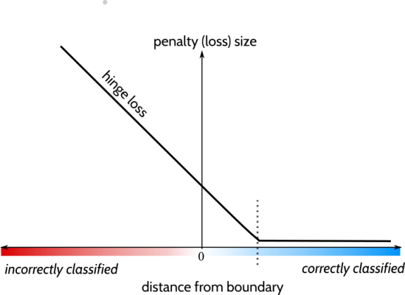
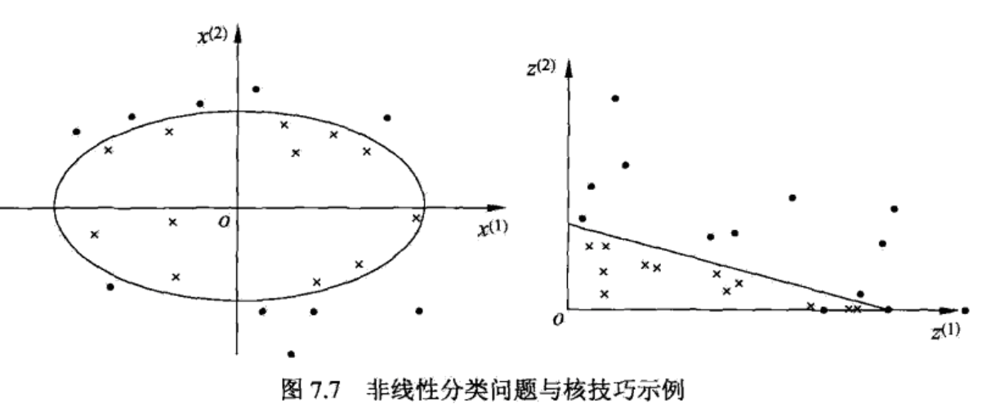

# 线性可分支持向量机与硬间隔最大化

- Linear support vector machine liearly separable case
- linear support vector machine
- Non-linear support vector machine

## 线性可分支持向量机

给定线性可分训练数据集，通过间隔最大化或等价地求解相应的凸二次规划问题学习得到分离超平面：
$$
w^* \cdot x + b ^* = 0
$$
以及相应的分类决策函数：
$$
f(x)=sign(w^* \cdot x + b ^*)
$$

## 函数间隔和几何间隔

**函数间隔：**
$$
\widehat{\gamma^*_i}=y_i(w \cdot x_i + b)
$$

即得到：
$$
\widehat{\gamma}= \min_{1,..,N}\widehat{r_i}
$$

进行规范化得到几何间隔：
$$
\gamma_i=y_i(\frac{w}{||w||} \cdot x_i + b||w||)
$$

即有：
$$
\gamma= \min_{i=1,...N}\gamma_i
$$

建议二者的关系：
$$
\gamma ||w|| = \widehat{\gamma}
$$

## 间隔最大化

**最大间隔分离超平面**
$$
\max_{w,b} \gamma \\
s.t. y_i(\frac{w}{||w||} \cdot x_i+\frac{b}{||w||}) \geq \gamma,i=1,2,...,N
$$
等价于：
$$
\max_{w,b} \frac{\widehat{\gamma}}{||w||} \\
s.t. y_i({w} \cdot x_i+{b}) \geq \widehat{\gamma},i=1,2,...,N
$$
从某种程度上，可以得到如下的最优化问题，假定$\widehat{\gamma}=1$：
$$
\min_{w,b} \frac{1}{2}||w||^2 \\
s.t. y_i(w \cdot x_i+b)-1 \geq 0 i=1,2,...,N
$$
转化为凸二次规划问题即可

**线性可分训练数据集的最大间隔分离超平面是存在且唯一的**

**支持向量和间隔边界**

支持向量是使约束条件式等号成立的点：
$$
y_i = (w \cdot x_i + b)=1
$$
间隔依赖于分离超平面的法向量$w$，等于\frac{2}{w}

## 学习的对偶算法

对偶形式的目的是降低运算量，但是并不是在任何情况下都能降低运算量，而是在特征空间的维度很高时才起到作用。

首先定义拉格朗日函数：
$$
L(w,b,\alpha) = \frac{1}{2}||w||^2+\sum_{i=1}^N\alpha_i(1-y_i(w \cdot x_i+b))
$$
我们首先要明白，如果要满足条件第二部分的值会要小于0，而我们知道系数$\alpha_i$是大于0的，那么这个式子不存在最小值，而对于第一部分又要尽可能的小，所以得到
$$
\max_a\min_{w,b}L(w,b,\alpha)
$$
我们先处理$\min_{w,b}L(w,b,\alpha)$得到：
$$
\bigtriangledown_wL(w,b,\alpha) = w- \sum_{i=1}^N\alpha_iy_ix_i=0
$$
以及：
$$
\bigtriangledown_bL(w,b,\alpha) = \sum_{i=1}^N\alpha_iy_i=0
$$
带入式子有：
$$
L(w,b,\alpha)=\frac{1}{2}\sum_{i=1}^N\sum_{=1}^N\alpha_i\alpha_jy_iy_j（x_i \cdot x_j）-\sum_{i=1}^N\alpha_iy_i((\sum_{j=1}^Na_jy_jx_j)\cdot x_i+b)+\sum_{i=1}^N\alpha_i
$$
得到：
$$
\min_{w,b}L(w,b,\alpha) = -\frac{1}{2}\sum_{i=1}^N\sum_{=1}^N\alpha_i\alpha_jy_iy_j（x_i \cdot x_j）+\sum_{i=1}^N\alpha_i
$$

之后求解对$\alpha$的极大，即是对偶问题：
$$
\min_\alpha \frac{1}{2}\sum_{i=1}^N\sum_{=1}^N\alpha_i\alpha_jy_iy_j（x_i \cdot x_j）-\sum_{i=1}^N\alpha_i \\
s.t. \sum_{i=1}^Na_iy_i=0 \\
\alpha_i \geq 0, i=1,2,...,N
$$
求得最优解：
$$
\alpha ^* = (\alpha_1^*,\alpha_2^*,\alpha_3^*,...\alpha_N^*)^T
$$
选择一个正分量计算：
$$
b^* = y_j -\sum_{i=1}^Na_i^{*}y_i(x_i \cdot x_j)
$$

# 线性支持向量机与软间隔最大化

## 线性支持向量机

**软间隔**：线性可分SVM的学习方法对线性不可分数据是不适用的，因为上述方法中的不等式约束并不能都成立。为了将其扩展到线性不可分问题，需要修改硬间隔最大化，使其称为软间隔最大化。

通常情况是，训练数据中有一些特异点（outlier）。将这些特异点除去后，剩下大部分的样本点组成的集合是线性可分的。

约束条件：
$$
y_i(w \cdot x_i +b) \geq 1-\xi_i
$$
目标函数：
$$
\frac{1}{2}||w||^2+C\sum_{j=1}^N\xi_i
$$
线性不可分的线性支持向量机的学习问题变成如下凸二次规划(convex quadratic programming)问题：
$$
\min_{w,b,\xi}\frac{1}{2}||w||^2+C\sum_{j=1}^N\xi_i \\
s.t. y_i(w \cdot x_i +b)\geq 1-\xi_i i=1,2,...,N\\
\xi_i \geq0, i =1,2,...,N
$$

## 学习的对偶算法

$$
\min_{\alpha} \frac{1}{2}\sum_{i=1}^N\sum_{j=1}^N\alpha_i\alpha_jy_iy_j(x_i \cdot x_j)-\sum_{i=1}^N\alpha_i\\
s.t. \sum_{i=1}^N\alpha_iy_i=0\\
0\leq \alpha_i \leq C,i=1,2,...,N
$$

拉格朗日函数：
$$
L(w,b,\xi,\alpha,\mu)=\frac{1}{2}||w||^2+C\sum_{i=1}^N\alpha_i(y_i(w\cdot x_i+b)-1+\xi_i)-\sum_{i=1}^N \mu_i\xi_i
$$
对$w,b,\xi$求极小：
$$
w= \sum_{i=1}^N\alpha_iy_ix_i=0 \\
\sum_{i=1}^N\alpha_iy_i=0 \\
C-\alpha_i - \mu_i=0
$$
带入：
$$
\min_{w,b,\xi}L(w,b,\xi,\alpha,\mu)=-\frac{1}{2}\sum_{i=1}^N\sum_{j=1}^N\alpha_i\alpha_jy_iy_j(x_i \cdot x_j)+\sum_{i=1}^N\alpha_i
$$
再求其极大值，即得对偶问题：
$$
\max_{\alpha} -\frac{1}{2}\sum_{i=1}^N\sum_{j=1}^N\alpha_i\alpha_jy_iy_j(x_i \cdot x_j)+\sum_{i=1}^N\alpha_i\\
s.t. \sum_{i=1}^N \alpha_iy_i=0\\
C-\alpha_i-\mu_i=0\\
\alpha_i \geq 0
\mu_i \geq 0,i=1,2,..N
$$

## 支持向量

分离超平面

间隔边界
$$
L(w,b,\xi,\alpha,\mu)=\frac{1}{2}||w||^2+C\sum_{i=1}^N\alpha_i(y_i(w\cdot x_i+b)-1+\xi_i)-\sum_{i=1}^N \mu_i\xi_i
$$
得到：
$$
若\alpha^* < C 则 \xi_i=0 支持向量x_i落在间隔边界上\\
若\alpha^* = C 则 0<\xi_i<1 分类正确，x_i间隔边界与分离超平面之间\\
若\alpha^* = C 则 \xi_i=1，则，x_i在分离超平面上\\
若\alpha^* = C 则 \xi_i>1，则x_i误分类 
$$

## 合页损失函数

$$
min \sum_{i=1}^N[1-y_i(w\cdot x_i+b)]_+ +\lambda||w||^2 \\
[z]_+ = \begin {cases}
z, & z>0 \\\
0, & z\leq0
\end {cases}
$$
横轴表示函数间隔，我们从两个方面来理解函数间隔：

- 正负

当样本被正确分类时，$y(wx+b)>0$；当样本被错误分类时，$y(wx+b)<0$。

- 大小

$y(wx+b)$的绝对值代表样本距离决策边界的远近程度。$y(wx+b)$的绝对值越大，表示样本距离决策边界越远。

因此，我们可以知道：

当$y(wx+b)>0$时，$y(wx+b)$的绝对值越大表示决策边界对样本的区分度越好

当$y(wx+b)<0$时，$y(wx+b)$的绝对值越大表示决策边界对样本的区分度越差

**合页损失函数不仅要正确分类，而且确信度足够高时损失才是0。也就是说，合页损失函数对学习有更高的要求。**

# 非线性支持向量机与核函数

主要思想：通过非线性变换，将输入空间对应到特征空间，使得输入空间中的分离超曲面对应到特征空间的分离超平面（svm），这样，原问题可以通过求解特征空间中的线性支持向量机完成。

## 核技巧

**Example**

$$
设原空间为\mathcal{X}	\subset	 R^2,x = (x^{(1)},x^{(2)}) \in \mathcal{X}\\
新空间为Z \subset	 R^2，z = (z^{(1)},z^{(2)}) \in Z\\
定义映射：\\
z = \phi(x)=((x^{(1)})^2,(x^{(2)})^2)^T\\
$$

**核函数的定义**

设$\mathcal{X}$为输入空间，又设$\mathcal{H}$为特征空间（希尔伯特空间）存在映射：
$$
\phi(x): \mathcal{X}\to\mathcal{H}
$$
使得对所有的$x,z \in \mathcal{X}$，函数$K(x,z)$满足条件：
$$
K(x,z)=\phi(x)\cdot \phi(z)
$$
则称$K(x,z)$为核函数，$\phi(x)$为映射函数，$\phi(x)\cdot \phi(z)$为内积。

**核函数在SVM的应用**

在线性SVM的对偶问题中，目标函数和决策函数都只涉及输入实例与实例之间的内积。对偶问题的目标函数中的内积$x_i \cdot x_j$可以用核函数$K(x_i,x_j)=\phi(x_i)\cdot \phi(x_j)$代替。
$$
W(\alpha) = \frac{1}{2}\sum_{i=1}^N\sum_{j=1}^N\alpha_i\alpha_jy_iy_jK(x_i,x_j)-\sum_{i=1}^N\alpha_i
$$
同样可以得到分类决策函数：
$$
f(x)=sign(\sum_{i=1}^{N_s}\alpha_i^*y_iK(x_i,x)+b^*)
$$

## 正定核

上一篇我们的内容是：采用经验方法直接给定一个核函数，这样就避免了通过寻找映射函数来计算内积从而构造出核函数。因为映射函数很难去寻找。

但是是不是随便给一个函数，我们都能称之为核函数呢？肯定不是，所以我们需要对我们选择的核函数进行一些判定——即是否满足**核函数的充要条件**。
$$

$$

