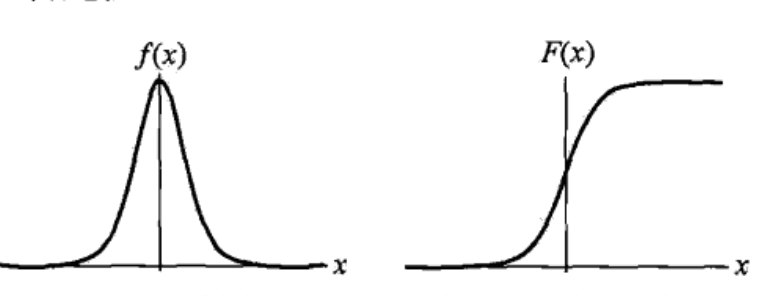

# 逻辑斯谛回归模型

## 逻辑斯谛分布

逻辑斯谛分布：设$X$是连续随机变量，$X$服从逻辑斯谛分布是指$X$具有下列分布函数和密度函数：
$$
F(x)=P(X \le x)=\frac{1}{1+e^{-(x-\mu)/\gamma}}； \mu为位置参数，\gamma>0为形状参数
$$

$$
f(x)=F^`(x)= \frac{e^{-(x-\mu)/\gamma}}{\gamma(1+e^{(x-\mu)/\gamma})^2}
$$

同时该曲线以点$(\mu,\frac{1}{2})$为中心对称：
$$
F(-x+\mu)-\frac{1}{2}=-F(x-\mu)+\frac{1}{2}
$$

## 二项逻辑斯谛回归模型

$$
P(Y=1|x)=\frac{exp(w \cdot x +b)}{1+exp(w \cdot x +b)}
$$

$$
P(Y=0|x)=\frac{1}{1+exp(w \cdot x +b)}
$$
有时可以把$w=(w^{(1)},w^{(2)},...,w^{n},b)^T$，以及x=(x^{(1)},x^{(2)},...,x^{(n)},1)，可以得到新的逻辑斯谛回归模型。

如果事件发生的概率是$p$，那么该事件的几率是$\frac{p}{1-p}$，该事件的对数几率（log odds）或logit函数是：
$$
logit(p)=log\frac{p}{1-p}
$$

更新公式：
$$
log\frac{P(Y=1|x)}{1-P(Y=1|x)} = w \cdot x
$$
继续得到新的公式：
$$
P(Y=1|x)=\frac{exp(w \cdot x)}{1 + exp(w\cdot x)}
$$
这时，线性函数的值越接近正无穷，概率值就越接近1；线性函数的值越接近负无穷，概率值就越接近0.这样的模型就是逻辑斯谛回归模型。

## 模型参数估计

$T=\{(x_1,y_1),(x_2,y_2),...,(x_N,y_N)\} ;x_i\in R^n;y_i \in \{0,1\}$，可以应用极大似然估计法估计模型参数。

Assume：
$$
P(Y=1|x)=\pi(x)
$$

$$
P(Y=0|x)=1-\pi(x)
$$
似然函数为：
$$
\prod_{i=1}^N[\pi(x_i)]^{y_i}[1-\pi(x_i)]^{1-y_i}
$$
对数似然函数为：
$$
L(w)=\sum_{i=1}^N[y_i(w \cdot x_i)]-log(1+exp(w\cdot x_i))
$$
对$L(w)$求极大值，得到w的估计值,便可以得到对应的逻辑斯谛回归模型。

## 多项逻辑斯谛回归

$Y =\{1,2,...,K\}$,得到多项逻辑斯谛回归模型：
$$
P(Y=k|x)=\frac{exp(w_k \cdot x)}{1 +\sum_{k=1}^{K-1}exp(w_k \cdot x)};k=1,2,...K-1
$$

$$
P(Y=K|x)=\frac{1}{1 +\sum_{k=1}^{K-1}exp(w_k \cdot x)}
$$

# 最大熵模型

最大熵原理认为，学习概率模型的时候，在所有可能的概率模型分布中，熵最大的模型是最好的模型。模型通常要满足数据集的约束条件。所以最大熵模型的原理可以被描述为在满足约束条件下熵最大的模型。

假设离散随机变量$X$的概率分布是p(X)，则其熵是：
$$
H(P)=-\sum_xP(x)logP(x)
$$
熵满足以下不等式：
$$
0 \leq H(P) \leq log|X|;|X|是X的取值个数
$$
直观地讲，最大熵原理，认为要选择的概率模型首先要满足已有的事实，即约束条件。然后再不确定信息的情况下，那些不确定的部分都是等可能的。最大熵原理通过熵的最大化来表示可能性，“等可能”不容易操作，但熵则是一个可以优化的数值指标。

eg：世界末日的时候，当我知道你为人类做出巨大贡献时，可以提高你转移的概率，当身份没有区别的时候等可能性是最好的方案（最容易令人信服），最大熵模型就是这个思路

## 最大熵模型的定义

给定一个数据集$T=\{(x_1,y_1),(x_2,y_2),(x_3,y_3),…(x_n,y_n)\}$,首先给出了联合分布$P(X,Y)$的经验分布和边缘分布$P(X))$的经验分布，分别以$\widetilde{P}(X,Y)$和$\widetilde{P}(X)$表示。这里：
$$
\widetilde{P}(X=x,Y=y)=\frac{v(X=x,Y=y)}{N}
$$

$$
\widetilde{P}(X=x)=\frac{v(X=x)}{N}
$$

其中$v(X=x,Y=y)$表示训练数据中样本$(x,y)$中出现的频数，$v(X=x)$表示训练数据中输入$x$出现的频数，$N$表示训练样本容量。

用特征函数（feature function）$f(x,y)$描述输入$x$与输出 $y$之间的某一事实（约束），其定义为：
$$
\begin{equation}
f(x,y) = \begin{cases}
1, & x与y满足某一事实 \\
0, & 否则
\end{cases}
\end{equation}
$$

特征函数$f(x,y)$关于经验分布$\widetilde{P}(X,Y)$的期望值，用$E_{\widetilde{p}}(f)$表示：
$$
E_{\widetilde{p}}(f)=\sum_{x,y}\widetilde{P}(x,y)f(x,y)
$$

特征函数$f(x,y)$关于模型$P(Y|X)$与经验分布$\widetilde{P}(X)$的期望值，用$E_{p}(f)$表示：
$$
E_{p}(f)=\sum_{x,y}\widetilde{P}(x)P(y|x)f(x,y)
$$
如果模型能够获取训练数据中的信息，那么就可以假设这两个期望值相等，即：
$$
E_P(f)=E_{\widetilde{p}}(f)
$$

假设满足所有约束条件的模型集合为：
$$
C = \{p \in P | E_p(f_i)=E_\widetilde{p}(f_i),i=1,2,...,n\}
$$
定义在条件概率分布$P(Y|X)$上的条件熵为：
$$
H(P)=-\sum_{x,y}\widetilde{p}(x)P(y|x)logP(y|x)
$$
则模型集合$C$中国条件$H(P)$最大的模型称为最大熵模型。

## 最大熵模型的学习

最大熵模型的学习等价于约束最优化问题：
$$
\max_{P \in C}H(P)=-\sum_{x,y}\widetilde{P}(x)P(y|x)logP(y|x)
$$

$$
s.t. E_p(f_i)=E_{\widetilde{p}}(f_i)
$$

$$
\sum_yP(y|x)=1
$$
按照最优化问题的习惯，将求最大值问题改写为等价的求最小值的问题：
$$
\min_{P \in C}-H(P)=\sum_{x,y}\widetilde{P}(x)P(y|x)logP(y|x)
$$

$$
s.t. E_p(f_i)-E_{\widetilde{p}}(f_i)=0
$$

$$
\sum_yP(y|x)=1
$$
首先，引进拉格朗日乘子$w_0,w_1,w_2,...w_n$，定义拉格朗日函数$L(P,w)$：
$$
L(P,w)=-H(P)+w_0(1-\sum_yP(y|x))+\sum_{i=1}^nw_i(E_{\widetilde{P}}(f_i)-E_p(f_i))
$$
最优化的原始问题是：
$$
\min_{P\in C} \max_w L(P,w)
$$
对偶问题是：
$$
\max_{w} \max_{P\in C} L(P,w)
$$

求解可以变成：
$$
\Psi(w)=\min_{P \in C}L(P,w)=L(P_w,w)
$$
$\Psi(w)$称为对偶函数，同时将其解记作：
$$
P_w = arg\min_{P \in C}L(P,w)=P_w(y|x)
$$
具体地，求$L(P,w)$对$P(y|x)$的偏导数：
$$
L(P,w)=\sum_{x,y}\widetilde{P}(x)P(y|x)logP(y|x)+w_0(1-\sum_yP(y|x))+\sum_{i=1}^nw_i(\sum_{x,y}\widetilde{P}(x,y)f(x,y)-\sum_{x,y}\widetilde{P}(x)P(y|x)f(x,y))
$$

得到：
$$
\frac{\partial L(P,w)}{\partial P(y|x)}=\sum_{x,y}\widetilde{P}(x)(1+logP(y|x))-\sum_y w_0-\sum_{i=1}^nw_i \sum_{x,y}\widetilde{P}(x)f_i(x,y)=0
$$
即：
$$
P(y|x)=\frac{exp(\sum_{i=1}^n)w_if_i(x,y)}{exp(1-w_0)}
$$
由于$\sum_y P(y|x)=1$，得：
$$
P_w(y|x)=\frac{1}{Z_w(x)}exp(\sum_{i=1}^nw_if_i(x,y))
$$
其中：
$$
Z_w(x)=\sum_yexp(\sum_{i=1}^nw_if_i(x,y))
$$
之后求解对偶问题的极大化问题：
$$
\max_w \Psi(w)
$$
即：
$$
w^* = arg \max_w \Psi(w)
$$

## Example

假设随机变量$X$有5个取值$\{A,B,C,D,E\}$，要估计取各个值的概率$P(A),P(B),P(C)P(D),P(E)$，并有如下假设：
$$
P(A)+P(B)=\frac{3}{10}; \\
P(A)+P(B)+P(C)+P(D)+P(E)=1; \\
$$
得到如下公式：
$$
min -H(P)=\sum_{i=1}^5P(y_i)logP(y_i) \\
s.t. P(y_1)+P(y_2) =\widetilde{P}(y_1)+\widetilde{P}(y_2)=\frac{3}{10}\\
\sum_{i=1}^5P{(y_i)}=\sum_{i=1}^5\widetilde{P}(y_i)=1
$$
引入拉格朗日乘子$w_0,w_1$：
$$
L(P,w)= \sum_{i=1}^5P(y_i)logP(y_i)+w_1(P(y_1)+P(y_2)-\frac{3}{10})+w_0(\sum_{i=1}^5P{(y_i)}-1)
$$
根据对偶性：
$$
\max_w \min_PL(P,w)
$$
首先求解极小值，固定$w_0,w_1$：
$$
\frac{\partial L(P,w)}{\partial P(y_1)}=1+logP(y_1)+w_1+w_0\\
\frac{\partial L(P,w)}{\partial P(y_2)}=1+logP(y_2)+w_1+w_0\\
\frac{\partial L(P,w)}{\partial P(y_3)}=1+logP(y_3)+w_0\\
\frac{\partial L(P,w)}{\partial P(y_4)}=1+logP(y_4)+w_0\\
\frac{\partial L(P,w)}{\partial P(y_5)}=1+logP(y_5)+w_0\\
$$

令偏导数都等于0：
$$
P(y_1)=P(y_2)=e^{-w_0-w_1-1}\\
P(y_3)=P(y_4)=P(y_5)=e^{-w_0-1}
$$
于是可以得到：
$$
\max_wL(P_w,w)=-2e^{-w_0-w_1-1}-3e^{-w_0-1}
$$
分别求偏导数并令其为0：
$$
e^{-w_0-w_1-1}=\frac{3}{20} \\
e^{-w_0-1}=\frac{7}{30}
$$
得到了要求的概率分布：
$$
P(y_1)=P(y_2)=\frac{3}{20}\\
P(y_3)=P(y_4)=P(y_5)=\frac{7}{30}
$$

## 极大似然估计

假设分布率为$P=p(x;θ)$，$x$是发生的样本，$θ$是代估计的参数，$p(x;θ)$表示估计参数为$θ$时，发生$x$的的概率。

那么当我们的样本值为：$x_1,x_2,...,x_n$时：
$$
L(\theta) = L(x_1,x_2,...,x_n;\theta)=\prod_{i=1}^n
p(x_i;\theta)
$$
有$\widehat{\theta}$使得$L(\theta)$的取值最大，即OK

可以证明对偶问题的极大化等价于最大熵模型的极大似然估计。即：
$$
\Psi(w) = L_{\widetilde{p}}(P_w)=log\prod_{x,y}
p(y|x)^{\widetilde{P}(x,y)}=\sum_{x,y}\widetilde{P}(x,y)logP(y|x)
$$
逻辑斯谛回归模型与最大熵模型都属于对数线性模型；他们一般采用极大似然估计，或正则化的极大似然估计。逻辑斯谛回归模型以及最大熵模型学习可以形式华为无约束最优化问题，求解该最优化问题的算法有改进的迭代尺度法、梯度下降法、拟牛顿法。

# 模型学习的最优化算法

## 改进的迭代尺度法

改进的迭代尺度法（improved iterative scaling，IIS）是一种最大熵学习的最优化算法。

已知最大熵模型为：
$$
P_w(y|x)=\frac{1}{Z_w(x)}exp(\sum_{i=1}^nw_if_i(x,y)) \\
Z_w(x)=\sum_yexp(\sum_{i=1}^nw_if_i(x,y))\\
L(w)=\sum_{x,y}\widetilde{P}(x,y)logP(y|x)
$$
得到：
$$
L(w)=\sum_{x,y}\widetilde{P}(x,y)\sum_{i=1}^nw_if_i(x,y)-\sum_{x,y}\widetilde{P}(x,y)logZ_w(x)
$$

# 拟牛顿法

Wait 

