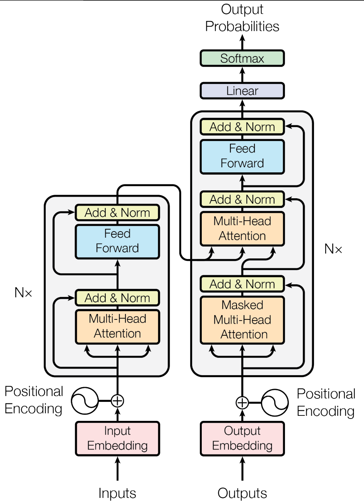
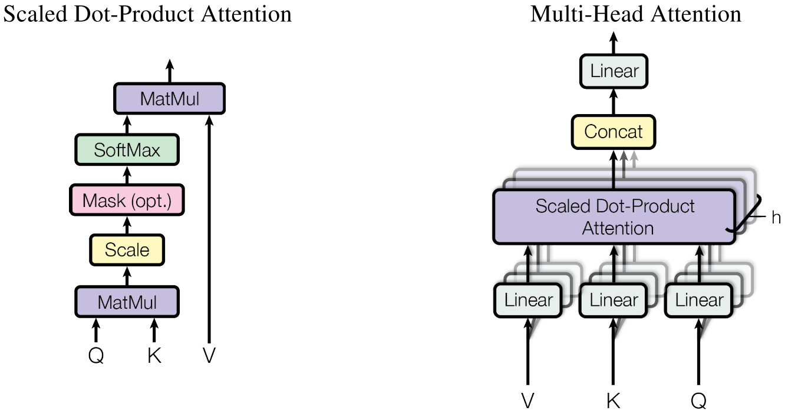

# Attention Is All You Need

## Problems

RNN（或者LSTM，GRU等）的计算限制为是顺序的，也就是说RNN相关算法只能从左向右依次计算或者从右向左依次计算，这种机制带来了两个问题：

1. 循环模型通常是对输入和输出序列的符号位置进行因子计算。 通过在计算期间将位置与步骤对齐，它们根据前一步的隐藏状态$h_{t-1}$和输入产生位置*t*的隐藏状态序列$h_t$。这种固有的顺序特性阻碍样本训练的并行化，这在更长的序列长度上变得至关重要，因为有限的内存限制样本的批次大小。
2. 顺序计算的过程中信息会丢失，尽管LSTM等门机制的结构一定程度上缓解了长期依赖的问题，但是对于特别长期的依赖现象,LSTM依旧无能为力。

## Idea

**Transformer is the first transduction model relying entirely on self-attention to compute representations of its input and output without using sequence aligned RNNs or convolution。**

Transformer中抛弃了传统的CNN和RNN，整个网络结构完全是由Attention机制组成。更准确地讲，Transformer由且仅由self-Attenion和Feed Forward Neural Network组成。一个基于Transformer的可训练的神经网络可以通过堆叠Transformer的形式进行搭建，作者的实验是通过搭建编码器和解码器各6层，总共12层的Encoder-Decoder，并在机器翻译中取得了BLEU值得新高。

- Multi-Head Attention(Scaled Dot-Product Attention 多头注意力机制——点乘注意力的升级版本)

$$
Attention(Q,K,V)=softmax(\frac{QK^T}{\sqrt{d_k}})V
$$

首先计算$q$和$k$的点乘，然后除以$\sqrt{d_k}$，经过softmax得到$v$上的权重分布，最后通过点乘计算$v$得到加权值

在实际中为了并行计算，可以在同一组queries上计算注意力函数，将多个query堆叠成$Q$，同理，keys和values也被堆叠成$K$和$V$。

有两种常用的注意力函数，一种是加法注意力(additive attention)，另外一种是点乘注意力(dot-productattention)，论文所采用的就是点乘注意力，这种注意力机制对于加法注意力而言，更快，同时更节省空间。

输入$q$、$k$、$v$，分别代表query、key-value pair。这里的 key, value 和 query把attention抽象为对 value() 的每个 token进行加权，而加权的weight就是 attention weight，而 attention weight 就是根据 query和 key 计算得到，其意义为：为了用 value求出 query的结果, 根据 query和 key 来决定注意力应该放在value的哪部分。以前的 attention是用 LSTM 做 encoder，也就是用它来生成key 和 value，然后由 decoder来生成 query。

这里$\frac{1}{\sqrt{d_k}}$ 是为了考虑如果点乘的值太大，如果不做scaling，结果就没有加法注意力好，另外，点乘的结果过大，这使得经过softmax之后的梯度很小，不利于反向传播的进行，所以通过对点乘的结果进行尺度化。

对于多头注意力机制而言，发现将query、key和value分别用不同的、学到的线性映射$h$倍到$d_k$、$d_k$和$d_v$维效果更好，而不是用$d_{model}$维的query、key和value执行单个attention函数。 基于每个映射版本的query、key和value，我们并行执行attention函数，产生$d_v$维输出值。 将它们连接并再次映射，产生最终值

Multi-head attention **allows the model to jointly attend to information from different representation subspaces at different positions**. With a single attention head, averaging inhibits this.
$$
MultiHead(Q,K,V) = Concat(head_1,...,head_h)W^O \ \ where head_i = Attention(QW_i^Q,KW_i^K,VW_i^V)
$$
这里$Q \in \mathbb{R} ^{n \times d_K}, \ K \in \mathbb{R}^{m \times d_k}, V \in \mathbb{R}^{m \times d_v}$。

在这项工作中，我们设定$h=8$并行注意力层或者称作heads。对于每个我们设定$d_k =d_v=d_{model}/h=64$。由于每个头部的尺寸减小，因此总维数与单头注意力的全维数相似

- Position-wise feed-Forward Networks(位置全链接前馈网络——MLP变形)

得到$Z$之后，它会被送到encoder的下一个模块，即Feed Forward Neural Network。这个全连接有两层，第一层的激活函数是ReLU，第二层是一个线性激活函数，可以表示为：
$$
FFN(Z) = max(0,ZW_1+b_1)W_2+b_2
$$

- Positional Encoding(位置嵌入向量——其实类似word2vec，只不过处理的是位置信息罢了)

截止目前为止，我们介绍的Transformer模型并没有捕捉顺序序列的能力，也就是说无论句子的结构怎么打乱，Transformer都会得到类似的结果。换句话说，Transformer只是一个功能更强大的词袋模型而已。

为了解决这个问题，论文中在编码词向量时引入了位置编码（Position Embedding）的特征。具体地说，位置编码会在词向量中加入了单词的位置信息，这样Transformer就能区分不同位置的单词了。

那么怎么编码这个位置信息呢？常见的模式有：a. 根据数据学习；b. 自己设计编码规则。在这里作者采用了第二种方式。那么这个位置编码该是什么样子呢？通常位置编码是一个长度为$d_{model}$的特征向量，这样便于和词向量进行单位加的操作

由于我们的模型不包含循环和卷积，为了让模型利用序列的顺序，我们必须注入序列中关于词符相对或者绝对位置的一些信息。 为此，我们将“位置编码”添加到编码器和解码器堆栈底部的输入嵌入中。 位置编码和嵌入的维度dmodel相同，所以它们俩可以相加。 有多种位置编码可以选择，例如通过学习得到的位置编码和固定的位置编码
$$
PE_{(pos,2i)}=sin(pos/1000^{2i/d_{model}})
$$

$$
PE(pose,2i+1)=cos(pos/10000^{2i/d_{model}})
$$

where $pos$ 代表position，并且$i$ 是dimension。这意味着位置编码的每个维度对应于一个正弦曲线。波长形成从$2\pi$到$10000·2\pi$的几何级数。

进一步对于编码器和解码器而言

输入：一个句子$z=(z_1,z_2,...z_n)$，它是原始句子$x=(x_1,x_2,...x_n)$的Embedding，其中$n$是句子长度。

输出：翻译好的句子$(y_1,y_2,...,y_m)$

**Encoder**

输入 $z \in R^{n \times d_{model}}$

输出大小不变

Positional Encoding

6个Block

- Multi-Head Self-Attention
- Position-wise Feed Forward
- Residual connection:LayerNorm(x+Sublayer(x))；引入了残差，尽可能保留原始输入x的信息
- $d_{model}=512$

**Decoder**

Positional Encoding

6个Block

- Multi-Head Self Attention(with mask)：采用0-1mask 消除右侧单词对当前单词attention的影响
- Multi-Head Self Attention(with encoder)：使用Encoder的输出作为一部分输入
- Position-wise Feed Forward
- Residual connection

## Experiments

### Training Data and Batching
WMT 2014 English-German dataset

WMT 2014 English-French dataset

Each training batch contained a set of sentence pairs containing approximately 25000 source tokens and 25000 target token.

### Hardware and Schedule

8 NVIDIA P100 GPUs.

### Optimizer

$$
lrate = d_{model}^{-0.5} \cdot (step_num^{-0.5},step{\_}num \cdot warmup{\_}steps^{-1.5})
$$

### Regularization

Attention Dropout(Residual Dropout)

Label Smoothing

## 总结

**优点**：（1）虽然Transformer最终也没有逃脱传统学习的套路，Transformer也只是一个全连接（或者是一维卷积）加Attention的结合体。但是其设计已经足够有创新，因为其抛弃了在NLP中最根本的RNN或者CNN并且取得了非常不错的效果，算法的设计非常精彩，值得每个深度学习的相关人员仔细研究和品位。（2）Transformer的设计最大的带来性能提升的关键是将任意两个单词的距离是1，这对解决NLP中棘手的长期依赖问题是非常有效的。（3）Transformer不仅仅可以应用在NLP的机器翻译领域，甚至可以不局限于NLP领域，是非常有科研潜力的一个方向。（4）算法的并行性非常好，符合目前的硬件（主要指GPU）环境。

**缺点**：（1）粗暴的抛弃RNN和CNN虽然非常炫技，但是它也使模型丧失了捕捉局部特征的能力，RNN + CNN + Transformer的结合可能会带来更好的效果。（2）Transformer失去的位置信息其实在NLP中非常重要，而论文中在特征向量中加入Position Embedding也只是一个权宜之计，并没有改变Transformer结构上的固有缺陷

## Relative Resource

http://karpathy.github.io/2015/05/21/rnn-effectiveness/

https://www.yiyibooks.cn/yiyibooks/Attention_Is_All_You_Need/index.html

