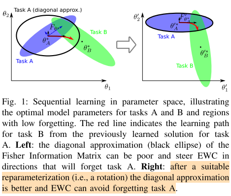
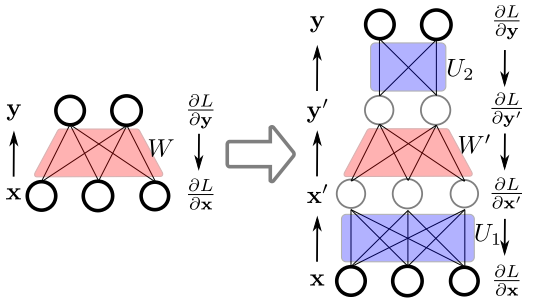
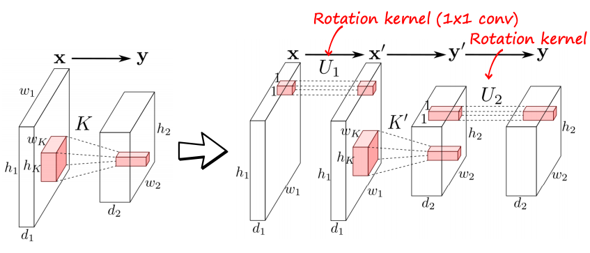

# Rotate your Networks: Better Weight Consolidation and Less Catastrophic Forgetting

## Problem

In a lifelong learning setting, however, learning is considered as a sequence of tasks to be learned, which is more similar to how biological systems learn in the real world.

## Related Work

lifelong learning 可以大致分为两类：

1. 存储一部分之前学习的任务的数据来避免遗忘先前的知识

2. 第二种不需要额外的训练数据，基于Elastic Weight Consolidation（EWC）

$$
log \ p_{1:K}=log \ p(\mathcal{Y}_k|\mathcal{X}_k;\theta)+log \ p(\theta |D_{1:K-1})-log\ p(D_K|D_{1:K-1})+C
$$

EWC 作用：

1. 参数量从$O(N^2)$减少到了$O(N)$，这里N代表参数空间中的数目，因而diagonal 矩阵可以更高效地去计算和存储

2. 除此之外，许多场景中，需要FIM矩阵的inverse，这极大程度简化并且加速了计算diagonal 矩阵

## Motivation

However, EWC has the drawback that it assumes the Fisher Information Matrix to be diagonal – a condition that is almost never true.  在本文中，我们具体讨论了EWC算法所作的对角线假设。如果FIM不是对角线，EWC可能无法防止网络偏离“良好参数空间”

- *rotating* the **parameter space** of the neural network in such a way that the output of the forward pass is unchanged

##Rotate your Networks

基于前面的观察，我们的目标是找到参数空间的重新参数化θ. 具体来说，我们希望重新参数化不改变网络的前馈响应，但更好地满足对角FIM的假设。在重新参数化之后，我们可以假设一个对角线FIM在新的参数空间。

**SVD 不适合：**

First, the SVD is extremely expensive to compute on very large matrices. 

Second, this rotation ignores the sequential structure of the neural network and would likely catastrophically change the feed-forward behavior of the network. 

Finally, we do not have the FIM in the first place.

**Indirect rotation**
$$
F_W= \mathbb{E}_{x \sim \pi \\
y \sim p} [(\frac{\partial{L}}{\partial{y}} \frac{\partial{y}}{\partial{W}})(\frac{\partial{L}}{\partial{y}} \frac{\partial{y}}{\partial{W}})^T]
$$

$$
F_W = E_{p \sim \pi }[(\frac{\partial L}{\partial y})xx^T(\frac{\partial L}{\partial y})^T]
$$

$$
E_{x\sim \pi}[xx^T] = U_1S_1V^T_1 \\
\mathbb{E}_{x \sim \pi \\
y \sim p} [(\frac{\partial{L}}{\partial{y}} \frac{\partial{y}}{\partial{W}})(\frac{\partial{L}}{\partial{y}} \frac{\partial{y}}{\partial{W}})^T] = U_2 S_2 V_2^T
$$
$x^{'}=U_1 x$  以及 $y=U_{2} y^{'}$

$W^{'}=U_2^T W U_1^T$

**Extension to convolutional layers**

上一节中提出的用于完全连接层的方法只需稍加修改即可应用于卷积层。通过添加两个额外的$1\times 1$卷积层

