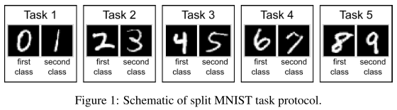
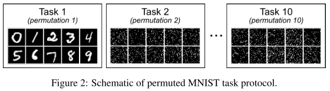

# Three scenarios for continual learning Gido

Standard artificial neural networks suffer from the well-known issue of **catastrophic forgetting**, making continual or lifelong learning difficult for machine learning.

## Three Continual Learning Scenarios

These scenarios are distinguished by whether at test time task identity is provided and, if it is not, whether task identity must be inferred.

| Scenario  | Required at test time                             |
| --------- | ------------------------------------------------- |
| Task-IL   | Solve tasks so far, task-ID provided              |
| Domain-IL | Solve tasks so far, task-ID not provided Class-IL |
| Class-IL  | Solve tasks so far and infer task-ID              |

- task-incremental learning (Task-IL)：有明确的任务定义（抽头网络）。（每个任务单独测试，观察指标变化，最后的指标是那个 numpy 矩阵）：Since task identity is always provided, in this scenario it is possible to train models with task-specific components. A typical network architecture used in this scenario has a “multi-headed” output layer, meaning that each task has its own output units but the rest of the network is (potentially) shared between tasks.

- domain-incremental learning (Domain-IL)：没有明确的任务 identifier，测试时需要同时解决所有 environments。（所有遇见过的任务放在一起进行测试，整体指标的变化，最后的指标是单独一个值在变化）：Typical examples of this scenario are protocols whereby the structure of the tasks is always the same, but the input-distribution is changing. A relevant real-world example is an agent who needs to learn to survive in different environments, without the need to explicitly
- class-incremental learning (Class-IL)：测试时没有 task identifier，而且需要模型进行 infer 现在是哪个 task：models must be able to both solve each task seen so far and infer which task they are presented with

### Comparison with Single-Headed vs Multi-Headed Categorization Scheme

**“multi-headed” or “single-headed”**

Multi-headed layout **requires task identity to be known**, while a single-headed layout does not.

### Example Task Protocols

Split MNIST according to each scenario:

| Scenario  | Desrcription                                                 |
| --------- | ------------------------------------------------------------ |
| Task-IL   | With task given, is it the 1st or 2nd class? (e.g., 0 or 1)  |
| Domain-IL | With task unknown, is it a 1st or 2nd class? (e.g., in [0, 2, 4, 6, 8] or in [1, 3, 5, 7, 9]) |
| Class-IL  | With task unknown, which digit is it? (i.e., choice from 0 to 9) |

在Split MNIST的情况下，Domain IL和Class-IL 都能处理

| Scenario  | Desrcription                           |
| --------- | -------------------------------------- |
| Task-IL   | Given permutation X, which digit?      |
| Domain-IL | With permutation unknown, which digit? |
| Class-IL  | Which digit and which permutation?     |

The second task protocol is permuted MNIST, in which **each task involves classifying all ten MNIST-digits but with a different permutation applied to the pixels for every new task** . Although permuted MNIST is most naturally performed according to the *Domain-IL scenario*, it can be performed according to the other scenarios too.

### Task Boundaries

描述的场景假设在训练期间，**要学习的任务之间存在明确且定义明确的界限**。如果任务之间没有这样的界限，**例如，因为任务之间的转换是渐进的或连续的，我们在这里描述的场景将不再适用，持续学习问题将变得不那么结构化，并且可能更加困难。**其中，使用随机抽样的小批量和多次传递每个任务的训练数据进行训练已不再可能。

## Strategies for Conintual Learning

### Task-specific Components

This suggests that not optimizing the entire network on each task could be one strategy for alleviating catastrophic forgetting. A straightforward way to do this is to **explicitly define a different sub-network per task**.

### Regularized Optimization

When task identity information is not available at test time, an alternative strategy is to still prefer- entially train a different part of the network for each task, but to always use the entire network for execution.

### Modifying Training Data

- One option is to take the input data of the current task, label them using the model trained on the previous tasks, and use the resulting input-target pairs as pseudo-data. （LwF）

- Generate the input data to be replayed.(DGR)

- Store data from previous tasks and replay those. (iCaRL)

