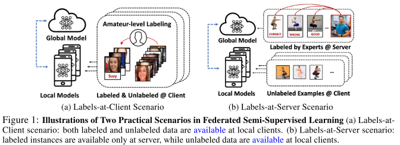
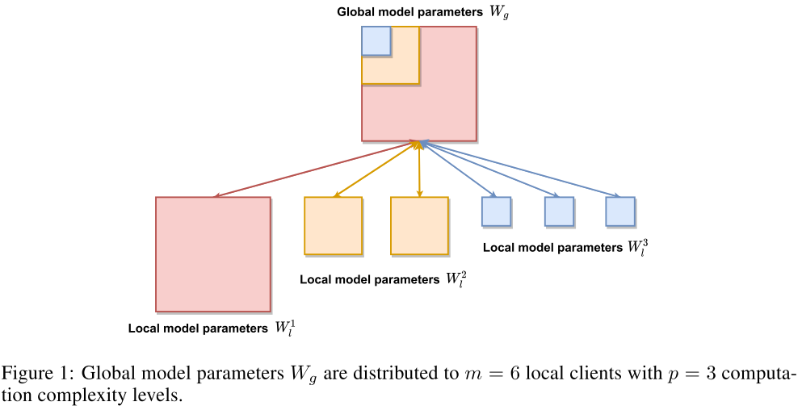
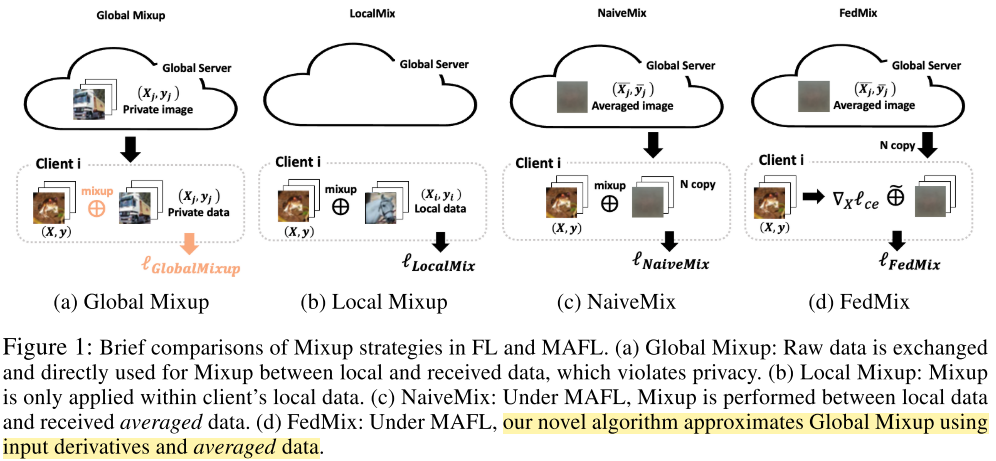

### Federated Semi-Supervised Learning With Inter-Client Consistency & Disjoint Learning

提出的问题很有意思

#### Problems

Two practical scenarios of Federated Semi-Supervised Learning (FSSL):

- each client learns with only partly labeled data (Labels-at-**Client** scenario) 客户端有数据 用户端同时具备Labeled 和 Unlabeled数据会带来模型对Labeled数据的遗忘
- supervised labels are only available at the **server** 服务器端有数据

#### Prior Work

**Federated Learning**.

....

**Semi-Supervised Learning**

The ratio of unlabeled data ($U=\{x_i,y_i\}_{i=1}^U$) is usually much larger than that of the labeled data ($S=\{x_i,y_i\}_{i=1}^S$)  (e.g. 1 : 10). 

Define the $p_{\theta}(y|x)$ be a neural network that is parameterized by weights $\theta$ and predicts softmax outputs $\widehat{y}$ with given input x.

Objective loss function: $\mathcal{l}_{final} \theta)=\mathcal{l}_{s}(\theta)+ \mathcal{l}_{u}(\theta)$.

**Federated Semi-Supervised Learning**

Given a dataset $D=\{x_i,y_i\}_{i=1}^N$ , $D$ is split into a labeleds set $S=\{x_i,y_i\}_{i=1}^S$ and unlabeled data $U=\{x_i,y_i\}_{i=1}^U$.

A global model $G$ and a set of local models $\mathcal{L}$ where

#### Idea

Federated Matching (FedMatch)

- inter-client consistency loss: aims to maximize the agreement between the models trained at different clients 针对不同的用户设计的Loss函数

$$
\frac{1}{H} \sum_{j=1}^H KL [p^{*}_{\theta^{h_j}}(y|u)||p_{\theta^l} (y|u)]
$$

这里$p^{*}_{\theta^{h_j}}(y|u)$代表筛选后的客户端基于模型的相似性，同时星号代表冷冻了这些参数，不更新这些筛选的模型。服务器每次选择并广播$H$个用于帮助的客户端。最终一致约束损失函数：
$$
\Phi(\cdot) = CrossEntropy(\widehat{y},p_{\theta^l}(y|\pi(u)))+\frac{1}{H} \sum_{j=1}^H KL [p^{*}_{\theta^{h_j}}(y|u)||p_{\theta^l}(y|u)]
$$
在这里$\pi(u)$代表随机增强 对于 无标签的数据，而对于对应的生成的标签$\widehat{y}$:
$$
\widehat{y}=Max (\mathbb{I}(p_{\theta^l} (y|u))+\sum_{j=1}^H \mathbb{I}p^{*}_{\theta^{h_j}}(y|u)
$$
$\mathbb{I}$代表生成one-hot的标签，Max($\cdot$) 输出one-hot 标签 中最大参数对应的类结果

- parameter decomposition for disjoint learning: **decomposes** the parameters into one for labeled data and the other for unlabeled data for preservation of reliable knowledge, reduction of communication costs, and disjoint learning 针对平衡对标记数据和非标记数据的记忆能力，把模型参数$\theta$解构为了两部分:$\sigma$ for supervised learning and $\psi$ for unsupervised learning such that $\theta = \sigma + \psi$

有标签数据：
$$
minimize \mathcal{L}_s(\sigma)=\lambda_s CrossEntropy(y,p_{\sigma+\psi^*}(y|x))
$$
无标签数据：
$$
minimize \mathcal{L}_u (\psi) = \lambda _{ICCS}\Phi_{\sigma^*+\psi}(\cdot)+\lambda_{L_2}||\sigma^*-\psi||^2_2+\lambda_{L_1}||\psi||_1
$$

Benefit：

Preservation Reliable Knowledge from Labeled Data

Reduction of Communication Costs

Disjoint Learning

#### 两种场景

**Labels-At-Client Scenario**

“客户端标签”场景假定最终用户会间歇性地注释其本地数据的一小部分（即，占整个数据的5％），而其余数据实例未标记。 这是用户生成的个人数据的常见情况，在这种情况下，最终用户可以轻松地注释数据，但可能没有时间或动力来标记所有数据（例如，为相册或社交网络注释图片中的面孔）。 我们假设客户端对标记和未标记的数据进行训练，而服务器仅聚合来自客户端的更新，然后将聚合的参数重新分发回客户端。

**Labels-At-Server Scenario**

现在，我们描述另一个现实的设置，即服务器标签场景。 此方案假定受监督的标签仅在服务器上可用，而本地客户端使用未标签的数据。

### Personalized Federated Learning With First Order Model Optimization

有意思的权重定义方式，但是隐私问题

#### Problems

在这种情况下，FL实际上缺乏跨客户的独立且均匀分布（IID）数据假设，这既可能是burden，也可能是blessing。 在非IID数据批次之间学习单个全局模型可能会带来挑战，例如无法保证的收敛性和模型参数的离散性。

此外，尝试微调这些全局模型可能会导致对本地客户端测试集的适应性较差。 但是，每个客户的本地数据的非IID性质也可以提供有用的信号，以区分其基础本地数据分布，而无需共享任何数据。 我们利用这一信号为个性化FL提出一个新的框架。 我们没有像以前的工作那样给所有客户相同的全球模型平均权重，而是通过恒定的本地培训规模对其进行加权，而是针对每个客户，通过对个性化目标测试进行评估来计算可用模型的加权组合，以最佳地与该客户的利益保持一致分配。

#### Idea

在每个联盟学习轮之后，我们将分别维护客户端上载的参数，从而使下一轮中的客户端能够彼此独立地下载这些副本。 然后，每次联邦更新都是一个两步过程：给定一个本地目标，客户（1）评估其接收的模型在其目标任务上的执行情况；（2）使用各自的表现评估结果在个性化更新中对每个模型的参数进行加权。

**FedFomo**

1. 每个用户的联邦更新取决于简单的first-order model optimization **approximating a personalized gradient step**

2. **fear of missing out**  错失恐惧症，也称社群恐慌症等，是指一种由患得患失所产生持续性的焦虑，得上这种症的人总会感到别人在自己不在时经历了什么非常有意义的事情。这种社会焦虑被描绘为想要与别人在干什么至始至终保持关联的渴望。

   每个客户不再需要在每个联邦回合中考虑所有活动客户的贡献。 换句话说，好奇心可以杀死猫。 **可以通过限制每个联合更新中无用的模型来保存每个模型的个性化性能**

#### Detail

Let $\mathbb{C}$ be a population with $|\mathbb{C}|=K$ total clients, where each client $c_i \in \mathbb{C}$ carries local data $D_i$ sampled from some distribution $D$ and local model parameters $\theta_i^{\mathcal{l}(t)}$ during any round $t$.

Each $c_i$ maintans some personalized objetive or task $\mathcal{T}_i$.

A test dataset $D_i^{test}\sim D^*.$ We define each $\mathcal{T}_i :=min \mathcal{L}(\theta_i^{\mathcal{l}(t)};D_i^{test})$

We aim to obtain the optimal set of model parameters:
$$
\{\theta_1^*,...,\theta_K^*\}=arg min \sum_{i\in [K]} \mathcal{L_T}_i(\theta_i)
$$
**Federated learning as an iterative local model update**

Tradition Update :
$$
\theta^G(t) = \sum_{n=1}^N w_n \cdot\theta_n^{\mathcal{l}(t)},where w_n = |D_n^{train}|/\sum_{j=1}^N D_j^{train}
$$
We then wish to find the optimal weights $w = <w_1,w_2,...w_N>$ that optimize for the client’s objective, minimizing $\mathcal{L}_i(\theta_i^\mathcal{l})$

Efficient personalization with FedFomo：
$$
w_n= \frac{\mathcal{L}_i(\theta_i^{\mathcal{l}(t-1)})-\mathcal{L}_i\theta_i^{\mathcal{l}(t)})}{||\theta_n^{\mathcal{l}(t)}-\theta_n^{\mathcal{l}(t-1)}}
$$
如果计算得到的$w_n$参数小于0，则$w_n=max(w_n,0)$, and among positive $w_n$ nomalize with $w_n=\frac{max(w_n,0)}{\sum_n max(w_n,0)}$.

### HeteroFL: Computation and communication efficient federated learning for heterogeneous clients

更多的是一种聚合 权重的新颖方式

#### Problems

HeteroFL 训练异构的本地网络（他们有不同的计算能力）并且能够依旧构造一个全局推断模型。

这里定义的模型异构区别于传统的方式，他是自适应地获取subnetworks 基于用户的计算能力（相对而言是 一个庞大的模型的一部分）：由于我们的主要动机是减少本地客户端的计算和通信复杂性，因此我们认为本地模型**具有相似的体系结构**，但可以在同一模型类内降低其复杂性。($W_i^{t+1}\subseteq W_i^g$)

#### Contribution

据我们所知，我们所呈现的是第一项允许本地模型具有与全局模型不同的体系结构的工作。 异构本地模型可以使本地客户适应性地为全局模型的训练做出贡献。 系统的异构性和通信效率可以通过我们的方法很好地解决，本地客户可以优化低计算复杂性模型，从而传达少量模型参数。 为了解决统计上的异质性，我们针对分类问题中的平衡非IID数据分区提出了“掩盖技巧”。 我们还建议对批处理规范化（BN）进行修改（Ioffe和Szegedy，2015年），因为运行估计的隐私问题会阻碍高级深度学习模型的使用。

#### Idea

Subsets of global model parameters $W_l$ for a single hidden layer parameterized by $W_g \in R^{d_g \times k_g}$, where $d_g$ and $k_g$ are the output and input channel size of this layer. Let $r$ be the hidden channel shrinkage ratio such that $d_l^p=r^{p-1}d_g$ and $k_l^p=r^{p-1}k_g$.  Hence, $|W_l^p|=r^{2(p-1)}|W_g|$.

Suppose that number of clients in each computation complexity level is $\{m_1,...,m_p\}$.
$$
W_l^p=\frac{1}{m}\sum_{i=1}^m W_i^p
$$
It shows that the smallest part of model parameters (blue, p = 3) is aggregated from all the local clients that contain it.
$$
W_l^{p-1}  \backslash W_l^P=\frac{1}{m-m_p}\sum_{i=1}^{m-m_p}W_i^{p-1} \backslash W_i^p
$$

$$
W_l^{1}  \backslash W_l^2=\frac{1}{m-m_{2:p}}\sum_{i=1}^{m-m_{2:p}}W_i^{1} \backslash W_i^2
$$

$$
W_g = W_l^1=W_l^p \cup（W_i^{p-1} \backslash W_i^p）\cup ... \cup W_i^{1} \backslash W_i^2
$$

The set difference between part p − 1 (orange) and p (blue) of model parameters is aggregated from local clients with computation complexity level smaller than p − 1

$ W^t_g[:d_m,: km] $denotes the upper left submatrix with a size of $d_m × k_m$.

$W^{p-1,t+1}_g \backslash W_g^{p,t+1}$ 代表属于$W^{p-1,t+1}_g$但不属于 $W^{p,t+1}_g$

#### Static Batch Normalization

将全局模型参数分配给活动的本地客户端后，我们可以使用私有数据优化本地模型参数。 众所周知，最新的深度学习模型通常采用批归一化（BN）来促进和稳定优化。 但是，经典的FedAvg和最新著作都避免使用BN。 BN的一个主要问题是它需要对每个隐藏层的表示进行运行估计。 将这些统计信息上传到服务器将导致更高的通信成本和隐私问题。

我们重点介绍了一种称为静态批处理规范化（sBN）的BN改编，用于优化优先级受限的异构模型。 **在训练阶段，sBN不会跟踪运行估算值，而只是将批处理数据标准化。** 我们不会跟踪本地运行统计信息，因为本地模型的大小也可能动态变化。 该方法适用于HeteroFL，因为每个通信回合都是独立的。 培训过程完成后，服务器将顺序查询本地客户端并累积更新全局BN统计信息。 对于累积计算全球统计数据存在隐私方面的担忧，我们希望在以后的工作中解决这些问题。

### FedBN : Federated Learning on Non-IID Features via Local Batch Normalization

目的在于解决feature shift （where local clients store examples with different distributions compared to other clients, which we denote as feature shift non-iid.）

看求不懂.......甩数学公式是真的酷炫啊..........

### Federated Learning Via Posterior Averaging: A New Perspective And Practical Algorithms

目的在于提高收敛&计算速度

本文的主要贡献可以概括如下：

1. 我们通过后验推理的角度介绍了关于联合学习的新观点，该观点拓宽了FL算法的设计空间，超越了单纯的优化技术。
2. 从这个角度出发，我们设计了一种计算和通信效率高的近似后验推理算法-联合后验平均（FEDPA）。 FEDPA与无状态客户端配合使用，其计算复杂度和内存占用量与FEDAVG相似。
3. 我们表明，具有许多局部步骤的FEDAVG实际上是FEDPA的一种特殊情况，它可以估计具有身份的局部后方协方差。这些有偏差的估计是不一致更新的根源，并解释了为什么即使在简单的二次设置中，FEDAVG仍具有次优收敛。
4. 最后，我们将FEDPA与Reddi等人在现实的FL基准上的强基准进行比较。 （2020年），并在多个关注指标方面取得了最先进的成果。Contributions.1

### Achieving Linear Speedup With Partial Worker Participation In Non-IID Federated Learning

### Adaptive Federated Optimization

#### Contribution

- 我们研究了使用服务器和客户端优化器进行联合优化的通用框架。该框架概括了许多现有的联合优化方法，包括FEDAVG。

- 我们使用此框架来设计新颖的，跨设备兼容的自适应联合优化方法，并在一般非凸设置下提供收敛分析。据我们所知，这是使用自适应服务器优化进行FL的第一种方法。我们展示了本地步骤数量与客户之间的异质性之间的重要相互作用。
- 我们引入了全面且可重现的经验基准，用于比较联合优化方法。这些基准测试包括涉及图像和文本数据的七种多样且具有代表性的FL任务，具有不同数量的异构性和客户数量。
- 我们展示了自适应优化器在整个过程中的强大经验性能，并在常用基准上进行了改进。我们的结果表明，我们的方法可以更轻松地进行调整，并突出显示它们在跨设备设置中的实用性。

### FEDMIX: Approximation Of Mixup Under Mean Augmented Federated Learning

允许客户之间发送数据，通过近似和增加参与方得到平均的数据结果

#### Problems

在独立且均布的（iid）本地数据的假设下有可喜的结果，但随着客户端之间本地数据异质性的提高，当前最新的算法会遭受性能下降的困扰。为了解决此问题，我们提出了一个简单的框架，即均值增强联合学习（MAFL），在该框架下，客户可以根据目标应用程序的隐私要求发送和接收平均本地数据。在我们的框架下，我们提出了一种名为FedMix的新扩充算法，该算法的灵感来自于一种惊人而又简单的数据扩充方法Mixup，**但它不需要在设备之间直接共享本地原始数据**。与传统算法相比，在高度非联合联合设置下，我们的方法在FL的标准基准数据集中显示出显着改善的性能

#### Comparison with different Mixup

#### Mixup

$$
\widetilde{x} = \lambda x_i + (1-\lambda)x_j
$$

$$
\widetilde{y} = \lambda y_i + (1-\lambda)y_j
$$

$$
\lambda \in [0,1]
$$

#### Idea

In order to mitigate the heterogeneity across clients while protecting privacy, we provide a novel yet simple framework, mean augmented federated learning (MAFL), in which **each client exchanges the updated model parameters as well as its mashed (or averaged) data.**

只能将丢失了大多数歧视性信息的我们框架中的平均数据带走，从而产生与全局混合类似的效果，在这种情况下，客户无需访问即可直接访问其他人的私有数据。（已证明还ok：Taylor expansion of global Mixup only involves the averaged data from other clients.）

**FedMix**的loss函数计算：
$$
\mathcal{l}_{FedMix}=\frac{1}{|J|}\sum_{j\in J}(1-\lambda)l(f((1-\lambda)x_i),y_i)+\lambda l(f((1-\lambda)x_i),y_i)+\lambda \frac{\partial l}{\partial x}\cdot  x_j
$$
进一步得到：
$$
\mathcal{l}_{FedMix}=(1-\lambda)l(f((1-\lambda)x_i),y_i)+\lambda l(f((1-\lambda)x_i),\bar{y}_i)+\lambda \frac{\partial l}{\partial x}\cdot \bar x_j
$$

### FedBE: Making Bayesian Model Ensemble Applicable To Federated Learning

针对模型整合model aggregation，使用了高斯分布和狄利克雷分布

联合学习旨在通过访问用户的本地训练模型而不是他们自己的数据来协作训练一个强大的全局模型。因此，至关重要的一步是将局部模型聚合为全局模型，这在用户没有i.i.d时显示出挑战。数据。在本文中，我们提出了一种新的聚合算法FEDBE，**它通过对高质量的全局模型进行采样并通过贝叶斯模型Ensemble对其进行组合，从而从贝叶斯推理的角度出发，从而实现了强大的聚合**。我们表明，可以通过简单地**将高斯或Dirichlet分布拟合到局部模型来构建有效的模型分布**。我们的实证研究证实了FEDBE的出色性能，尤其是在没有i.i.d.用户数据的情况下。以及当神经网络更深入时。此外，FEDBE与最近在规范用户模型训练方面所做的努力兼容，使其成为易于应用的模块：您只需要替换聚合方法，而使联邦学习算法的其他部分保持不变。

