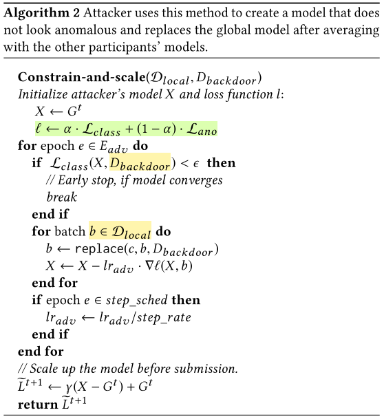

# Problem

Our main insight is that **federated learning is generically vulnerable to model poisoning**, which is a new class of poison- ing attacks introduced for the first time in this paper. (以前的中毒攻击只针对训练数据。模型中毒利用联邦学习使恶意参与者直接影响联合模型这一事实，使得攻击比训练数据中毒更为强大)

任何联邦学习中的参与者都可以替换Joint Model

1. The new model is equally accurate on the federated-learning task
2. The attacker controls how the model performs on an attacker-chosen backdoor subtask

# Motivation

Federated learning is generically vulnerable to backdoors and other model-poisoning attacks （联邦学习容易遭受到后门攻击和其他模型下毒攻击）

后门攻击希望在模型的训练过程中通过某种方式在模型中埋藏后门(backdoor)，埋藏好的后门通过攻击者预先设定的触发器(trigger)激发。在后门未被激发时，被攻击的模型具有和正常模型类似的表现；而当模型中埋藏的后门被攻击者激活时，模型的输出变为攻击者预先指定的标签（target label）以达到恶意的目的。

1. 从定义上来说，会存在着成千上万的不受中心节点控制训练过程的device，这样必然会容易存在着恶意的device

- First, when training with millions of participants, it is impossible to ensure that none of them are malicious. The possibility of training with multiple malicious participants is explicitly acknowledged by the designers of federated learning （首先，当有数百万的参与者进行训练时，不可能保证他们中没有一个是恶意的。联合学习的设计者们明确承认有可能出现多个恶意参与者的训练）
- Neither defenses against data poisoning, nor anomaly detection can be used during federated learning because they require access to, respectively, the participants’ training data or their submitted model updates针对数据中毒的防御措施和异常检测都不能在联合学习中使用，因为它们分别需要访问参与者的训练数据或他们提交的模型更新。聚合服务器既不能观察训练数据，也不能观察基于这些数据的模型更新，否则会破坏参与者的隐私，这也是联邦学习的关键动机。
- Latest versions of fed- erated learning employ “secure aggregation”, which provably prevents anyone from auditing participants’ data or updates 联邦学习的最新版本采用了“安全聚合”，这可以防止任何人审核参与者的数据或更新

2. 联邦学习的一个假设就是device上的数据分布是NON-IID的，并且为了聚合的安全性，会引入secure aggregation。这样异常检测就很难做了

- Proposed techniques for Byzantine-tolerant distributed learning make assumptions that are explicitly false for federated learning with adversarial participants (e.g., they assume that the partici- pants’ training data are i.i.d., unmodified, and equally distributed). 现有方法
- Participant-level differential privacy partially mitigates the attack, but at the cost of reducing the joint model’s accuracy on its main task.

3. 虽然异常检测与secure aggregation是不相容的，但是FL未来会在不泄露用户隐私的情况下以某种方式将其部署进aggregation server

**为了证明模型替换仍然有效**：To demonstrate that model replacement will remain effective, we develop a generic **constrain-and-scale technique** that incorporates evasion of anomaly detection into the attacker’s loss function. The resulting models evade even relatively sophisticated detectors, e.g., those that measure cosine similarity between submitted models and the joint model. We also develop a simpler, yet effective train-and-scale technique to evade anomaly detectors that look at the model’s weights [60] or its accuracy on the main task.

- 我们开发了一种通用的约束和规模技术，将规避异常检测纳入攻击者的损失函数。由此产生的模型甚至可以规避相对复杂的检测器，例如，那些测量提交的模型和联合模型之间余弦相似度的检测器。
- 我们还开发了一种更简单，但有效的训练和规模技术来逃避异常检测器，这些检测器看的是模型的权重或它在主要任务上的准确性。

# Related Work

- **Training-time attacks**：“Traditional” poisoning attacks compro- mise the training data to change the model’s behavior at test time

1. Previous backdoor attacks change the model’s behavior only on specific attacker-chosen inputs via data poisoning

2. by inserting a backdoored component directly into a stationary model.

我们表明，这些攻击对联邦学习无效，在联邦学习中，攻击者的模型与成百上千的良性模型聚集在一起。会对其造成淡化处理。

所有这些防御措施都需要防御者检查训练数据，或者所产生的模型（它泄露了训练的数据) 这些防御措施都不能应用于联合学习，因为联邦学习在设计上对用户的训练数据以及他们的本地模型都是保密的，并为此采用了安全聚合的方式。

- **Test-time attacks**

对抗样本是故意制作的，以便被模型错误分类。相比之下，后门攻击会导致模型对未经修改的输入进行错误分类

- Backdoor和Adversarial examples的区别和联系

1. 后门攻击包括Semantic backdoor和Pixel-pattern backdoor：

   Semantic backdoors：攻击者可以自由选择 攻击者可以自由选择物理场景中自然出现的特征（例如，某种汽车颜色）或没有攻击者参与就不会出现的特征（例如，只有攻击者拥有的特殊帽子或眼镜）。

   而Pixel-pattern backdoors 这些后门要求攻击者在测试时以特殊方式修改数字图像的像素，以便模型对修改后的图像进行错误分类。

   在FL大规模部署时，Semantic backdoors也是更加危险的。

2. Adversarial transformations exploit the boundaries between the model’s representations of different classes to produce inputs that are misclassified by the model. 

   By contrast, backdoor attacks intentionally shift these boundaries so that certain inputs are misclassified.

3. 从攻击程度的强弱来说，Semantic backdoor>Pixel-pattern backdoor>Adversarial attack

# Idea

## Assumption

Federated learning gives the attacker full control over one or several participants, e.g., smartphones whose learning software has been compromised by malware.

1. The attacker controls the local train- ing data of any compromised participant; 
2. It controls the local training procedure and the hyperparameters such as the number of epochs and learning rate; 
3. It can modify the weights of the resulting model before submitting it for aggregation; 
4. It can adaptively change its local training from round to round.

The **main difference** between this setting and the traditional poisoning attacks：

1. The latter assume that the attacker controls a significant fraction of the training data
2. In federated learning the attacker controls the entire training process—but only for one or a few participants.

## Constructing the attack model

根据FL-AVG算法，可到到 Model replacement为：
$$
G^{t+1} = G^t + \frac{\eta}{n}\sum_{i=1}^{m}(L_i^{t+1}-G^t)
$$
全局学习率$\eta$控制联邦模型中每轮更新的部分。如果模$\eta = \frac{n}{m}$型就完全被局部模型的平均值所取代。
由于非即定训练数据，每个局部模型可能与当前的全局模型相差甚远。随着全局模型的收敛，这些偏差开始被抵消：
$$
\sum_{i=1}^{m-1}L_i^{t+1}-G^t \approx 0
$$
The attacker can solve for the model it needs to submit as follows:
$$
\widetilde{L}_m^{t+1}= \frac{n}{\eta}X-(\frac{n}{\eta}-1)G^t-\sum_{i=1}^{m-1}(L_i^{t+1}-G^t) \approx \frac{n}{\eta}(X-G^t)+G^t
$$
这种攻击将后门模型X的权重按$\gamma = \frac{n}{\eta}$，以确保后门在平均化过程中存活下来，并且这在任何一轮联合学习中都有效，但在全局模型接近收敛时更有效。

## Improving persistence and evading anomaly detection

**后门攻击难以检测的原因：**

1. 安全聚合：使用安全聚合，无法检测到聚合包含恶意模型，也无法检测出谁提交了该模型。

2. 数据no-iid: 如果没有安全汇总，则汇总参与者模型的中央服务器可能会尝试过滤掉“异常”贡献。但是联合学习的主要动机是利用非i.d.参与者的多样性。训练数据，包括不正常或低质量的本地数据，例如智能手机照片或文本消息历史记录。良性参与者模型的相当广泛的分布如何使攻击者能够创建看上去不异常的后门模型。因此，通过设计，聚合器甚至应接受精度较低且与当前全局模型有很大差异的局部模型。

**为了躲避异常检测本文提出两种改进方式**

1. Constrain-and-scale

我们现在描述一种通用的方法，使对手能够产生一个在主要任务和后门任务上都具有高准确性的模型，但不被聚合器的异常检测器拒绝。直观地说，我们通过使用一个目标函数将逃避异常检测纳入训练，该目标函数（1）奖励模型的准确性和（2）惩罚它偏离聚合器认为的 "正常"。根据Kerckhoffs原则，我们假设异常检测算法为攻击者所知。(Kerckhoffs’s Principle)
$$
L_{model} = \alpha L_{class} + (1-\alpha)L_{ano}
$$
$L_{class}$ captures the accuracy on both the main and backdoor tasks.

$L_{ano}$ accounts for any type of anomaly detection.

The hyperparameter α controls the importance of evading anomaly detection.

2. Train-and-scale

Anomaly detectors that consider only the magnitudes of model weights (e.g., Euclidean distances between them) can be evaded using a simpler technique. The attacker trains the backdoored model until it converges and then scales up the model weights by $\gamma$ up to the bound S permitted by the anomaly detector.
$$
\gamma = \frac{S}{||X-G^t||_2}
$$

# Experiments

