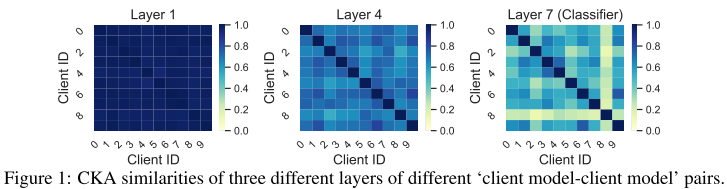
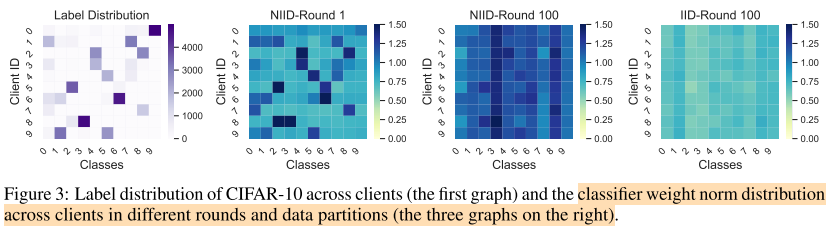

# No Fear of Heterogeneity: Classifier Calibration for Federated Learning with Non-IID Data

## Existing Methods for non-IID data

1. client drift mitigation

通过修改Local 参与者的目标，因而Local模型可以在一定程度上保持与全局模型的一致

2. aggregation scheme

通过提升服务器端模型融合方案

3. data sharing

通过引入公开数据集或者生成数据来帮助在服务器或者客户端构建更平衡的数据分布

4. personalized federated learning

针对每个独立的客户端训练专属定制的模型，而非共享模型

## Motivation

- 现有方法依旧不能取得好的表现使用深度模型在图片数据集上，甚至不能比普通的FedAVG好

通过使用Centered Kernel Alignment相似估计方法来评估不同用户本地模型的相同层之间的相似性，发现在Classifier 有着最低的特征相似性

- 研究如何在联邦学习中优化Classifier权重，证明了分类器会倾向于指定的类别，现有方法post-calibration策略通过使用一小部分IID数据，能够显著提升分类器的表现。但是由于侵犯隐私，不能部署到联邦学习中、

  

提出了Classifier Calibration with Virtual Representations（CCVR）：
**CCVR通过学习的特征抽取器在特征空间中生成基于近似高斯混合模型（GMM）的虚拟表示**

## Contribution

1. 本文首次系统地研究了非IID数据上FedAvg训练的不同层次神经网络的隐式表示，为理解异构数据下的联邦学习提供了一个新的视角
2. 我们的研究揭示了一个有趣的事实，即在非IID数据上训练的神经网络性能下降的主要原因是分类器
3. 提出了一种简单通用的联合学习分类器校正算法CCVR（Classifier Calibration with Virtual Representations）。CCVR构建在现成的特征提取器之上，不需要传输原始数据的表示，因此不会引起额外的隐私问题。我们的实证结果表明，CCVR比普通的联邦学习方法带来了相当大的准确率增益。

## Idea

### Hypothesis

基于以上对分类器的观察，我们假设：由于分类器是最接近局部标签分布的一层，它很容易偏向于异构的局部数据，表现为不同局部分类器之间的特征相似度较低，权重范数有偏。此外，我们认为对分类器进行debiasing处理可以直接提高分类性能。

### Classifier Regularization and Calibration

**Classifier Weight L2-normalization**
$$
g_\varphi(z)_i = \frac{e^{\varphi_i^T z/||\varphi_i||}}{\sum_{i^{'}=1}^C e^{\varphi_i^T z/||\varphi_{i^{'}}||}}
$$
**Classifier Quadratic Regularization**
$$
L（w_k^{(t)};w^{(t-1)},x,y）=l(g_{\varphi_k^{(t)}}(f_{\theta_k^{(t)}}(x)),y)+\frac{\mu}{2}||\varphi_k^{(t)}-\varphi^{(t-1)}||^2
$$
Where $l$ is the cross-entropy loss and $\mu$ is the regularization factor

**Classifier Post-calibration with IID Samples**

在联邦训练之后，我们固定了特征抽取器，并在IID样本上用交叉熵损失的SGD优化方法对分类器进行了校正。请注意，此校准策略需要从异构客户机中采样IID原始数据。因此，它只能作为一种实验性的学习使用，而不能应用于真正的联邦学习系统。

### Classifier Calibration with Virtual Representations

In our CCVR, we assume that features of each class in $D$ follow a Gaussian distribution. The server estimates this distribution by computing the mean $\mu_c$ and the covariance $\sum_c$ for each class $c$ of $D$ using gathered local statistics from clients, without accessing true data samples or their features.

Feature extractor $f_{\widehat{\theta}}$

$N_{c,k}=|D_c^k|$ be the number of samples of class $c$ on client $k$

$N_c=\sum_{k=1}^K N_{c,k}$ 

Client $k$ produces features $\{z_{c,k,1},...,z_{c,k,N_{c,k}}\}$ for class $c$

$z_{c,k,j}=f_{\widehat{\theta}}(x_{c,k,j})$

Here, we get the local mean $\mu_{c,k}$ and convariance $\sum_{c,k}$ of $D_c^k$
$$
\mu_{c,k}=\frac{1}{N_{c,k}}\sum_{j=1}^{N_{c,k}}z_{c,k,j}
$$

$$
\sum_{c,k}=\frac{1}{N_{c,k}-1}\sum_{j=1}^{N_{c,k}}(z_{c,k,j}-\mu_{c,k})(z_{c,k,j}-\mu_{c,k})^T
$$
Then client k uploads $\{(\mu_{c,k},\sum_{c,k}) : c \in [C]\}$ to server. For the server to compute the global statistics of $D$, it is sufficient to represent the global mean $\mu_c$ and covariance $\sum_c$ using $\mu_{c,k}$'s' and $\sum_{c,k}$’s for each class $c$. The global mean can be straightforwardly written as
$$
\mu_c = \frac{1}{N_c}\sum_{k=1}^K\sum_{j=1}^{N_{c,k}}z_{c,k,j}=\sum \frac{N_c}{N_{c.k}}\mu_{c,k}
$$
For the convariaince, note that by definition we have:
$$
(N_{c,k}-1)\sum_{c,k}=\sum_{j=1}^{N_{c,k}}z_{c,k,j}z_{c,k,j}^T - N_{c,k} \cdot \mu_{c,k} \mu_{c,k}^T
$$
whenever $N{c,k} \geq 1$. Then the global covariance can be written as
$$
\sum_c = \frac{1}{N_c-1}\sum_{k=1}^K \sum_{j=1}^{N_{c,k}}z_{c,k,j}z_{c,k,j}^T-\frac{N_c}{N_c-1}\mu_c\mu_c^T
$$
Equally:
$$
\sum_c = \sum_{k=1}^K\frac{N_{c,k}-1}{N_c-1}\sum_{c,k}+\sum_{k=1}^K \frac{N_{c,k}}{N_c-1}\mu_{c,k}\mu_{c,k}^T -\frac{N_c}{N_c-1}\mu_c\mu_c^T
$$
**Virtual Representations Generation**

After obtaining $\mu_c$ and $\sum_c$, the server generates a set $G_c$ of virtual features with ground truth label $c$ from the Gaussian distribution $N(\mu_c,\sum_c)$. The number $M_c := |G_c|$ of virtual features for each class $c$ could be determined by the fraction $\frac{N_c}{|D|}$ to reflect the inter-class distribution.

**Classifier Re-Training**

The last step of our CCVR method is classifier re-training using virtual representations. We take out the classifier $g$ from the global model, initialize its parameter as $\widetilde{\varphi}$, and re-train the parameter to $\widetilde{\varphi}$ for the objective.
$$
\min_{\widetilde{\varphi}}\mathbb{E}_{(z,y)}\sim U_{c\in [C]}G_c[l(g_{\widetilde{\varphi}}(z),y)]
$$

## Experiments

### Federated Simulation

**Dataset**

CIFAR-10, CIFAR-100  and CINIC-10

**Sampling**

$p_i \sim Dir_K(\alpha)$ and assign $p_{i,k}$ proportion of the samples from class $i$ to client $k$

And set $\alpha =0.5$ unless otherwise specified

**Virtual Representation Generation Scale**

$M_c$ is set to 100, 500 and 1000 for CIFAR-10, CIFAR-100 and CINIC-10 respectively.

## Conclusion

在这项工作中，我们提供了一个新的视角来理解基于深度学习的分类模型在联邦学习中使用非IID数据进行训练时性能下降的原因。我们首先对神经网络进行了剖析，并通过最新的表示分析技术研究了不同客户机上不同层次模型的相似性。我们观察到，不同局部模型的分类器比其他任何一层都不相似，并且分类器之间存在显著的偏差。然后提出了一种新的基于虚拟表示的分类器校正方法（CCVR），该方法从一个近似高斯混合模型（GMM）中提取虚拟特征进行分类器校正，以避免将原始特征上传到服务器。在三个图像数据集上的实验结果表明，CCVR算法比几种常用的联邦学习算法有了稳定的改进。