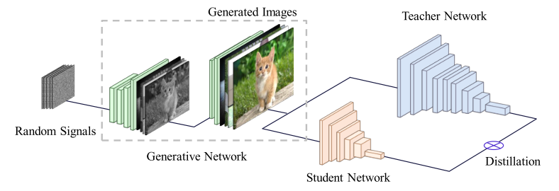

## Data-Free Learning of Student Networks

### Objective

对于当前的网络模型压缩和加速算法来说，它们都需要大量的训练数据。然后很多情况下训练数据并不可用，而且当前的模型压缩算法的性能比原始网络低。为此，作者提出了一种利用生成对抗网络(GANs)训练高效深度神经网络的新框架。首先，预先训练好的教师网络作为固定的判别器，并利用该判别器生成训练样本。然后，利用生成的数据和教师网络，训练出尺寸较小、计算复杂度较低的高效网络。

### Idea

知识蒸馏（Knowledge Distillation）是当前应用较为广泛的方法，一般是把复杂网络的输出迁移到一个更简单的网络。这篇文章作者使用了三部分损失函数达到Data-Free Learning目的。

1. Teacher模型的输出概率(prob)与伪标签（argmax(prob))之间的交叉熵

作者认为如果生成器生成的样本非常接近于真实样本，那么输入到Teacher模型之后，得到的输出概率应该会呈现出很好的分类结果，即某个类别的概率会非常高。

2. Teacher模型的全连接层之前的特征图的L1范数

作者认为真实图片的输出特征图通常不会是一些随机的向量，而应该有比较高的激活值

3. Teacher模型的输出类别的信息熵

类别分布越平均，信息熵越大，所以这个loss用于控制样本类别数量的平衡。

注意这个因为这个信息熵的设计，训练这个模型的时候，batchsize不能太小，具体数值可以参考作者的建议。

有了这三个loss函数、再加上Teacher和Student之间的交叉熵，就可以在无任何真实数据的情况下对模型进行知识蒸馏了。

**Stage 1：**输入一组随机向量，使用生成器G生成图像，然后通过教师网络优化生成器。生成器——教师网络的损失函数：
$$
Loss(1): \mathbb{L}_{oh}=\frac{1}{n}\sum_i \mathbb{}{H}_{cross}(y_S^i,t_i)
$$
$y_S^i$和$y_T^i$分别表示学生网络和教师网络的输出，$t_i=\mathcal{argmax}_j (y_T^i)_j$如果生成器G生成的图像与教师网络的训练数据分布相同，那么它们的输出也应该与训练数据具有相似的输出。因此使用one-hot loss促使教师网络生成的图像输出接近one-hot like vectors。也就是说，期望生成与教师网络完全兼容的合成图像，而不是适用于任何场景的一般真实图像。
$$
\mathbb{L}_{\alpha} = \frac{1}{n}||f_T^i||_1
$$
$f_T^i$表示教师网络全连接层前的特征输出。教师网络中的滤波器用来提取训练数据中的固有模式，因此如果输入真实图像，而不是一些随机的向量，特征图往往会收到更高的激活。
$$
\mathbb{L}_{ie}=-\mathbb{H}_{info}(\frac{1}{n}\sum_iy_T^i)
$$

$$
\mathbb{H}_{info}(p)=-\frac{1}{k}\sum_i p_ilog(p_i)
$$

表示所拥有的信息量，所有变量都为$\frac{1}{k}$时得到最大值。因此，最小化$\mathbb{L}_{ie}$能够得到一组类别数量均衡的生成样本。

最终教师网络的损失函数： 
$$
\mathbb{L}_{total} = \mathbb{L}_{oh}+\alpha \mathbb{L}_{\alpha}+\beta \mathbb{L}_{ie}
$$
**Stage 2：**输入一组随机向量，使用生成器G生成图像，得到教师网络和学生网络的输出，计算知识蒸馏损失：
$$
\mathbb{L}_{KD}=\frac{1}{n}\sum_i \mathbb{H}_{cross}(y_S^i,y_T^i)
$$

### Conclusion 

通过Generator去生成网络，用Teacher 去当判别器，能过通过随机的变量生成对应的多类别的数据，是一个值得参考的数据生成方式 同时可以迁移到联邦学习中

模型结构中包含了三个模型，一个生成器、一个Teacher模型和一个Student模型。在训练过程中，Teacher模型相当于一个固定参数的判别器，我们需要训练的是生成器和Student模型。

