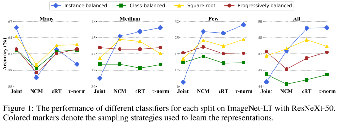

# Decoupling Representation and Classifier for Long-Tailed Recognition

## Challenge

实例丰富或者称作头部类别主宰了训练过程，学会的模型趋向于在这些类别上表现更好，而表现明显更差在实例缺少或者尾部类别

## Existing Method

1. 重采样数据或者数据特殊的损失函数来更好地促进不均衡数据训练

re-sample the data or design specific loss functions that better facilitate learning with imbalanced data

2. 通过迁移头部类别的知识，加强尾部类别的识别表现能力

enhance recognition performance of the tail classes by transferring knowledge from the head classes

**Common Belief** behind existing approaches is that *designing proper sampling strategies, losses, or even more complex models*, is useful for learning high-quality representations for long-tailed recognition.

## Sampling策略

作者将三种Sampling策略统一为一个公式，即从类别 $j$ 中挑选一个样本的概率 $p_j$ 。其中， $n_j$ 代表的是类别 $j$ 的样本数量， $C$ 是类别数量， $q \in [0,1]$ 。若 $q=1$ ，为***random sampling***，文中也称之为**Instance-balanced sampling**；*当 $q=0$ 的时候，为***Class-balanced Samling**；当  $q=\frac{1}{2}$时为**Square-root Sampling**；
$$
P_j = \frac{n_j^q}{\sum_{i=1}^C n_i^q}
$$
**Progressively-balanced sampling**

在训练前期使用random-sampling策略，后期使用class-balanced sampling
$$
p_j^{PB}(t) = (1-\frac{t}{T})p_j^{IB}+\frac{t}{T}p_j^{CB}
$$
其中， $t$ 为当前训练的Epoch， $T$ 为总的训练Epoch

## Classifier 的学习策略

**Classifier Re-training（cRT）**

- 固定住representations部分，随机初始化classifier的weight和bias参数，并使用class-balanced sampling在训练少量epoch

**Nearest Class Mean classifier（NCM）**

首先将training set里的每个类别计算feature representaitions的均值，然后在test set上执行最近邻查找。或者将mean features进行L2-Normalization之后，使用余弦距离或者欧氏距离计算相似度。作者指出，余弦相似度可以通过其本身的normalization特性来缓解weight imbalance的问题。

**$\tau$ -normalized classifier**

令$W=\{w_j\}\in R^{d\times C}$，其中$w_j \in R^d$ 是类别$j$ 的classifier 权重
$$
\widetilde{w} = \frac{w_i}{||w_i||^\tau}
$$
**Learnable weight scaling (LWS)**

如果将公式3写为公式4的形式，我们可以将 $f_i$ 看作是一个可学习的参数，我们通过固定住representations和classifier两部分的weighs来只学习这个scaling factors。
$$
\widetilde{w} =f_i \times w_i, \ where f_i = \frac{1}{||w_i||^\tau}
$$

## Experiments

为了更好地测试在训练期间每个类别样本数量对结果的影响，作者将类别集合分成三种情况。Many-shot (more than 100 images), Medium-shot (20100 images) and Few-shot (less than 20 images).

其中，Joint代表的是传统的representations和classifier结合训练的策略。由此，作者的几点发现包括：

- - **Sampling matters when training jointly.** 可见，使用更好地sampling策略可以显著提高Joint的性能。疑惑的是，第一个Many的实验中，作者解释出现这种情况的原因是，模型高度偏向many-shot的类别，但是为什么这样就会导致acc高呢？感觉作者的解释不是很好。

- - **保持 representation frozen训练classifier要比finetune效果好。**如图2所示。和一些SOTA的模型比较如图3所示。其他的实验结果及分析具体可参见paper。

## Conclusion

1. 数据不平衡可能不是学习高质量表达的问题

2. 通过最简单的实例平衡（自然）采样学习表示，也可以通过仅调整分类器来实现强大的长尾识别能力

