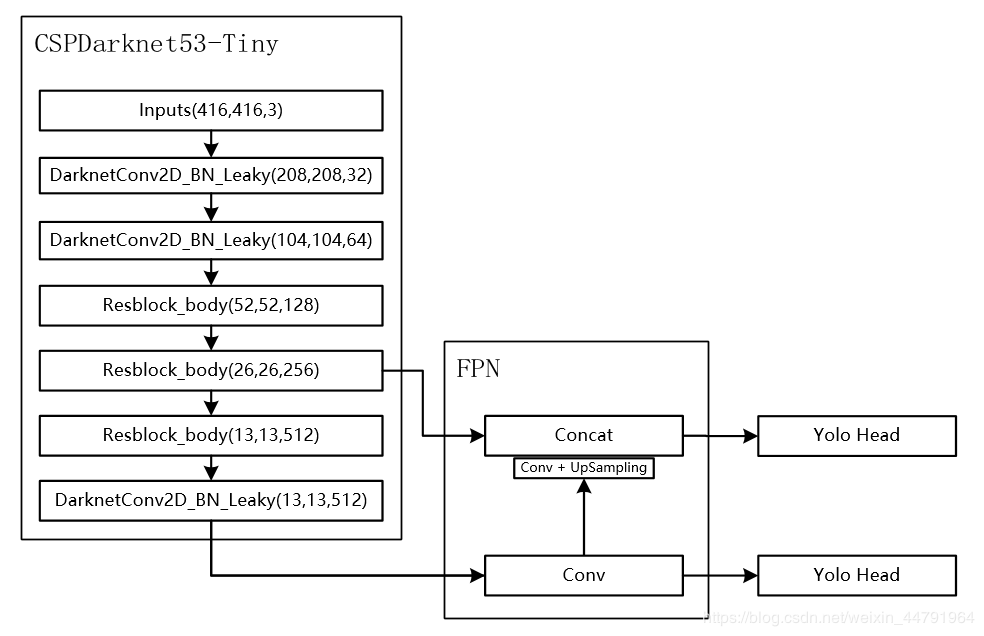
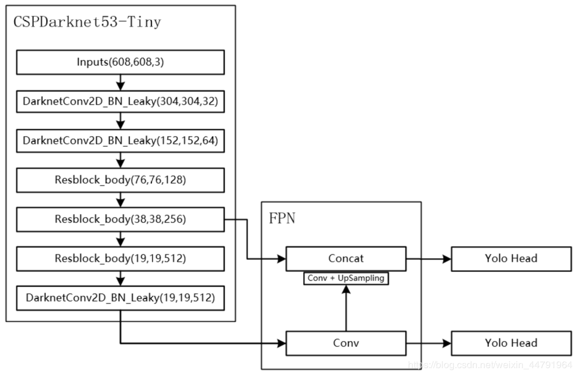

# 背景

**YoloV4-Tiny是YoloV4的简化版，少了一些结构，但是速度大大增加了，YoloV4共有约6000万参数，YoloV4-Tiny则只有600万参数。**

**YoloV4-Tiny仅使用了两个特征层进行分类与回归预测。**

# 结构分析

## 主干特征提取网络Backbone

当输入是416x416时，特征结构如下：

当输入是608x608时，特征结构如下：

而在YoloV4-Tiny中，其使用了CSPdarknet53_tiny作为主干特征提取网络。
和CSPdarknet53相比，**为了更快速，将激活函数重新修改为LeakyReLU**。

