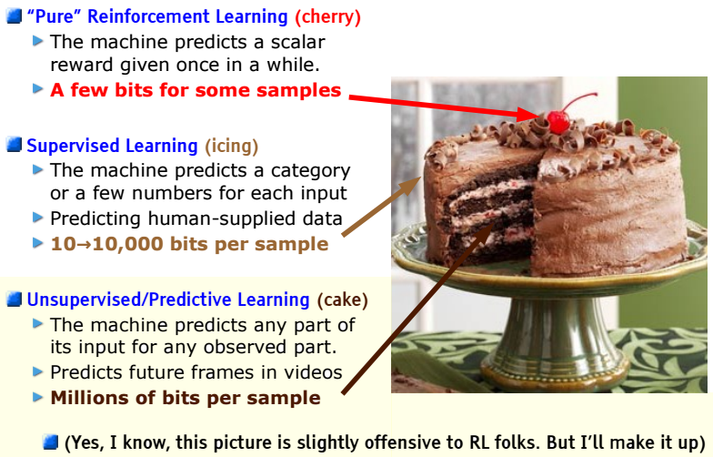
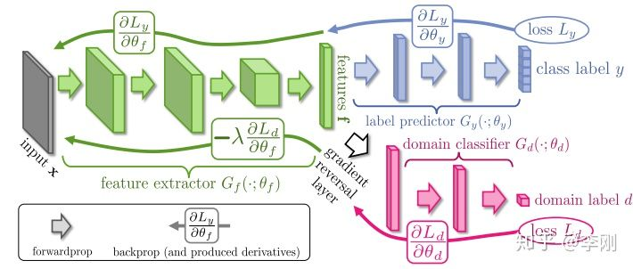
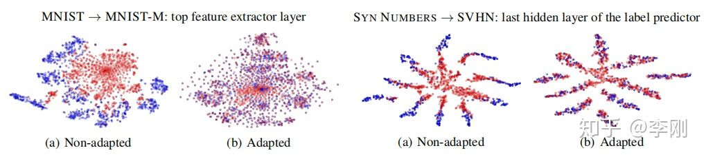
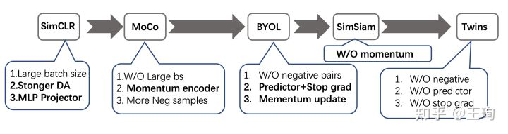

# 迁移学习是个啥

## 引子

 举个例子，譬如三个月后 武汉会变得很热，武汉如此，北京，纽约都很热。然而此刻，假如我问你，阿根廷的首都布宜诺斯艾利斯，天气如何？稍稍有点地理 常识的人就该知道，阿根廷位于南半球，天气恰恰相反：正是夏末秋初的时候，天气渐渐凉了起来。

我们何以根据北京的天气来推测出纽约、东京和巴黎的天气？我们又何以不能用相同 的方式来推测阿根廷的天气？

因为它们的地理位置不同。除去阿根廷在南半球之外，其他几个城市均位于北半球，故而天气变化相似。

因而根据地点的相似性和差异性，很容易地推测出其他地点的天气。 这样一个简单的事实，就引出了我们要介绍的主题：**迁移学习**

## 概念

迁移学习作为机器学习的一个重要分支，侧重于将已经学习过的知识迁移应用于新的问题中

**找到新问题和原问题之间的相似性**

Example：

举一反三，照猫画虎，数学&物理

## 为啥需要

1. **大数据与少标注之间的矛盾**

大数据带来了严重的问题：总是缺乏完善的数据标注。

机器学习模型的训练和更新，均依赖于数据的标注。然而，尽管我们可以获 取到海量的数据，这些数据往往是很初级的原始形态，很少有数据被加以正确的人工标注。

2. **大数据与弱计算之间的矛盾**

大数据，就需要大设备、强计算能力的设备来进行存储和计算。

我电脑就一张显卡，还时不时被我跑到宕机

3. **普适化模型与个性化需求之间的矛盾。**

对于每一个通用的任务都构建了一个通用的模型。这个模型 可以解决绝大多数的公共问题。但是具体到每个个体、每个需求，都存在其唯一性和特异 性，一个普适化的通用模型根本无法满足。那么，能否将这个通用的模型加以改造和适配， 使其更好地服务于人们的个性化需求？

4. **特定应用的需求**

机器学习已经被广泛应用于现实生活中。在这些应用中，也存在着一些特定的应用，它 们面临着一些现实存在的问题。比如推荐系统的冷启动问题。一个新的推荐系统，没有足够的用户数据，如何进行精准的推荐? 一个崭新的图片标注系统，没有足够的标签，如何进行 精准的服务？现实世界中的应用驱动着我们去开发更加便捷更加高效的机器学习方法来加 以解决。

| 矛盾                   | 传统机器学习                     | 迁移学习       |
| ---------------------- | -------------------------------- | -------------- |
| 大数据与少标注         | 增加人工标注，但是昂贵且耗时     | 数据的迁移标注 |
| 大数据与弱计算         | 只能依赖强大计算能力，但是受众少 | 模型迁移       |
| 普适化模型与个性化需求 | 通用模型无法满足个性化需求       | 模型自适应调整 |
| 特定应用               | 冷启动问题无法解决               | 数据迁移       |

## 分类

迁移学习的分类可以按照四个准则进行：按目标域有无标签分、按学习方法分、按特征分、按离线与在线形式分

**按目标域标签分** 

这种分类方式最为直观。类比机器学习，按照目标领域有无标签，迁移学习可以分为以 下三个大类： 

1. 监督迁移学习 (Supervised Transfer Learning) 
2. 半监督迁移学习 (Semi-Supervised Transfer Learning) 
3. 无监督迁移学习 (Unsupervised Transfer Learning)

**按学习方法分类**

1. 基于样本的迁移学习方法 (Instance based Transfer Learning) 

   通过权重重用，对源域和目标域的样例进行迁移。就是 说直接对不同的样本赋予不同权重，比如说相似的样本，我就给它高权重，这样我就完成了 迁移，非常简单非常非常直接。

2.  基于特征的迁移学习方法 (Feature based Transfer Learning) 

   假设源域和目标域的特征 原来不在一个空间，或者说它们在原来那个空间上不相似，那我们就想办法把它们变换到 一个空间里面

3.  基于模型的迁移学习方法 (Model based Transfer Learning) 

   构建参数共享的模型。这个主要就是在神经网络里面用的特 别多，因为神经网络的结构可以直接进行迁移。比如说神经网络最经典的 finetune 就是模 型参数迁移的很好的体现

4. 基于关系的迁移学习方法 (Relation based Transfer Learning)

   挖掘和利用关系进行类比迁 移。比如老师上课、学生听课就可以类比为公司开会的场景。这个就是一种关系的迁移。

**按特征分类**

1. 同构迁移学习 (Homogeneous Transfer Learning)  

2. 异构迁移学习 (Heterogeneous Transfer Learning)

这也是一种很直观的方式：如果特征语义和维度都相同，那么就是同构；反之，如果特 征完全不相同，那么就是异构。举个例子来说，不同图片的迁移，就可以认为是同构；而图 片到文本的迁移，则是异构的。

**按离线与在线形式分**

1. 离线迁移学习 (Offline Transfer Learning) 
2. 在线迁移学习 (Online Transfer Learning)

#大数据与少标注 Domain Adaptation

在MNIST数据集上训练出来的网络，同样去跑相近的数据集，比如MINIST-M，准确率大打折扣？或者是想跑另外一个没有标签的数据集却没有精力去标注？

**Unsupervised Domain Adaptation by Backpropagation**

对于一个常规的网络而言，一般由特征提取backbone和分类器classifer组成

source domain的数据是有标签的

target domain的数据是无标签的。

$G_f$ 将source和target domain的数据都映射到一个特征空间$Z$上 

$G_y$预测标签y

$G_d$ 预测数据来自于target还是source domain

流入$G_y$的是带标签的source数据

流入$G_d$的是不带标签的source和target的数据。

当我们不考虑七里八里的 正常的一个分类模型
$$
\theta_f \leftarrow \theta_f - \mu(\frac{\delta L_y}{\delta \theta_f})
$$

$$
\theta_y \leftarrow \theta_y - \mu(\frac{\delta L_y}{\delta \theta_y})
$$
模型要应用到数据集分为两部分：源域（source domain）和目标域（target domain）。前者是可以很方便地训练的数据集，后者是很少有标签或者就没标签的数据集。

这就是一个半监督或者无监督的学习问题。由于存在dataset bias，这个判别模型不能直接移植到目标域，否则效果会很差，在本文结构中CNN的作用主要是找到合适的features，这些features可以送到全连接分类器进行分类，同时送到domain classifier ，让domain分类器得到如何分辨domian的梯度，经过梯度反转，使得CNN搞出来的features更加迷惑domain classifier，最后使得domain classifier无法分辨出这两个domain。这时，任务就达到了，因为在无法分辨两个分类器的情况下，这些features彩色这两个domain共享的，这时把CNN网络迁移到另外这个分布，效果会好很多。

对于$\theta_f$ 他是要在确保提取有效特征的情况下，把Domain Identifier 给弄迷糊
$$
\theta_f \leftarrow \theta_f - \mu(\frac{\delta L_y}{\delta \theta_f})
$$

$$
\theta_f \leftarrow \theta_f + \mu(\frac{\delta L_d}{\delta \theta_f})
$$

$$
\theta_f \leftarrow \theta_f - \mu(\frac{\delta L_y}{\delta \theta_f}-\frac{\delta L_d}{\delta \theta_f})
$$
对于$\theta_d$ 他是要尽可能去分出这两个类
$$
\theta_d \leftarrow \theta_d - \mu(\frac{\delta L_d}{\delta \theta_d})
$$

#大数据与弱计算  Knowledge Distilliation

#普适化模型与个性化需求  Personalized Model

#特定应用 Self-Supervised Learning 

迁移学习很重要的一种形式，是把别人学到的迁移到自己的这里来，但是如果别人的数据是没有标签的呢，那么很自然，如果源数据是无标签的，我们很难说对源数据进行有监督的学习。那么自监督学习在这里会发挥很重要的作用。

在这里 着重讲两篇文章，

# 迁移学习的理论保障

# 引用

## 笔记

[迁移学习简明手册](http://jd92.wang/assets/files/transfer_learning_tutorial_wjd.pdf)

[《迁移学习》: 领域自适应(Domain Adaptation)的理论分析 - 小蚂蚁曹凯的文章 - 知乎](https://zhuanlan.zhihu.com/p/50710267)

[Adversarial Discriminative Domain Adaptation](https://zhuanlan.zhihu.com/p/67065333)

[Adversarial Discriminative Domain Adaptation阅读笔记](https://zhuanlan.zhihu.com/p/275694799)

[最简单的self-supervised方法](https://zhuanlan.zhihu.com/p/355523266)

[Self-Supervised 总结](https://zhuanlan.zhihu.com/p/357830995)

## 论文

### Domain Adaptation

ICML_2015	[Unsupervised domain adaptation by backpropagation](http://proceedings.mlr.press/v37/ganin15.pdf)

CVPR_2017	[Adversarial Discriminative Domain Adaptation](https://ieeexplore.ieee.org/document/8099799)

